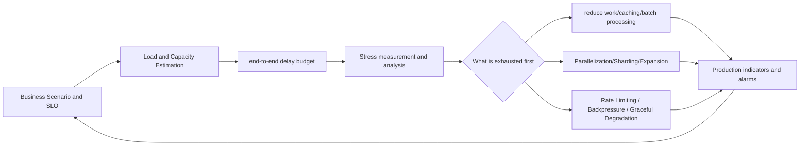

# Latency, Throughput and Tail Latency

Performance design is not about pursuing an isolated "high QPS", but about achieving user-perceivable latency goals under well-defined load, data scale, and failure conditions. Throughput, Concurrency, Queueing and Tail Latency are coupled to each other: after the system is close to saturation, receiving a little more traffic may only increase queuing, but no longer increase effective Throughput.

## Remember the conclusion first

- Average masks slow requests. User SLO looks at at least P50, P95, P99, error rate and timeout rate simultaneously.
- Latency must indicate measurement boundaries: client end-to-end, server-side processing, downstream calls and queue waits are not the same metric.
- QPS alone does not determine capacity; request bytes, CPU cost, storage IOPS, number of connections, hot spots, and peak factor are also estimated.
- The amount of concurrency is approximately equal to the arrival rate multiplied by the average dwell time. A longer delay will occupy more connections and memory, forming a positive feedback.
- The latencies of serial links are additive; the latencies of parallel fan-outs are dominated by the slowest necessary branch. The wider the fan-out, the greater the probability that at least one branch is slow.
- Timeout is a contract between correctness and resources, and Deadline should be propagated in a descending manner along the call chain; the downstream cannot be allowed to continue doing useless work after the upstream has given up.
- The queue only absorbs short-term fluctuations. When the long-term input rate is greater than the processing capacity, the current must be limited, downgraded, expanded, or the workload reduced.
- Caching, batching, and asynchronization are not free optimizations: they introduce consistency, latency, and state recovery costs respectively.
- Locate bottlenecks before optimizing and verify with close to real data distribution, hit rate and dependency behavior.

## Performance closed loop

The optimization sequence is usually: first remove unnecessary work, then reduce remote round trips and data volume, then increase locality or parallelism, and finally rely on more machines to carry the remaining work. Any optimization should be re-validated for correctness, cost, and failure performance.

## Navigation of this chapter

1. [Indicator caliber and correct measurement](01-metrics-definition-and-correct-measurement.md)
2. [Load, capacity, concurrency and bottleneck](02-from-load-contract-to-concurrency-capacity-and-bottleneck.md)
3. [Delay Budget, Deadline and Critical Path](03-latency-budget-deadline-and-critical-path.md)
4. [Tail Latency and Fan-out](04-tail-latency-and-fan-out.md)
5. [Queueing, Backpressure and Overload Protection](05-queueing-backpressure-and-overload-protection.md)
6. [Case Deduction and Design Checklist](06-case-study-and-design-checklist.md)

## Boundaries with other chapters

- [Back-of-the-Envelope](../../01-Back-of-the-Envelope/) is responsible for converting DAU, behavior frequency, and object size into QPS, bytes, working set, and machine magnitude; this chapter uses these results directly.
- The "capacity" focus in this chapter is to explain how concurrency, saturation, queuing, bottlenecks, and failure margin affect runtime performance without repeating the full business sizing arithmetic.
- For the task semantics after the long job is moved out of the request path, see [Synchronization, Asynchronous and Event-driven](../05-synchronous-asynchronous-and-event-driven-architecture/).
- Can you retry after timeout and how to prevent retry storm? See [Idempotent, Retry and Deduplication](../06-idempotency-retry-and-deduplication/).
- Bulkhead, Circuit Breaker and downgrade recovery see [Fault Tolerance, Downgrade and Disaster Recovery](../07-fault-tolerance-graceful-degradation-and-disaster-recovery/).
- Sharding keys, hotspots, and data rebalancing belong to subsequent data distribution topics; this chapter first explains how to identify them from indicators.

## Minimum answer framework in interviews

When discussing performance, at least state:

1. **Goal**: Which API, which type of user, what P95/P99 and availability goals under what load.
2. **Scale**: average/peak QPS, request size, read-write ratio, hot spots and growth period.
3. **Budget**: How much is entrance, queuing, computing, storage and network, and where is the critical path.
4. **Capacity**: Which one uses up CPU, IOPS, bandwidth, connections or a shared dependency first, and how much fault margin is left.
5. **Overload**: Queuing limit, Admission Control, current limit, downgrade and retry budget.
6. **Verification**: What stress testing model, quantile, Trace and saturation indicators are used to prove that the solution is effective.
