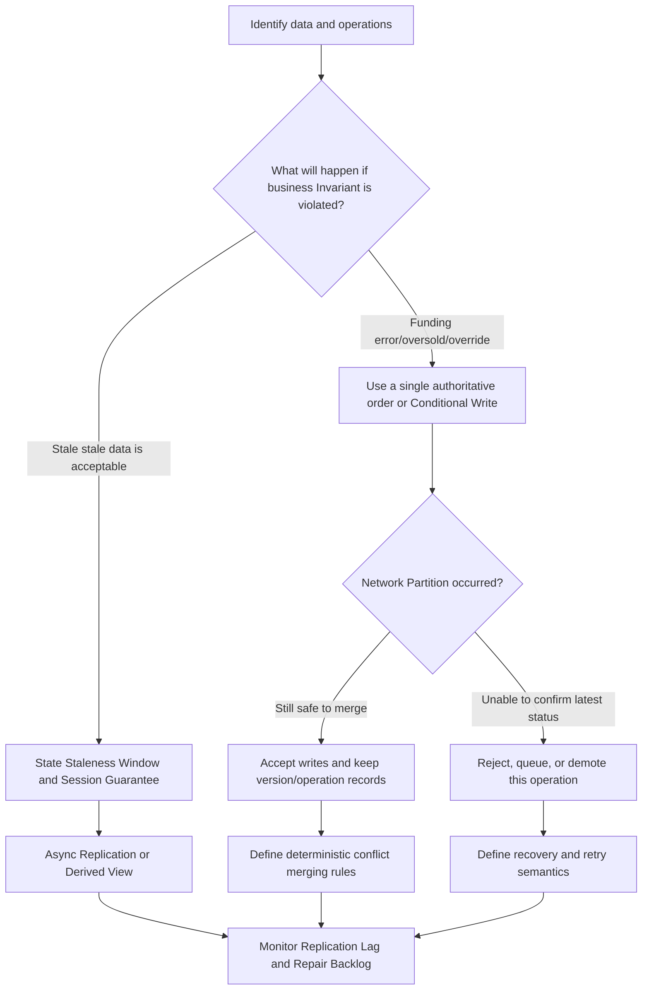

# CAP and Consistency Model

The first step in consistent design is not to label the entire system "Strong Consistency" or "Eventual Consistency", but to answer four specific questions: **Which data, which Invariant, who must see what in what time frame, and which types of requests would rather be rejected in the event of failure**.

For example a social system can simultaneously require:

- The main text of the Post is stored as the Source of Truth and cannot be lost after it is successfully created;
- The author must immediately see his Post in the current Session;
- Fans' feeds allow this post to appear within a few seconds;
- The fact of a like cannot be repeated, but the like count can be aggregated later.

These four are not contradictory - they choose different semantics for different data and different reading paths. What is really important in system design is to clearly explain these choices and provide implementation and verification methods.

## Map of this chapter

1. [Define the consistency object first] (01-Definition-Consistency-object and scope.md): Start judging from the business Invariant, Source of Truth and Visibility Window.
2. [CAP, Partition and PACELC](02-cap-partition-and-pacelc.md): Under what circumstances is it necessary to discuss CAP, and what should be sacrificed during the Partition period and the normal period.
3. [Consistency Model and Session Guarantee](03-consistency-model-and-session-guarantee.md): Linearizability, Causal Consistency, Eventual Consistency and Read-Your-Writes.
4. [Replication, Quorum and Conflict Handling] (04-Replication-Quorum-and conflict Handling.md): How Leader, Quorum, version and merge strategy fulfill the semantics promised previously.
5. [The boundary between Transaction Isolation and distributed consistency] (05-Transaction-Isolation-The boundary with distributed consistency.md): Why ACID, Isolation Level and cross-replica visibility are three different issues.
6. [Case Decision Matrix and Verification Checklist] (06-Case-Decision-Matrix-and Verification Checklist.md): Apply the concept to payment, ticket booking, shopping cart, feed and chat.

## Shortest decision path

An interview expression could be:

> Seat ownership is an Invariant that cannot be violated, so confirm the order through a single Source-of-Truth Partition plus Conditional Write; if the ownership cannot be confirmed during the Network Partition, the confirmation will be refused, or the order will be transferred to the waiting list. The search results are Derived Data, allowing second-level Eventual Consistency, relying on Versioned Events, Idempotent Consumers, and delayed alerts to recover.

## Common misunderstandings

- **"CAP Three Choose Two"**: When Partition actually occurs, you can only choose one between "Consistent Response" and "Sustained Response". Partition Tolerance is not a third product feature that can be easily turned off.
- **"This system is CP/AP"**: The selection is usually specific to a certain operation, a certain failure mode. In the same system, payment confirmation can be biased toward CP, and product browsing can be biased toward AP.
- **"Eventual Consistency is not guaranteed"**: Must be added - how long it takes to converge when there are no new writes, how conflicts are resolved, and what exceptions users will see.
- **"$R+W>N$ is equal to Strong Consistency"**: This formula only shows that the reading and writing sets have intersection. Without correct version selection, write arbitration, and membership change protocols, old values ​​will still be read or forks will occur.
- **"Transaction is Linearizable"**: Transaction Isolation constrains concurrent transactions; the read path of Replication and the client may still expose old data.

## How to quote in case design

For each case, at least:

1. Which is Source of Truth and which is Derived Data that can be reconstructed;
2. What is Invariant and what is its scope of action;
3. How large the Staleness Window is allowed under normal circumstances;
4. Whether the current Session requires Read-Your-Writes;
5. During Network Partition, whether each type of operation is rejected, queued, read-only, or continues to be accepted;
6. How to deal with duplication, disorder, conflict, deletion and recovery respectively;
7. What indicators are used to demonstrate that these commitments are being met.
