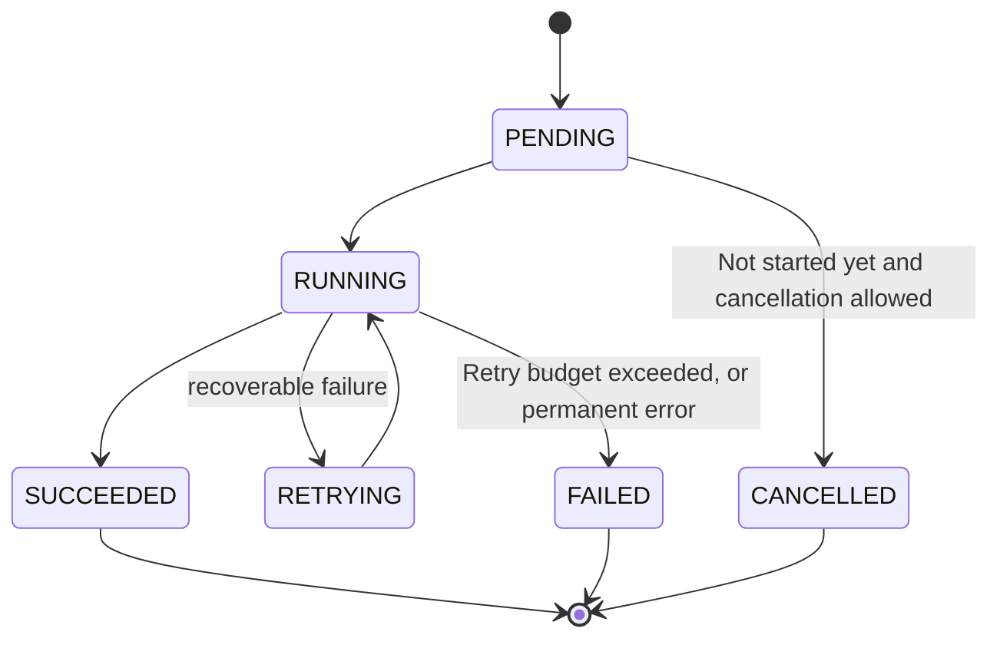

# When to asynchronously: Determination methods and counterexamples

The most important prerequisite for asynchronousization is not technology, but business allowing "accept now and complete later". If the business cannot tolerate intermediate states at all, then adding a Message Queue will not make it asynchronous - it will only cause a synchronization failure and turn it into an intermediate state that no one can handle.

## What is the difference between synchronization and asynchronousness?

In synchronous calls, the caller waits for the result from the callee before the response is returned. The success boundary usually covers the entire critical path. It is easy to understand, easy to debug, and can report errors immediately, but it will transmit downstream delays and faults back to the upstream as they are.

In an asynchronous call, the submitter first persists the request or business facts, and leaves the remaining work to the background Consumer to complete. The caller does not need to wait for the connection, but the system has the `PENDING / RUNNING / SUCCEEDED / FAILED` set of states and has to deal with duplication, reordering, backlog and replay.

| Dimensions | Synchronous | Asynchronous |
|---|---|---|
| Return semantics | Usually returns the final result | Usually just means "accepted" or "fact committed" |
| Delay propagation | If the downstream is slow, it will directly slow down the caller | The downstream is slow mainly in the form of queue backlog |
| Fault propagation | Downstream faults immediately affect upstream | Can be temporarily isolated, but the delay will continue to grow |
| Traffic shape | The peak value is directly transmitted to the downstream | The queue absorbs the short-term peak value |
| Status complexity | Low | Requires task status, retry, DLQ, reconciliation |
| User experience | Immediate success or failure | Requires progress, polling, push, or "visible later" |

## Five types of signals suitable for asynchronous

### 1. This work is not within the correctness boundaries of the user request

When a user changes their avatar, the user profile row and new avatar reference must be submitted reliably; while Search Index updates, CDN warm-up, and audit analysis can all happen later. These derived actions fail and should not leave the main request hanging.

Decision question: **If this job is delayed by 30 seconds, should I fail the original request? ** If the answer is "shouldn't", then it can usually be moved out of the sync path.

### 2. The work takes far longer than a reasonable request timeout

Video transcoding, report generation, and batch import may take several minutes. Holding an HTTP connection is unreliable and provides no way to communicate progress. A more appropriate interface form is:

1. The client submits the task;
2. Service persistence task, return `202 Accepted` and one `job_id`;
3. Worker executes in the background;
4. The client gets the results through the status interface, Webhook or push.

### 3. Traffic has recoverable short-term spikes

The moment the ticketing system went on sale, 100,000 "send confirmation notification" tasks were generated per second, and the stable processing capacity of the notification service was 20,000 per second. The queue allows the submission side to return quickly, and the consumer slowly catches up after the peak passes.

But if you can produce 100,000 per second for several hours and can only consume 20,000, asynchrony is just delaying failure - the backlog will continue to increase until storage is exhausted. At this time, it is necessary to expand the capacity, downsample, merge tasks, or limit the flow at the entrance.

Assuming that the production rate is $\lambda$ and the consumption rate is $\mu$, the growth rate of the backlog when fluctuations are ignored is:

$$
\frac{dB}{dt}=\lambda-\mu
$$

Only when $\lambda < \mu$ is satisfied in the long term and a peak margin is left, the system has the opportunity to clear the backlog.

### 4. One fact drives multiple independent actions

After the order is completed, inventory, points, emails, risk control, and data warehouses may all concern `OrderCompleted`. Stringing them into a synchronous RPC chain will force the order service to know all downstreams, and let the slowest downstream determine the overall latency. Publish a Domain Event and each consumer can evolve independently.

The premise is to figure out which actions are necessary for the order to be "completed". For example, if the inventory deduction must be successful before the order can be accepted, you cannot just move it out of the transaction boundary just because there is an Event Bus.

### 5. Need to be isolated across fault domains and expand and shrink independently

Image uploading and content review consume completely different resources: the former is bound by network bandwidth, and the latter may rely on GPU. After decoupling with the persistent queue, the two groups of workers each expand according to their own indicators, and the temporary unavailability of one of them will not immediately bring down the entrance.

## Don’t rush into asynchronous scenarios

### The user must know the result immediately

Whether the login credentials are correct, whether the balance is sufficient, whether the seat has been taken away-these usually need to be given a definite answer in the current interaction. Peripheral work can be asynchronous, but core decisions should be kept synchronous, or provide a business-recognized "in-process" semantics.

### There is a close immediate dependency between the two steps

If step B must use the return value of step A, and the caller must use the result of B immediately, then putting the intermediate step into the queue does not reduce any workload, but only increases the status and troubleshooting difficulty out of thin air.

### The scale and risk of failure are not worth the complexity.

If a low-traffic internal tool's mailing can meet the SLO with a single synchronous call, there is no need to introduce the Broker, Consumer Group, DLQ, and replay tool first. System design is not a stamp collection, complexity should be driven by observed bottlenecks or clear requirements.

### The business cannot accept final consistency, but there is no means of compensation.

If asynchronous failure leaves an intermediate state that is neither acceptable nor repairable—for example, the user has been told that the transfer was successful, but the ledger has not been submitted at all—then it means that the success boundary was drawn incorrectly from the beginning.

## How to determine the synchronization boundary

Divide a business operation into three categories:

| Types | Questions to ask | Typical treatments |
|---|---|---|
| Core Facts | Before returning successfully, what must be ensured to never be lost? | Synchronous verification and submission within the transaction |
| Reconstructable derived data | Can it be regenerated from facts after being lost? | Asynchronous updates, regular reconciliation |
| External side effects | Can retry be idempotent? Can it be revoked through compensation? | Asynchronous Command, state machine and compensation |

Take "Publish Post" as an example:

- Core facts: post content, author, visibility, and Outbox record used to post the event;
- Derived data: author timeline, fan feed, Search Index;
- External side effects: notification push, content analysis.

Therefore, the success of the interface can be defined as "Post and Outbox have been submitted" rather than "Every fan's homepage has been updated." However, the product side also needs to provide a visibility delay budget. For example, 99% of fans' homepages will be visible within 10 seconds - otherwise "visible later" will become an unverifiable statement.

## How to express status in asynchronous API

Don't return an ambiguous `200 OK`, which would make the caller think the work is done. Common contracts are:

```http
HTTP/1.1 202 Accepted
Location: /jobs/job_123
Retry-After: 2
Content-Type: application/json

{
  "job_id": "job_123",
  "status": "PENDING",
  "submitted_at": "2026-08-13T18:00:00Z"
}
```

The task state machine must be able to distinguish at least these states:



Also define: how long the state is retained, what the semantics of cancellation are, which idempotent key is used for repeated submissions, where the result URL is, and how to express the reason for failure.

## A practical judgment checklist

Only when most of the following questions have clear answers can we truly enter asynchronous implementation:

- Which specific work needs to be moved out of the synchronization critical path?
- How long can users tolerate its delay? How will it be displayed on the interface if it exceeds the standard?
- What has been reliably saved when the API returns?
- When a task fails, can it be retried, compensated, or does it require manual intervention?
- How does the caller know it completed, failed, or was canceled?
- Can the average consumption capacity exceed the average production rate?
- Do you really need a Broker, or is a task table in the database enough?

[Return to the entrance of this chapter](README.md)
