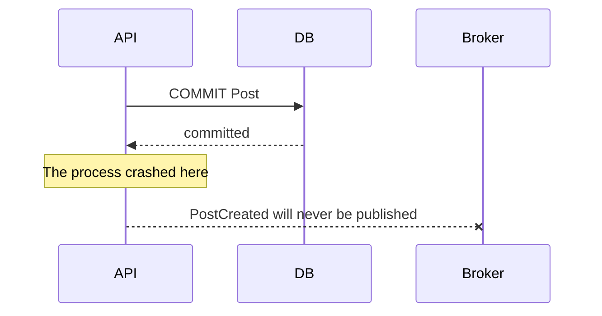
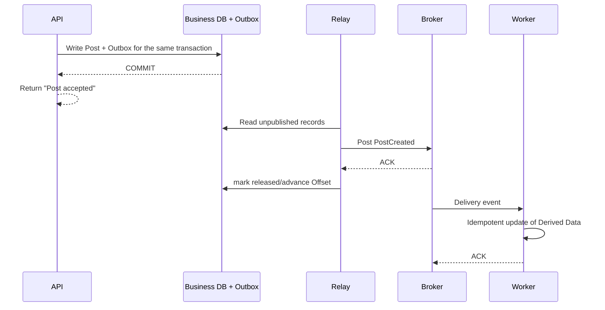

# Reliable Delivery: Success Boundary and Consistency

The most dangerous misunderstanding in asynchronous systems is: "Broker guarantees not to lose messages, so the business is correct." Message reliability spans at least three boundaries - Producer's transactions, Broker, and Consumer's side effects. The same ambiguity may occur at every boundary: the ** operation was actually successful, but the confirmation was lost. **

## First define three types of "success"

Take publishing a post as an example:

1. **Accept successfully**: Post facts and events to be published have been persisted;
2. **Processing Successful**: A Consumer has updated the author's timeline;
3. **Visible business success**: The target users actually saw this post within the time required by the product.

These three moments cannot be confused. API return values, SLOs and alerts should correspond to them respectively.

## Why does direct Dual Write lose events?

Suppose the service does two things in sequence:

1. Write business database;
2. Post a message.

After the database is submitted and before the message is sent, the process hangs, leaving a state with business facts and no events. On the contrary, if you send the message first and then write to the library, the Consumer may see business data that does not exist yet and may even be rolled back eventually. Simply retrying won't save it - after the timeout, the caller has no idea whether the previous step was successful or not.



## Transactional Outbox

When business facts and Outbox are in the same database that supports transactions, you can write both in a local transaction:



Outbox solves the atomic problem of "the business facts have been submitted, but the events to be released do not exist". It **doesn't** handle duplication smoothly: the Relay hangs up when the Broker has accepted the message but the Outbox has not yet marked it as complete, and will send it again after recovery. So whether Consumer should be idempotent or idempotent.

There are three common publishing methods for Outbox:

- **Polling table**: The simplest implementation, but needs to manage indexing, batch size, lock contention and cleaning of published records;
- **CDC Read Transaction Log**: Low latency, no need to poll business tables, but requires log infrastructure and management of Offset and Schema evolution;
- **Database Native Notifications**: Depending on specific product capabilities, persistence and replay boundaries still have to be verified.

Outbox is not a Broker. It only records "which facts have not been sent out", and usually still requires a Broker to provide buffering, subscription, retention and Consumer Group. In small-scale scenarios, you can also use the database table directly as a task queue - but that is another selection decision that needs to be made consciously.

## The Consumer side also has atomicity issues

Consumer also has its own Dual Write:

1. Update the database;
2. Confirm the message to the Broker.

If the database has been submitted but the ACK is lost, the Broker will vote again. A safe approach is usually to write business updates and "processed `event_id`" records into the same database transaction:

```sql
BEGIN;

INSERT INTO processed_events (consumer, event_id)
VALUES ('timeline-worker', :event_id)
ON CONFLICT DO NOTHING;

-- Only if the above insertion does add a new row, the following side effects should be applied.
INSERT INTO author_timeline (author_id, post_id, rank_time)
VALUES (:author_id, :post_id, :rank_time)
ON CONFLICT (author_id, post_id) DO NOTHING;

COMMIT;
```

ACK after successful submission. If the side effect is to call an external service, which cannot be stuffed into the same transaction as the local deduplication record, then pass a stable idempotent key to the external service, or use a state machine and reconciliation to converge those calls with uncertain results.

## What exactly does Delivery semantics mean?

| Semantics | Broker/application behavior | Business risks | Applicable methods |
|---|---|---|---|
| At-Most-Once | Confirm first, do not re-roll if failed | May be lost, but usually not repeated | Discardable telemetry, low-value samples |
| At-Least-Once | Re-roll without confirmation | Basically not lost, but repeated | Most common; Consumer must be idempotent |
| Exactly-Once | Atomic processing within limited system boundaries | Easily misunderstood as end-to-end guarantee | Read and write within the same platform transaction, external side effects still need to be verified separately |

"Exactly-Once" must clarify the boundaries. The stream processing framework can atomically submit input offsets and output topics, but things like sending emails, debiting third-party accounts, and writing to another database are not included in that transaction. The more practical goal of end-to-end business is: **At-Least-Once transmission + idempotent business effect**.

## Idempotent strategy

Idempotence is not about "ignoring duplication when you see it", but allowing repeated execution to produce the same business effect. Common practices:

- Unique constraint: `UNIQUE (author_id, post_id)`;
- Consumption deduplication table: `UNIQUE (consumer, event_id)`;
- Condition update: only applies to `incoming_version > current_version`;
- State machine guard: only `PENDING -> PAID` is allowed, repeated `Pay` directly returns the existing result;
- External idempotent key: Pass a stable `operation_id` to the payment or notification service provider.

Deduplication tables must take retention periods into account. If the broker allows replay after 30 days, but only keeps deduplication records for 7 days, those old events will have another side effect when they come back. If it cannot be retained indefinitely, it is preferable to use mechanisms such as business unique constraints or entity versions that do not rely on time windows.

## Schema evolution and compatibility

Asynchronous Consumer will not be deployed synchronously with Producer. When the Producer sends a message with new fields, the old Consumer is still running; and during replay, the new Consumer will see old events from several years ago.

Safety principles:

- New fields are made optional and given default meanings;
- Do not directly change the units or semantics of existing fields;
- Before deleting a field, confirm that all consumers and histories within the retention period no longer rely on it;
- Destructive changes require new event types or clear version numbers;
- Consumers should be tolerant of unknown fields and fail explicitly for missing required fields;
- Conduct Producer–Consumer contract testing before going online.

Don't let the Consumer directly read the Producer's internal database table to "complete" the fields - that is equivalent to turning the newly decoupled asynchronous boundary back into runtime coupling.

## Reconciliation is the last line of defense

Retry and DLQ can only handle failures that have been recognized by the system. Code defects, incorrectly written filter conditions, and silent data loss caused by offset jumps, none of them can be found - because no errors are reported at all in these cases. Therefore, the reconstructed Derived Data must be regularly compared with the Source of Truth:

- Compare count by Partition, Version High-Water Mark or Checksum;
- Sampling reads of facts and derived views and doing semantic diff;
- Generate repair tasks with speed limit after discrepancies are discovered;
- Snapshot Watermark for large-scale reconstruction: backfill the Snapshot first, and then add increment from this Watermark.

"Can be replayed" does not mean "has been verified that it can be replayed". Really practice before going online: rebuild a new index from the specified offset and observe its impact on online traffic.

[Previous section: Message Model and selection] (02-Message-Model-and selection.md) · [Return to the entrance of this chapter] (README.md) · [Next section: Ordering, Backpressure and operation] (04-Ordering-Backpressure-and operation.md)
