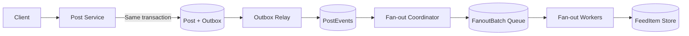
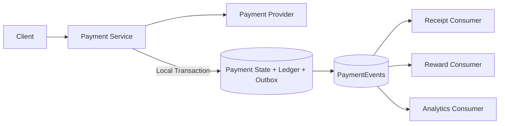
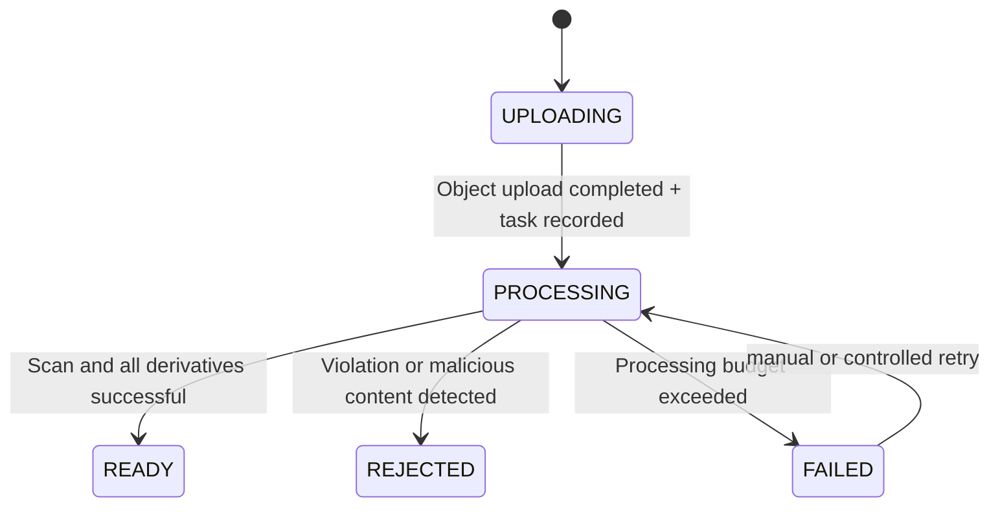

# Case deduction: How does the asynchronous boundary fall into the design?

You cannot draw just one `Service → Queue → Worker` in the case. An asynchronous link that can pass the review must be able to answer: why it is asynchronous, what is submitted synchronously, how the message is generated, how the consumer is idempotent, how the backlog is restored, and what the user finally sees.

## Case 1: News Feed distributed on write

### Why asynchronous

An author may have hundreds of thousands of fans. If the publishing interface writes each fan's `FeedItem` synchronously, the response time is determined by the number of fans and the slowest storage shard; and any failure in the middle will make "whether this post was sent or not" become ambiguous.

The business allows the post fact to be established first and the fan homepage to be gradually visible within a few seconds, so the Fan-out is removed from the synchronization path.

### Success Boundary and Process



The publishing API returns success, which only guarantees that `Post + PostCreated Outbox` has been submitted. Relay delivers at least once, Coordinator creates batch tasks by fan page, and Worker uses the unique key `(owner_id, post_id, follow_cycle)` to write `FeedItem`.

### Key trade-offs

- **Consistency**: The author himself must see the post immediately and can merge author timelines on the read path; other fans accept final consistency in a few seconds.
- **Duplication**: The three layers of Relay, Coordinator and Worker may be executed repeatedly, so each layer must have a stable ID and unique constraints.
- **Sequence**: According to `post_id` or author partition; the deletion event has an entity version to prevent a late creation/edit event from overwriting the deletion.
- **Hotspot**: Large V cannot run a single very large task and must be split into a batch of small batches that can be retried; you can also use mixed distribution of reading-time pull for large V.
- **Backpressure**: Monitor the P99 visible from submission to feed; give priority to keeping new posts online when backlogged, and limit historical replay.
- **FIX**: Reconciling `FeedItem` by Post and fan relationships, allowing you to reconstruct the entire derived feed from facts and events at any time.

For the complete evolution, see [News Feed: Asynchronous Index Version](../../06-case-design/02-specific-application-system/03-news-feed/04-asynchronous-index-version-news-feed/README.md) and [News Feed: Write-time Distribution Version](../../06-case-design/02-specific-application-system/03-news-feed/02-data-reliable-version-news-feed/README.md).

## Case 2: Bypass action after payment

### What must be synchronized and what can be asynchronous

Payment authorization and ledger facts belong to the core correctness boundary - the payment service must not tell the user success before confirming the result. The emails, points, analysis and most notifications after successful payment can be asynchronous.



### "Unknown result" that cannot be ignored

When the call to the Payment Provider times out, the money may have been deducted. If this type of timeout is requeued directly and a new payment ID is generated, the payment will be repeatedly deducted. The correct approach is:

1. Generate stable `payment_operation_id` for a logical payment;
2. Use the same idempotent key every time you call Provider;
3. After timeout, mark the status as `UNKNOWN` or `PROCESSING`, **not** `FAILED`;
4. Use the same idempotent key to query or retry safely until the result is determined;
5. Only after the payment fact is confirmed, `PaymentSucceeded` or `PaymentFailed` will be released.

Points Consumer uses `payment_id` as the only constraint. Although repeated sending of emails will not destroy the ledger, it will actually harm the user experience, so the Provider's idempotent key or a sending record table is also required.

### Trade-offs

Making the bypass action asynchronous reduces the tail delay of the payment interface and isolates the failure of the email service; the cost is that the user may first see the payment as successful and then receive the receipt after a while. The product needs to give an SLO for receipt delays and allow users to proactively query it from the order page.

## Case 3: Image upload and processing

### Why use asynchronous tasks?

Virus scanning, metadata extraction, and thumbnail generation in various specifications are both time-consuming and consume different types of resources. The upload interface is only responsible for obtaining the object, verifying basic metadata, and creating a `Media(PENDING)`; the rest is left to the background Workflow to advance the status.



### How to implement

- The client first obtains a pre-signed URL and directly transfers the object to the object storage. Do not let large files pass through the application server;
- Complete the interface to confirm that the object actually exists, and then create stable `media_id` and processing tasks in the database;
- The idempotent key for each step is `(media_id, source_version, transform_type)`;
- The product is first written to the temporary key, and then the reference in the database is updated atomically after passing the verification;
- Worker cannot rely on "the message will only be received once" to avoid repeatedly generating thumbnails;
- The object exists but is not referenced by the database, or the database stops at `PROCESSING` but the task has disappeared - these two situations are subject to periodic reconciliation cleaning or reissue.

### User experience

"Do you have to wait until the media becomes `READY` to post?" is a product choice, and all three are reasonable:

- **Must wait**: The experience is consistent, but the posting delay is tied up by the processing link;
- **Allow placeholders**: The post will be sent first, and the media will be visible later, but there must be a clear `PROCESSING`/`FAILED` interface;
- **Unpublic until review**: First visible only to the author and hidden from others.

This means that asynchronous technology choices must be designed together with visibility rules and cannot be determined separately.

## Common confusing answers and improvements

| What was said | Missed questions | What should be made up |
|---|---|---|
| "Use Kafka as a buffer" | Can't catch up after the peak has passed | $\lambda/\mu$, capacity margin, oldest message age and inlet flow limit |
| "Async improves performance" | Is the improvement in ingress latency or total completion time | SLOs for synchronization boundaries and end-to-end completion time |
| "Broker Guarantee Exactly-Once" | External side effects are not covered by this guarantee | Transaction boundaries, idempotent keys and reconciliation |
| "Try again if you fail" | What to do if there are permanent errors and unknown results | Error classification, backoff budget, DLQ and status query |
| "Guaranteed order by timestamp" | What to do if the clock drift is the same as the timestamp | Entity Partition Key plus monotonic version |
| "Put it in DLQ" | Who will fix it, how to replay it | Owner, alerts, retention period, root cause repair and rate limiting |
| "Eventually consistent" | How long? What do users see during this period? | Staleness Window, Read-Your-Writes, Downgrade and Repair |

## Case design template

When introducing an asynchronous link in `06-case design`, you can directly apply this template:

```markdown
### Asynchronous link: <name>

- Trigger signal: <Why the synchronization path no longer meets the requirements>
- Business tolerance: <How long is the delay allowed, whether it can be shuffled, and whether it can be discarded>
- Synchronization success boundary: <The fact that it has been persisted when returned>
- Message semantics: <Command / Event, schema, stable ID>
- Model: <Queue / Pub-Sub / Event Stream / Workflow>
- Partition and order: <partition key, versioning rules, hotspots>
- Production reliability: <Transaction Task List/Outbox/CDC>
- Consumer reliability: <ACK timing, idempotency key, unique constraints>
- Failure recovery: <Backoff, retry budget, DLQ, compensation, reconciliation>
- Backpressure and capacity: <producer/consumer rate, scaling, and rate limiting>
- User experience: <202 + Job, polling/push, Stale status display>
- SLO and Observation: <Oldest message age, Lag, end-to-end visible delay, business differences>
- Evolution and rollback: <shadow consumer, backfill offset, canary, and the impact of stopping the consumer>
```

## Ten questions during review

1. If it is not asynchronous, which specific quantifiable requirement will fail?
2. What exactly is guaranteed when the API returns success?
3. If the process crashes immediately after the database is submitted, will the message disappear permanently?
4. The Consumer submitted the side effect but the ACK was lost. Is it safe to repeat the execution?
5. When messages from the same entity are out of order, will the old state overwrite the new state?
6. Will a piece of permanent bad news block the entire Partition?
7. How long does it take for Consumer to catch up after being down for one hour? Will it overwhelm the downstream when chasing?
8. How does the user know that the task is still being processed, has failed, or can it be retried?
9. How to find the silent error that "no error is reported but part of the processing is missing"?
10. Can Derived Data be reconstructed from Source of Truth? When was the last drill?

[Previous section: Ordering, Backpressure and Operation](04-runtime-correctness-ordering-backpressure-retry-and-observability.md) · [Return to the entrance of this chapter](README.md)
