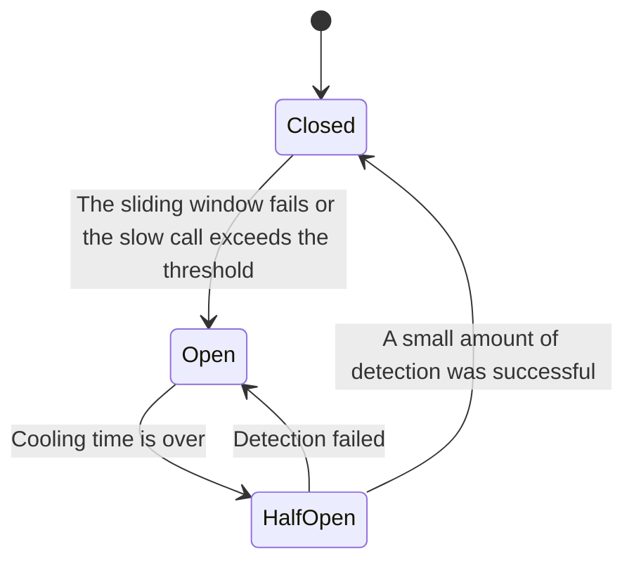

# Bulkhead, Circuit Breaker & Graceful Degradation

## 1. Bulkhead: Isolation resource pool and failure radius

Bulkhead comes from the metaphor of a ship's compartments: water entering one compartment should not flood the entire ship. Common isolation dimensions in the system:

- Dependency-level connection pool: the recommendation service becomes slow and cannot occupy the connection of the payment service;
- Routing-level thread pool/concurrent semaphore: batch export cannot slow down login;
- Tenant-level quota: one large tenant cannot consume all Workers;
- Queue and Consumer Group: real-time tasks are separated from offline tasks;
- Sharding/Available Zone: Single shard or single zone failure should not block other traffic;
- Control plane and data plane: When configuration management fails, the data plane continues to use the last stable snapshot.

Isolation reduces resource sharing efficiency and increases pool size configuration and monitoring complexity. Don’t create separate pools for each small feature; divide them by priority, dependency risk, and failure radius.

### Example: API Gateway

If Gateway shares a connection pool for all backends, the slow query of the reporting service may fill up the connection, making login and payment callbacks unable to enter. Isolating connection pools by dependency or service level and preserving concurrency for critical routes can limit failures to the reporting path. For the complete entry strategy, see [API Gateway: Timeout Retry and Failure Degradation](../../06-case-design/01-common-basic-system/02-api-gateway/04-timeout-retry-and-fault-degradation.md).

## 2. Circuit Breaker: Fail quickly when failure continues

- **Closed**: Normal call and statistics of failure rate and slow call rate.
- **Open**: Do not call downstream temporarily, fail immediately or perform downgrade.
- **Half-open**: Only a small number of detection requests are allowed to determine whether to recover.

### When to use

Ideal for remote dependencies with persistent timeouts, connection failures, or server-side errors, especially when the call consumes scarce threads and connections. It reduces pointless waits and retries, leaving room for downstream recovery.

### When not to take it as an answer

- Permanent client errors such as parameter errors and permission failures should not be counted towards dependency health;
- Local calls within the database are sometimes better suited to concurrency limits and timeouts;
- There are too few low-traffic service samples, and simple percentages can easily trigger errors;
- Circuit Breaker does not fix root causes and does not replace Rate Limit, Bulkhead and Capacity Planning.

### Configuration Notes

- Use sliding windows and minimum number of samples instead of "open on failure";
- Distinguish between timeout, `5xx`, `429`, service rejection and client cancellation;
- Half-open detection must have a concurrency upper limit;
- Multiple instances of independent Circuit Breaker will produce different states, and the overall situation needs to be monitored;
- Gradually increase the volume after recovery to prevent all instances from impacting the newly recovered downstream at the same time;
- Circuit Breaker State, Rejected Count and Probe Result must be observable.

## 3. Graceful Degradation To protect business invariants

Graceful Degradation (business downgrade) is to clearly provide a lower service level acceptable to the business when a dependency is unavailable or the system is overloaded, instead of returning an error result that "seems successful".

| Scenario | Reasonable Graceful Degradation | Why |
|---|---|---|
| Recommendation service failed | Returning popular content or no personalized feed | Content relevance decreased, but core reading is still available |
| Comment count failed | Do not display count yet | Does not affect factual content |
| Routing configuration control plane failure | Using the last stable snapshot | Old routing is usually preferable to a site-wide outage |
| Log backend blocking | Bounded buffering, discarding ordinary access logs by level | Ordinary logs cannot block user requests |
| Authorization information cannot be confirmed | Sensitive operations are denied | Availability cannot be exchanged for unauthorized access |
| Inventory authority is unreachable | Refuse to confirm ticket sales and display "possibly changed" seat maps | Prevent overbooking |
| The payment result is unknown | Return to processing and allow inquiry | Do not lie about success or failure and deduct money repeatedly |

### Decision-making problem

1. What business invariants must still hold after a dependency fails?
2. Is returning old data just an inconvenience, or does it create funding, permissions, or inventory errors?
3. Can the user tell whether the result is a downgraded or tentative status?
4. How long does it take for the downgrade result to expire and how to correct it after recovery?
5. Are downgrade paths regularly rehearsed?

### Fail-open and fail-closed

- **Fail-open**: Continue to release the dependency when it fails, favoring availability. Suitable for clear scenarios such as non-critical personalization and low-risk anti-abuse.
- **Fail-closed**: Reject the operation when the dependency fails, favoring safety and correctness. Suitable for certification authorization, funds, and inventory confirmation.

The entire system cannot be set to fail-open or fail-closed uniformly. It should be determined according to the invariants of the specific operation.

## 4. Checklist

- Is critical and non-critical traffic segregated? Are tenants isolated from each other?
- What errors does Circuit Breaker count, and what are the minimum sample and half-open concurrency?
- Will each dependency fail fast, return to cache, read-only, asynchronously receive, or reject?
- Does Fail-open violate permissions, funds, or inventory invariants?
- Is the downgrade response clear, are there expiration boundaries and recovery methods?

[Return to detailed directory](README.md)
