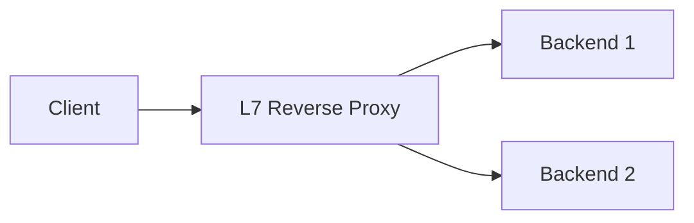
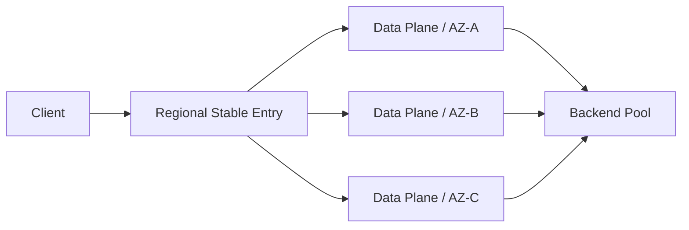
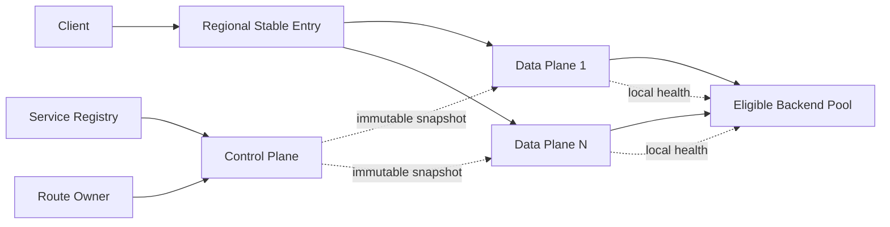

# Load Balancer: Progressive Design Mainline

This article is the only thread of knowledge in this case. Each evolution answers:

> Pressure or failure → Why the current solution fails → Minimum new mechanism → Guarantee obtained → Cost and boundary

The core scenario is limited to single Region, L7 HTTP/Unary gRPC, and horizontally scalable stateless Backend. Global Portal, L4 Fast Path and full API Gateway are not in this main line.

## 1. Fix the contract first: LB chooses Attempt, which does not prove the success of the business.

The caller hands the request to the stable Regional Listener, and LB gives five types of logical results:

```text
Backend Response
NO_ROUTE
NO_ELIGIBLE_ENDPOINT
OVERLOADED
TIMEOUT / RESET
```

LB is responsible for selecting the Endpoint, forwarding and returning the response for a request, but the boundary must be clearly stated first:

- Backend Response only indicates that Backend returned a proxyable response; business success is defined by Backend Contract.
- `NO_ROUTE` is the configuration result; `NO_ELIGIBLE_ENDPOINT` is the result of the current member and health view.
- `OVERLOADED` is an explicit capacity denial and should not be hidden as an unbounded queue.
- `TIMEOUT / RESET` may occur after the request has been served or even had side effects.
- By default, a Backend Attempt is generated only once per request; automatic retry is not a default by-product of load balancing.

Therefore, the primary invariant is: LB cannot interpret the failure of the proxy layer as the business has not been executed, nor can it use transparent retries to create repeated side effects.

## 2. Single proxy: first open the minimum request path

### pressure

The client needs a stable address, the Backend instance will scale horizontally, and each client is not expected to understand the instance list.

### Minimal mechanism



A single agent accomplishes four things:

1. Accept the connection and terminate TLS.
2. Use Host / Path and other attributes to match the Route.
3. Round Robin select the Endpoint from the static Backend Pool.
4. Establish or reuse a Backend connection and forward requests and responses.

L7 was chosen because this case requires routing by HTTP request, multiplexing connections, and differentiating response phases. If you only need TCP/UDP connection forwarding or end-to-end TLS, L4 may be more suitable, but is another implementation contract.

### Guarantees, Prices and Boundaries

- The client only relies on one entry, and Backend can be added after the entry.
- Round Robin provides statistical dispersion when instance capacity is approximately equal to request cost, and does not promise to be exactly uniform for each time window.
- LB adds a proxy jump, TLS/HTTP parsing cost and new failure points.
- The static list does not know about instance release, crash or overload; the next step is to solve "who is eligible to receive new requests".

## 3. Endpoint will change: Membership, Health and Draining

### pressure

Instances are subject to scaling, rolling releases, and failures. The static list will continue to send requests to the exited instances, and may also allow new instances that are not Ready to immediately bear the full share.

### Minimal mechanism

Endpoint only enters the selection set if it meets three levels of conditions:

```text
Belongs to the current Endpoint Membership View
AND this Data Plane is judged to be Healthy
AND is currently accepting new requests
```

- Membership: Service Registry / Control Plane declares which Endpoints belong to the Pool.
- Active Health: Detect Readiness at bounded cost, continuous success/failure threshold reduces Flapping.
- Passive Ejection: When the actual request continues to experience connection errors, timeouts, protocol errors, or clearly classified server-side exceptions, the Endpoint is temporarily reduced or removed. General business `4xx`, as well as general `5xx` that does not differentiate between request problems and common dependency failures, cannot be regarded as unhealthy by default as a single Endpoint.
- Slow Start: Newly added or newly restored Endpoints gradually increase their weight from small to large.
- Draining: When planning to go offline, new requests will be stopped first, and then existing requests or connections will be given a completion window with a deadline.

Health judgments are stored locally in each Data Plane to avoid synchronizing each detection result into a global consensus on the request path. Membership is a configuration fact, and instantaneous Health is a local observation; the two cannot be mixed into a Boolean field.

### Failure window

Health Check must have detection intervals, timeouts, and thresholds, so bad Endpoints may still be selected for a short period of time after a failure. If the threshold is too sensitive, mispicking will occur; if the threshold is too conservative, the failure window will be extended. Passive ejection can shorten the impact of gray failures, but when all Backends slow down, continued ejection will further lose capacity.

Draining is not a lossless migration either: each LB can only stop itself from creating new attempts to the Endpoint; old nodes in configuration propagation, direct traffic, and existing long connections may still exist. After the deadline, outstanding connections can be forcibly closed.

### Guarantees, Prices and Boundaries

- Endpoints that have been confirmed to be unhealthy or draining will no longer receive new requests from this node.
- New instances will not take full traffic share directly from zero.
- Health only means "worth trying" and does not prove the success of the next business request.
- Detection traffic, local status and misjudgment are new costs; for detailed status convergence, see [Health status and configuration convergence] (optional/Health status and configuration convergence.md).

## 4. Uneven request costs: from polling to local load awareness

### pressure

Even if the number of requests is the same, the execution time, response size, and backend capabilities of different requests may vary significantly. Pure Round Robin will cause slow requests to gather accidentally, and the number of connections under long connections cannot represent the number of requests within the connection.

### Minimal mechanism

1. Static Weight expresses the known capability differences of instances, using weighted Round Robin as the baseline.
2. Data Plane gives priority to healthy Endpoints with lower local load based on the in-flight, recent delay and failure signals it sees.
3. To avoid full scanning every time, you can randomly sample a small number of candidates and then select the better ones.
4. New Endpoints and newly restored Endpoints are still subject to Slow Start.

Least Connections is suitable for "one connection is approximately one job" protocol; under HTTP/2 or gRPC Multiplexing, one connection carries many concurrent Streams, and the number of connections can be misleading. Core should measure In-flight Request/Stream and latency closer to real resources.

### Guarantees, Prices and Boundaries

- Scheduling can adapt to heterogeneous instances and local slow nodes, reducing requests from piling up on busy nodes.
- Each Data Plane only sees the traffic sent by itself, and local optimality does not mean global exact uniformity.
- If the feedback is too fast, it will oscillate, and if it is too slow, it will not be able to catch up with the load; the signal selection needs to be smooth and upper bounded.
- Hash / Sticky are only introduced when the calling contract requires bounded affinity; hot keys will still create hot spots, and instance changes will be remapped.

## 5. Insufficient capacity of a single machine: expand to cross-AZ Data Plane Fleet

### pressure

There are at least four axes of LB capacity that are irreplaceable for each other:

| Dimensions | Main consumption |
|---|---|
| Request/s | HTTP parsing, routing, logging and Backend Attempt |
| New connection/s | Accept, TLS Handshake, connection establishment and source port |
| Concurrent connections | Socket status, Buffer, File Descriptor and memory |
| Bit/s | NIC, Kernel Copy, Agent Buffer and Cross-AZ Cost |

In this case, the peak value is $Q=1{,}000{,}000$ Request/s, the average response is about $B=10\ ext{KB}$, and the logical bandwidth of only responding to Payload is about:

$$
BW_{response}\approx Q\times B\approx10\ 	ext{GB/s}\approx80\ 	ext{Gb/s}
$$

If the peak concurrent connection is $C=2{,}000{,}000$, each connection is only calculated based on the state and Buffer of $32\ ext{KB}$:

$$
M_{conn}\approx C\times32\ 	ext{KB}\approx64\ 	ext{GB}
$$

The bandwidth result is just a logical payload in the client direction. Full Proxy will also receive the same response from the Backend and then send it to the Client; the request body, TLS and protocol overhead must also be included in the NIC, cross-AZ traffic and fees according to the specific link. The above results cannot be directly regarded as the complete physical bandwidth requirements.

These magnitudes have not yet taken into account request body, TLS, protocol metadata, bidirectional traffic, and security margin, and single-machine entry cannot be established.

### Minimal mechanism



- Multiple Data Plane nodes with no shared request status jointly undertake ingress traffic.
- Nodes are distributed across AZs; capacity planning reserves a Headroom after the fault domain fails.
- Backend connection pool, Health view, In-flight and Breaker state remain local.
- Scaling is triggered by the earliest saturated axis of request, connection, handshake, bandwidth and tail latency.

Assume that the four upper bounds of a single node under safe utilization obtained by the stress test are $q_{node}$, $cps_{node}$, $conn_{node}$, $bw_{node}$, and the node lower bound used only for preliminary planning is:

$$
N_{base}\ge\max\left(
\frac{Q}{q_{node}},
\frac{CPS}{cps_{node}},
\frac{C}{conn_{node}},
\frac{BW}{bw_{node}}
\right)
$$

Then check based on single AZ failure and release margin, instead of giving a fixed number of nodes based on average QPS. For each dominant dimension of Request/s, CPS, Connection and Bandwidth, the following should be met:

$$
Capacity_{fleet}-Capacity_{largest\ AZ}\ge Demand_{peak}
$$

If growth or node release is allowed during the failover, the corresponding margin should also be included on the right.

### Guarantees, Prices and Boundaries

- The total capacity of the Data Plane can be scaled out, and a single node or single AZ failure will not cause the entire stable entrance to disappear.
- New connections after a node failure can fall to other nodes, but existing connections and in-flight requests to the node may still Reset/Timeout.
- Fleet has multiple local health and load views, so the selection will not be completely consistent globally.
- How the stable entrance sends the connection to Fleet through the cloud network, VIP or Anycast is platform dependent, and the underlying protocol is not designed in this case.

## 6. Fleet configuration changes: versioned Snapshot instead of field-by-field hot modification

### pressure

Route, Pool and Membership will change. If the Data Plane updates fields separately, there may be a temporary half-configuration in which the Route points to the new Pool but the Endpoint has not yet arrived; incorrect configuration may also destroy the entire entry at once.

### Minimal mechanism

1. Control Plane generates a complete Config Snapshot from Route Owner and Service Registry.
2. Verify reference integrity, conflicts, scale limits, and security constraints before publishing.
3. Each Data Plane downloads the full version and switches atomically after the local build is successful.
4. Grayscale a small number of nodes first, observe `NO_ROUTE`, `NO_ELIGIBLE_ENDPOINT`, 5xx and delay, and then expand the release.
5. When the new version is abnormal, re-publish the last Last Known Good content to a higher version; do not allow Data Plane to accept the version number regression.
6. When the Control Plane is unavailable, the Data Plane continues to use the LKG; at the same time, new Endpoints, emergency removals, and Route changes cannot be propagated normally.

Fleet does not need to switch versions at the same instant, but Version Skew must be quantified. Requests may hit different Data Planes to see the old and new Routes within the propagation window; if a change requires global atomic switching, a stronger contract is needed instead of pretending that Push arrives at the same time.

### Guarantees, Prices and Boundaries

- A single node always uses a self-consistent complete Snapshot, and there is no semi-installed configuration.
- A control plane failure does not directly stop the running data plane.
- LKG improves availability but allows control state to become stale; propagation caps for emergency revocation must incorporate risk.
- Snapshot construction, grayscale, rollback and version observation increase the complexity of the control plane; this case does not expand the Registry consensus and complete configuration products.

## 7. Backend slows down: overload cannot be solved by queuing and retrying

### pressure

According to Little's Law, in a stable system:

$$
L=\lambda W
$$

When the arrival rate $\lambda=1{,}000{,}000/s$ and the average end-to-end dwell time increases from $20\ ext{ms}$ to $200\ ext{ms}$, the average In-flight will increase from about $20{,}000$ to $200{,}000$. If unbounded queuing continues, LB's memory, connection pool, and deadline will be exhausted first.

Transparent retry also amplifies the Backend Attempt Rate:

$$
Q_{attempt}=Q_{request}(1+A_{retry})
$$

If 20% of requests are retried one extra time, the number of Backend attempts increases from $1{,}000{,}000/s$ to $1{,}200{,}000/s$; this will delay recovery when the Backend is overloaded.

### Minimal mechanism

- Set In-flight / Connection caps and short bounded queues by Backend Pool.
- When the boundary is exceeded, clear `OVERLOADED` is returned, giving priority to preserving the completion probability of accepted requests.
- Use end-to-end deadlines; stop meaningless queuing and proxy work as soon as possible after upstream cancellation.
- Passive Ejection is used for a few abnormal instances; if the entire Pool is slow, perform Admission Control / Load Shedding instead of emptying all instances.
- No retry by default; only when a response has not been submitted to the caller, the failure type is safe to retry, the request itself is idempotent or the downstream does perform idempotent key deduplication, and the deadline is still sufficient, limited retry, backoff, and jitter will be performed by the unique policy layer, and are subject to the Retry Budget.
- After Backend recovery, use a small amount of detection and Slow Start to gradually reflow to avoid recovery storms.

### Guarantees, Prices and Boundaries

- A slow Pool will not overwhelm the entire Data Plane with unbounded in-flights and queues.
- Explicit rejection reduces apparent success rates but protects critical traffic and resilience.
- LB cannot create capacity for Backend; the real business priority and degradation still belong to the caller/Gateway.
- Automatic retry must meet the following requirements: the response has not yet been submitted, failure can be safely retried, the request has end-to-end idempotent semantics, the deadline is sufficient, and the budget is sufficient; otherwise, the return result is unknown.

## 8. Closing: Final structure and mechanism responsibility



| Mechanism | What pressure is introduced | What is not responsible for |
|---|---|---|
| L7 Reverse Proxy | Stable entry and request-level routing | Business success and data persistence |
| Membership + Health | Instance changes and failures | Predicting that the next request will be successful |
| Draining + Slow Start | Release, exit and recovery | Lossless migration of existing long connections |
| Weight + Load-aware Choice | Heterogeneous instances and request costs | Globally accurate and uniform |
| Data Plane Fleet | Single node four-axis capacity and failure | Keep the existing connections of the failed node |
| Versioned Snapshot + LKG | Dynamic configuration and control plane failure | Full Fleet effective at the same time |
| Bounded In-flight + Shedding | Backend slowdown and queuing amplification | Increase business capacity for Backend |
| Retry Budget | Short and safely retryable failures | Eliminate unknown results or provide Exactly-once |

## 9. Verify and stop

Minimal validation only covers core promises:

- Under single Endpoint hard failure and gray failure, the failure window, mispick rate and recovery Slow Start meet the goals.
- During scaling and release, new Endpoints will not be overwhelmed instantly, Draining will no longer accept new requests and has a deadline.
- Load-aware selection is better than Round Robin when request cost is skewed; local algorithm does not oscillate.
- In the event of a single Data Plane/single AZ failure, the ingress retains new traffic capacity and it is clear what will happen to existing connections.
- Invalid or half-referenced configurations cannot be installed; Grayscale, Rollback, LKG and Version Skew are observable.
- When the backend is slow, the connection pool is exhausted and traffic suddenly increases, the queue is bounded, rejection is clear, and Retry does not exceed the budget.
- Use real connection reuse and payload distribution to jointly impose QPS, CPS, concurrent connections, TLS and bandwidth pressure; running a single axis separately cannot prove the safety of the combined load.

Minimum indicators include ingress Request/s and Backend Attempt/s, P50/P99 latency breakdown, In-flight and errors per Pool / Endpoint, Active / New Connections, TLS Handshake Rate, inbound and outbound bandwidth, Ejection / Drain status, Snapshot Version distribution, Retry Amplification, Queue and Shed Rate. Average is not a substitute for Endpoint and AZ distributions.

After completing [Review and Exercise] (02-Review and Exercise.md), you can deduce health, scheduling, fleet, configuration and overload boundaries in a closed-book manner. State convergence and long-lived connection variants go into [`optional/`](optional/); global scheduling, L4 Fast Path and full product governance stay in [Parking Lot](PARKING-LOT.md).
