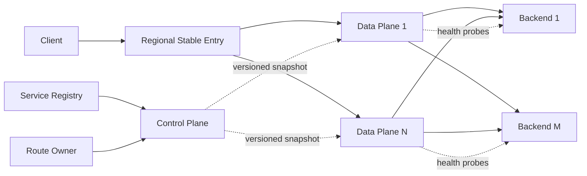

# Design Load Balancer

This case trains how to start from an L7 Reverse Proxy and gradually introduce health judgment, adaptive selection, Data Plane Fleet, versioned configuration and Load Shedding through backend failures, load tilt, ingress capacity, configuration changes and overload, instead of reciting load balancing algorithms or cloud product functions.

The default learning path only has three documents:

1. This article: Fixed learning contracts, external semantics, architectural maps, and completion conditions.
2. [Progressive Design Mainline] (01-progressive design mainline.md): Continuous derivation from single agent to single Region L7 Load Balancer.
3. [Review and Practice] (02-Review and Practice.md): Close-book reconstruction of the design and verification of mastery.

Stop when you have completed the exercise. Health and configuration convergence, protocol and long connection boundaries are placed in [`optional/`](optional/); global entry, underlying forwarding implementation and complete product governance are placed in [Parking Lot](PARKING-LOT.md).

## 1. Learning Contract

| Project | Agreement in this case |
|---|---|
| Core scenario | Within a Region, forward HTTP/Unary gRPC requests to healthy instances of the same Service through stable entrances |
| Design Objects | L7 Load Balancer that terminates TLS, understands HTTP semantics, and selects backend on a per-request basis |
| Core Guarantee | When there is a matching Route, at least one Eligible Endpoint and the load is within the safe capacity, the Backend Attempt is only created once by default |
| Scale assumptions | Peak $1{,}000{,}000$ Request/s, $100{,}000$ new connections/s, $2{,}000{,}000$ concurrent client connections, average response about $10\ ext{KB}$ |
| SLO boundary | Under normal load, the new P99 delay of LB is less than $5\ ext{ms}$; the monthly unavailability target caused by LB itself is less than $0.01\%$ |
| Failure and Convergence | A single Data Plane instance or single AZ failure does not cause the entire ingress to disappear; health and configuration change goals converge on the order of 10 seconds, but zero-failure switchover is not promised |
| Digging deeper | Membership and Health; Data Plane expansion; Configuration convergence; Overload and retry amplification |
| Definitely not researching | Global Region selection, L4 kernel forwarding implementation, WAF/API governance, lossless connection migration, complete managed LB product |

These numbers are only used to expose the four different capacity axes of request, connection, handshake, and bandwidth; the final number of nodes must come from stress testing under the target protocol and payload distribution.

## 2. Scope

Core functions:

- Provides a stable Regional Listener that terminates client TLS and proxies HTTP requests.
- Map requests to a Backend Pool based on immutable Route Snapshot.
- Select targets from endpoints that are configuration enabled, locally healthy, and not draining.
- Supports Endpoint joining, fault removal, recovery Slow Start and Connection Draining with deadline.
- Scale out a data plane with no shared request state and preserve failure margin across AZs.
- Verification, versioning, grayscale release and configuration rollback; use Last Known Good Snapshot when the control plane fails.
- Prevent backend slowdowns from turning into entrance avalanches with bounded in-flights, queues, and retry budgets.

Out of scope：

- Global Region Selection and Cross-Region Failover for DNS/Anycast.
- Authentication, business authorization, quotas, request transformation, and API Lifecycle; these belong to API Gateway.
- WAF, DDoS cleaning, Bot Detection and business risk control.
- Backend's business status, transaction correctness and data persistence.
- TCP/UDP Fast Path, NAT/DSR, eBPF, Kernel Bypass and VIP Announcement Protocol.
- Migrate existing TCP, WebSocket or gRPC Stream across LB nodes.
- Complete certificate platform, tenant console, RBAC, billing, auditing and DR runbooks.

For the usage contract of ready-made components, see [Load Balancer and Reverse Proxy](../../../04-Infrastructure-Components/02-load-balancers-and-reverse-proxies/); this case only studies how the Load Balancer itself forms a scalable system.

## 3. Minimum external contract

The following table is a logical result and does not specify specific HTTP status codes:

| Results | What the caller can rely on | What not to assume |
|---|---|---|
| Backend Response | The response comes from the selected Backend Attempt | The business operation must be successful, or the Backend must be healthy |
| `NO_ROUTE` | The current Snapshot does not match Listener / Route | Retrying the same configuration will result in different results |
| `NO_ELIGIBLE_ENDPOINT` | This Data Plane currently has no safe endpoint to select | All Backend processes have died permanently |
| `OVERLOADED` | LB or Backend Pool has reached the declared safe concurrency/queue boundary | Queue longer or retry immediately to ensure success |
| `TIMEOUT / RESET` | No acknowledgable complete response | Backend No request received or no side effects produced |

By default, an entry request only generates one Backend Attempt. Limited additional attempts are allowed to be created by a unique policy layer only if a response has not yet been submitted to the caller, the failure type is safe to retry, the request itself is idempotent or the downstream does deduplicate according to the stable idempotent key, the deadline is still sufficient and the Retry Budget has margin. Merely carrying an idempotent key that is not recognized downstream does not make it safe to retry.

Load Balancer only promises selection and agency, not Backend's business results. Timeout may occur after the request has been served; for non-idempotent writes, it is an unknown result rather than "definitely not executed".

## 4. Core model

| Concept | Meaning |
|---|---|
| Listener / Route | Rules for determining Backend Pool based on connection and HTTP properties |
| Backend Pool | A set of candidate Endpoints for the same logical Service |
| Endpoint | Instance address and static Capacity Weight that can receive requests |
| Eligible Endpoint | An Endpoint that is part of the current Snapshot, is partially healthy, and has not stopped receiving new requests |
| Backend Attempt | LB A proxy attempt initiated to an Endpoint |
| Config Snapshot | Full immutable versions of Routes, Pools, Endpoints and Policies |
| Data Plane | LB nodes that receive, select, and proxy requests online |
| Control Plane | Verify and publish Snapshot without entering the per-request path |

Membership is a statement that controls "who is allowed to be sent to"; Health is the Data Plane's time-sensitive judgment on "whether it is worth trying at this moment." If both are satisfied, the Endpoint can receive new requests.

## 5. Target architecture map



This diagram is only a road map, the text must be able to be re-derived along the pressure:

```text
Single L7 Reverse Proxy + Static Round Robin
→ Endpoint will fail or release
→ Membership, Health, Ejection and Draining
→ Uneven request costs and instance capabilities
→ Weight + local load aware selection
→ Requests, connections, handshakes and bandwidth exceed that of a single machine
→ Across AZ Data Plane Fleet
→ Configuration changes dynamically in Fleet
→ Versioned Snapshot + Last Known Good
→ Backend Slow down and retry amplification
→ Bounded concurrency, Load Shedding and Retry Budget
```

## 6. Core invariants

1. New requests are only sent to Endpoints that the current Snapshot belongs to, are locally healthy, and accept new traffic.
2. Config Snapshot fully verifies and installs atomically in a single Data Plane; Fleet can coexist with short-lived versions, but cannot install half of the configuration.
3. The Control Plane does not enter the request-by-request path; the Data Plane continues to use Last Known Good when the connection is lost, but it cannot pretend to have acquired new members or urgently revoke it.
4. Health Check is a delayed and possibly misjudged signal, which does not prove that the next business request will be successful.
5. Backend Response does not mean business success; Timeout / Reset does not mean Backend has not been executed.
6. By default, a request has only one Backend Attempt; any automatic retry is subject to semantics, deadline and Retry Budget.
7. Queues and in-flight must have upper bounds; explicitly reject when capacity is exhausted, and unbounded waiting cannot be used to hide overload.
8. Data Plane nodes do not share per-request status; if a node fails, Fleet can take over new traffic, but its existing connections and requests may still fail.
9. The scheduling algorithm pursues statistical load dispersion and does not promise precise proportions, fixed instances, or business state affinity.
10. The application can only trust the source identity header overwritten and written by the controlled LB, and cannot trust the client to forge values.

## 7. Completion standards

After completing the following tasks without reading the document, this case ends:

- Derive the final architecture from a single agent in five minutes and explain what pressures each mechanism is introduced by.
- Distinguish between Route Membership, Readiness, Active Health and Passive Ejection.
- Track a normal request, an Endpoint failure and a Draining.
- Explain why Round Robin is imbalanced under heterogeneous requests, and the boundaries of local load awareness.
- Do a quad capacity estimate using Request/s, Concurrent Connections, New Connections/s and Bandwidth.
- Explain what Data Plane Fleet preserves, and why node failures can still lead to disconnections.
- Explain the role of versioned Snapshot, atomic install, grayscale and Last Known Good.
- Explain how backend slowdown induces queuing and retry amplification, and gives rejection bounds.
- Give at least three trade-offs and make it clear that Global Entry, L4 Fast Path, Sticky Status and Full Product Governance are not in scope.

## 8. Directory

```text
README.md
01-Progressive design mainline.md
02-Review and practice.md
optional/
Health status and configuration convergence.md
Protocol long connection and affinity.md
PARKING-LOT.md
REVIEW.md
```
