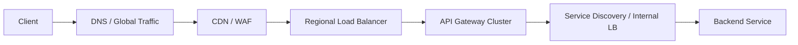

# Responsibility boundaries and entry links

## Positioning in one sentence

API Gateway answers: who made this API request, whether it is allowed, which service it should be sent to, and the maximum number of resources it can consume.

## Differences from adjacent components

| Components | Main Basis for Judgment | Core Responsibilities |
|---|---|---|
| DNS / Global Traffic Manager | Region, health status, latency | Direct users to the appropriate regional entrance |
| CDN | URL, Cache Key, TTL | Caching and delivering content at the edge |
| WAF | HTTP attack characteristics and security rules | Block injection, scanning and malicious requests |
| Load Balancer | Number of connections, weight, instance health | Distribute traffic to healthy instances |
| API Gateway | API, caller identity, tenant, policy | Routing, authentication, authorization, throttling, timeouts and auditing |
| Backend Service | Business data and state machine | Execute real business rules |

The actual product may integrate WAF, Load Balancer and Gateway in the same hosting service, but logical responsibilities must still be distinguished during the interview.

## Common request links

The Load Balancer is in front of the Gateway and distributes requests to healthy Gateway instances; the Gateway then sends the requests to business services based on API routing. Small systems can merge these two layers, but the responsibilities remain separate.

## Capabilities that should be placed in Gateway

- TLS termination and protocol verification;
- API routing and version selection;
- Authentication and coarse-grained authorization;
- Throttling by caller, tenant or API;
- Request ID, Trace Context and identity context propagation;
- Request size, header size and connection duration limits;
- Timeout, limited retry, Circuit Breaker and overload protection;
- Access logs, auditing and unified error formatting.

## Abilities that should not be put in

-Business rules such as order price calculation and feed sorting;
- Business status changes that require multi-table transactions;
- Massive response assembly and complex workflow orchestration;
- Long-term tasks such as video transcoding and file scanning;
- Treat Gateway as a fact data store.

The reason is straightforward: the Gateway is the shared fault domain for all APIs. The more business logic there is, the more frequent the releases, the more difficult it is to isolate resources, and the wider the business affected by any errors.

## Which requests do not go through the ordinary Gateway

- Images, JavaScript, map tiles and video tiles hit by CDN;
- Upload large files directly to Object Storage using short-lived signed URLs;
- Internal asynchronous events and message queue traffic;
- Dedicated Connection Gateway for very large-scale WebSocket connections;
- Infrastructure traffic such as database replication and backup.

Bypassing a normal Gateway does not mean bypassing security controls. Authorization can be done first by API Gateway, which then issues a limited-scope, short-lived upload or download certificate.
