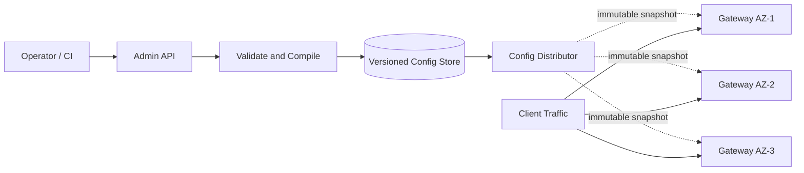

# Control plane and data plane

The most important architectural split of API Gateway is to separate "configuration rules" and "processing requests".

## What do the two planes do?

| Part | Responsible content | Whether it is located in the user request path |
|---|---|---|
| Control plane | API registration, routing, certificates, authentication methods, Rate Limiting rules, grayscale publishing | No |
| Data plane | Receives requests, executes local rules, selects backends, forwards and returns responses | Yes |

Dotted lines represent configuration releases and solid lines represent online requests. Online requests should not make synchronous calls to the control plane in order to obtain routing rules.

## Core components of the control plane

- Admin API: Receive API, routing, certificate and policy changes.
- Validator: Checks for duplicate routes, invalid certificates, unknown services and dangerous timeouts.
- Compiler: Compiles high-level configuration into immutable snapshots that can be quickly read by the data plane.
- Versioned Config Store: Saves each configuration version and operator, supporting auditing and rollback.
- Distributor: Push the configuration to the Gateway instance or let the instance pull the configuration, and collect ACK.

## What is saved in the data plane?

Each Gateway instance saves locally:

- Current configuration snapshot and last stable version;
- Routing table, certificate and public key cache;
- Service discovery results and backend health status;
- Local current limit counting and short-term result caching;
- Connection pooling, Circuit Breaker status and few runtime statistics.

Gateway does not store factual data such as orders, users, or payments. After an instance fails, other instances can take over new requests.

## A secure configuration release

1. Verify the configuration and generate a new immutable version.
2. Publish to a small number of canary Gateway instances first.
3. Check configuration ACK, routing error rate, `4xx/5xx` and latency.
4. After the indicators become normal, gradually expand according to the availability zone.
5. Roll Back to the last stable snapshot when a problem occurs.

Configuration releases should not overwrite older versions; rollbacks should be a reactivation of known stable versions rather than in-field modification of bad configurations.

## What to do when the control plane fails

When the control plane is temporarily unavailable:

- The data plane continues to use the last verified snapshot to process requests;
- It is forbidden to receive new configurations that cannot be persisted;
- Certificates and public keys must be actively refreshed and alerted before expiration;
- Service discovery can use the last known instance for a short period of time, but must respect instance health checks;
- After the control plane is restored, check the configuration version of each instance and reissue the outdated version.

Therefore, a control plane failure primarily affects "changeability" and should not immediately disrupt an already functioning API.
