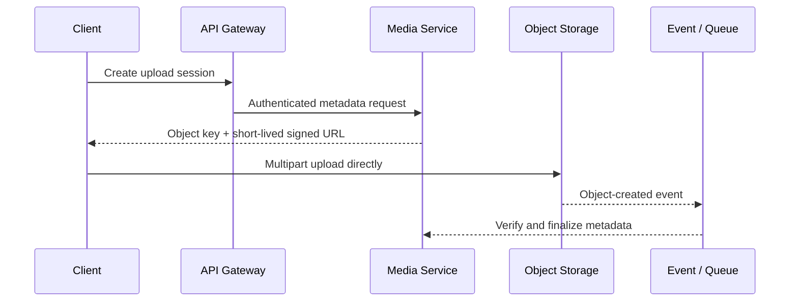

# Long connections, large files and Direct Data Path

"All traffic goes through API Gateway" looks uniform, but in fact it will cause expensive byte streams and long connections to occupy ordinary API resources.

## Large file upload

It is recommended to let Gateway be responsible for authorization and let Object Storage carry data:



Signing credentials should limit Bucket, Object Key, Method, Size, Content Type, and Validity Period. After the upload is completed, the Checksum, actual size and ownership must be verified. You cannot trust the file directly just because you get the completion callback.

## Large file download and video playback

Common paths are:

```text
Client -> CDN -> Object Storage / Media Origin
```

Gateway is only involved in generating short-lived Signed URLs, Signed Cookies, or playback authorizations. Video fragments, images, and map tiles are cached by the CDN and do not go through the ordinary API Gateway.

## WebSocket

Chat and collaboration systems can use specialized Connection Gateways:

- Manage a large number of long connections, heartbeats and disconnections;
- Save the short-term route of `connection_id -> gateway_instance`;
- Verify identity when establishing connection and process Token renewal;
- Publish messages to the internal messaging system;
- Notify the client to reconnect during Connection Draining.

It can share the authentication and routing control plane with the ordinary request gateway, but the data plane resource model is different: ordinary API cares about QPS, while Connection Gateway cares more about the number of concurrent connections, memory per connection, message rate and connection duration.

## SSE and long polling

- SSE is a long response from the server to the client. It is necessary to turn off the ordinary short request timeout and configure the heartbeat.
- Long polling will occupy the connection for a long time, and the number of concurrencies per user should be limited.
- No matter which method is used, perform Connection Draining when deploying and scaling down.

## gRPC

Gateway needs to understand HTTP/2, multiplexing, streaming and deadline propagation. Streaming RPC cannot be treated as an ordinary short HTTP request to buffer the complete body, otherwise it will increase memory and destroy Backpressure.

## Three questions to determine whether to use Direct Data Path

1. Does this link mainly transmit business control information or large volumes of data?
2. Does Gateway need to inspect the complete content before making an authorization decision?
3. Is it possible to authorize first and then issue short-term certificates with limited scope?

If the primary cost is byte transfer and the ability to securely issue short-lived credentials, a CDN, Object Storage, or dedicated connection portal should be preferred.
