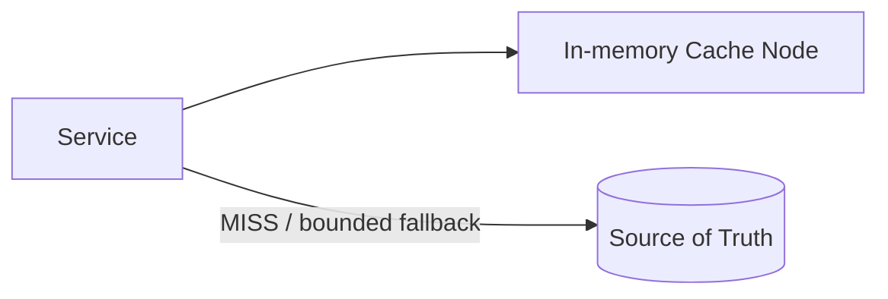
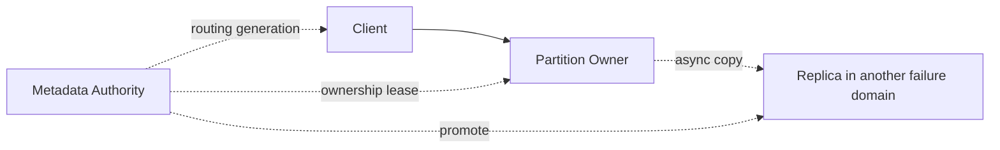
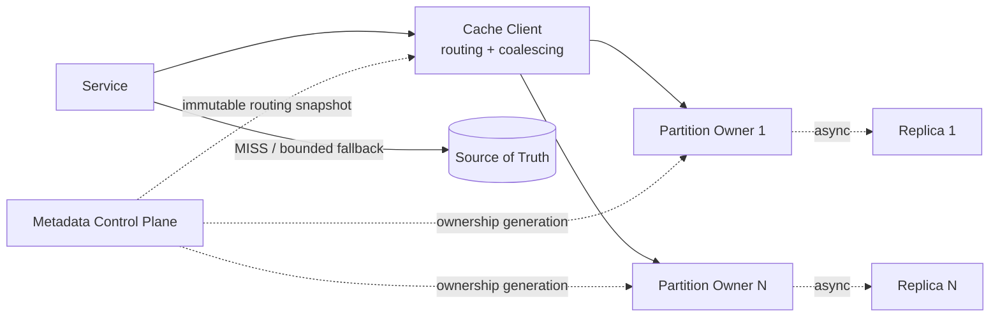

# Distributed Cache: Progressive design mainline

This article is the only thread of knowledge in this case. Each evolution answers:

> Pressure or failure → Why the current solution fails → Minimum new mechanism → Guarantee obtained → Cost and boundary

The core scenario is limited to a single Region, checked by Key, and Value can be reconstructed from the Source of Truth. Even though sessions, locks, and throttling counts may also use Redis, they still belong to different data contracts.

## 1. Fix the contract first: Cache is a loseable derived copy

The caller relies on only three logical operations:

```text
GET(key)             → HIT(value) | MISS | ERROR
SET(key, value, ttl) → STORED | ERROR
DELETE(key)          → APPLIED | ERROR
```

- `HIT` means that the current Owner returns a copy that has not yet expired, which does not mean that it must be the latest business fact.
- `MISS` may come from unwritten, expired, phased out, restarted, or Failover; the caller does not rely on the specific cause.
- Timeout or `ERROR` means the result is unknown and cannot be disguised as ordinary `MISS` and then infinitely returned to the source.
- `SET` success means that the current Owner has accepted single Key writing. There is no guarantee that the Entry will be retained until TTL, nor will it still exist after Failover.
- `DELETE` only invalidates the cached copy and does not replace the business deletion of Source of Truth.

Key must contain the necessary Namespace, Tenant, Object ID and Schema Version, and be standardized. Value has an upper limit on size; the cache is oriented to known Key searches and does not provide business queries that rely on full Key Scan.

The first invariant is this: clearing the entire cache will only degrade performance or availability, not permanently lose business facts.

## 2. Single node: first make repeated reads cheaper

### pressure

A Service reads the same batch of data repeatedly, the read load or latency of the Source Database is close to the upper limit, and the business allows staleness within a clear range.

### Minimal mechanism



Cache Node saves `key → value + expireAt` in the in-memory index. A typical read is:

1. Service uses the copy directly when executing `GET`; `HIT`.
2. When `MISS`, the Origin is read within the independent return-to-origin budget.
3. Try `SET` after Origin is successful; failure of Cache Fill does not change the success of this authoritative read.

The write path first submits the Source of Truth, and then invalidates the relevant cached Entry. Successful business writing only means that the authoritative fact has been submitted, but does not mean that all caches are updated immediately. For complete Cache-Aside orchestration, see [Cache Read Link](../../../05-general-design-patterns/01-cache-read-path/).

### Limited memory: TTL and Eviction

Continuous `SET` will eventually run out of memory, so a single node will need from the start:

- `expireAt`: No longer returns normally after expiration, limiting the return time of Entry from the time of Fill.
- Eviction: Remove low-value entries in advance when the memory reaches the Watermark for capacity management.
- Write access: limit Key/Value size; non-critical Fill can be rejected when pressure is out of control.

TTL is an input that satisfies the business Staleness Window, but is not a sufficient proof; concurrent Late Fill and failure delays still need to be calculated separately. The Eviction strategy is then optimized based on access distribution and Origin cost. Maintaining an exact global LRU results in expensive updates for each `GET`, and in practice approximate Recency/Frequency is often used.

### Guarantees, Prices and Boundaries

- A hit only requires one memory access, and repeated reads no longer all reach Origin.
- Cache adds Staleness and a new runtime dependency.
- TTL does not promise that Value will be kept until expiration; Eviction can make it become `MISS` earlier.
- Database and Cache are not a transaction, and concurrent Fill may still cause old values ​​​​to reappear briefly. Core accepts bounded staleness; stricter requirement for on-demand reads [cache to source data boundary](./optional/optional-cache-and-source-data-boundaries.md).

## 3. The working set and throughput exceed that of a single node: sharding by Key

### pressure

Assume the number of active Entries is $N_{active}$, and the average serialized Value size is $B_{value}$:

$$
M_{payload}=N_{active}\times B_{value}
$$

When $N_{active}=10^9$, $B_{value}\approx2\ \text{KB}$, only the Value Payload is about $2\ \text{TB}$, not counting Key, metadata, replicas, fragments and safety margin. A peak of $5{,}000{,}000$ GET/s may also exhaust single-node network or operation throughput first.

Based on rough calculation only based on the average Value, the logical outbound bandwidth returned by cache hits is approximately:

$$
BW_{read}\approx Q_r\times H\times B_{value}\approx10\ \text{GB/s}
$$

Protocol, key, and replica traffic will continue to amplify it. If any of the working set, operation throughput, and bandwidth exceeds a single node, it is enough to launch sharding; planning cannot be based solely on the number of Entries.

### Minimal mechanism: Logical Partition and Routing Snapshot

```text
normalized key
→ hash
→ logical partition
→ current owner node
```

- Different Keys are dispersed into multiple Logical Partitions.
- Metadata Control Plane releases versioned `partition → owner` mapping.
- Cache Client saves the complete and immutable Routing Snapshot and directly accesses the Owner.
- Wrong-owner response triggers refresh Snapshot and bounded retries instead of unbounded forwarding.
- Within a Routing Generation, a Partition has only one valid Owner.

Client-side Routing reduces one proxy jump and is suitable for strict latency goals, but increases the responsibility for SDK and topology refresh; Proxy Routing can be managed centrally at the cost of one more hop and proxy capacity. The mainline chooses the former, as the sharding semantics of both are the same.

### Guarantees, Prices and Boundaries

- The total memory, QPS and bandwidth of different keys can be scaled horizontally.
- Single Key operations are still performed atomically by an Owner.
- Sharding introduces routing, member management and rebalancing; the core does not provide cross-Key transactions.
- Adding ordinary Shards cannot increase the upper limit of a single Hot Key.

## 4. Member changes: expansion cannot be turned into a full cold start

### pressure

If `hash(key) mod nodeCount` is used, when the number of nodes changes from $N$ to $N+1$, most keys will change Owner. If the new Owner does not have these Entries, the large area `MISS` will turn the expansion into an Origin traffic accident.

### Minimal mechanism: stable mapping and batch rebalancing

1. Key is first mapped to a relatively stable number of Logical Partitions. Member changes only adjust the owners of some Partitions.
2. Control Plane generates a higher Routing Generation and switches Ownership in batches.
3. The new owner backfills on demand by default; at the same time, the concurrency of Origin Fallback and Cache Fill is limited.
4. Continuously observe the Hit Rate, Origin QPS and node load, and suspend subsequent batches when the budget is exceeded.
5. Warm up Top Keys or relocate Value from the old Owner only if the controlled backfill still exceeds the Origin margin.

Cache is not a fact store, so there is no need to relocate all entries for "zero data loss". What really limits the switching speed is Origin's security capacity, not the hash ring update speed.

### Guarantees, Prices and Boundaries

- Only part of the working set will be cooled during one expansion and contraction, and the cooling speed is controlled by the budget.
- When the Control Plane fails, the Client continues to use the Last Known Good Snapshot; a new Ownership cannot be safely generated.
- Switching Keys may still briefly `MISS`, retry, or see old copies.
- Consistent Hashing, Rendezvous Hashing and Virtual Nodes are just mapping options; comparison and migration details are in [Shard Migration and Hotspots](./optional/optional-shard-migration-and-hotspots.md).

## 5. Node failure: Asynchronous Replica is guaranteed to be available, but business facts are not guaranteed.

### pressure

When there are no replicas, an Owner failure can make the entire Partition unavailable or cold at the same time. Entry can be rebuilt, but centralized back-to-origin may exceed SLO and Origin capacity.

### Minimal mechanism: Replica and controlled Failover



- The Owner of each Partition asynchronously copies the Entry to another Failure Domain.
- Metadata Authority Serialization Ownership Generation.
- Node only serves when holding the current, time-limited Ownership Lease; Authority only promotes Replica after the old Lease expires or is reliably isolated, and stops serving after the old Owner expires.
- After receiving the new Snapshot, the Client accesses the new Owner and makes a limited retry to the Wrong-owner.

The mainline does not expand the consensus protocol of Metadata Authority, but it must be acknowledged that when Authority is unavailable, the existing data plane can continue to serve within valid Ownership, but a new Failover cannot be safely completed.

### Guarantees, Prices and Boundaries

- Replica reduces the unavailability time and full cooling miss after node failure.
- The most recent `SET` that the Owner has acknowledged but not yet replicated may be missing, appearing as `MISS`.
- `DELETE` that has not yet been copied may be briefly "resurrected" after a Failover, appearing as bounded staleness.
- Copies consume additional memory and bandwidth; ordinary reads still go to the Owner to maintain a simple single-Key sequence.

If the caller cannot accept recent cache write losses or ephemeral old values, it needs a stronger data contract and cannot treat the asynchronous cache copy as a persistent database.

## 6. Miss Amplification: Protect Origin before restoring

### pressure

When the read QPS is $Q_r$ and the Hit Rate is $H$, the normal return to the source is about:

$$
Q_{origin}=Q_r(1-H)
$$

When $Q_r=5{,}000{,}000/s$, $H=99\%$ still generates $50{,}000$ times back to the source per second. When the cold start drops to $H=80\%$, the back-to-origin rises to $1{,}000{,}000/s$, which far exceeds the $100{,}000/s$ Origin security budget in this case.

When the same hot key expires, many Service Instances will also perform the same authoritative read at the same time, forming a Cache Stampede.

### Minimal mechanism

1. Combine In-flight Load with the same Key in each Service instance, and push this instance back to the source at one time; it cannot provide the upper bound of the entire Fleet alone.
2. Execute a feasible Origin Fallback concurrency budget for global, tenant and single Key; fail quickly when exceeded, or return the old value when the specially reserved copy does not exceed the business hard staleness limit.
3. Add a small amount of Jitter to TTL to avoid a large number of Keys from expiring at the same time.
4. During Cold Start, give priority to preheating a small amount of Top Keys, and gradually increase the amount along with the remaining Origin.

### Guarantees, Prices and Boundaries

- Cache failure and recovery will not directly bring down Source of Truth through unbounded return to source.
- Coalescing adds waiter management; rate limiting and degradation means some requests are slower, fail, or see old values.
- Hit Rate is not an isolated target; it must be observed simultaneously with the Origin QPS, concurrency, and tail latency it produces.

## 7. Hotspots vs. Big Key: Load average does not prove security

### pressure

Uniform Hash can only disperse different keys, but cannot eliminate business access skew:

| Problem | Main bottleneck | Why adding ordinary Shard is not enough |
|---|---|---|
| Hot Partition | One Partition gathers multiple high-frequency keys | New Shard will not automatically move the correct Partition |
| Hot Key | A single Key occupies one Owner's network or QPS | This Key still has only one ordinary Owner |
| Big Key | A single Value takes up too much memory, network or processing time | Hash only changes the position, not the single cost |

### Minimal mechanism

- Hot Partition: Move or split a Logical Partition and verify adjacency load.
- Hot Key: Do request merging and isolation first; use short TTL L1 or explicit hotspot read copy only when there are more reads and less writes and staleness is allowed.
- Big Key: Set the upper limit of Value; split Value only when the call semantics allow it.
- Hot Tenant: Limit Entry, memory, QPS and back-to-origin budget to avoid one tenant evicting other tenants' working sets.

L1 and hotspot replication use failure costs and longer stale windows in exchange for read throughput; write hotspots still need to propagate updates, which cannot be solved by infinitely increasing read replicas.

## 8. Closing: Final architecture and invariants



| Mechanism | What pressure is introduced | What is not responsible for |
|---|---|---|
| In-memory Node | Repeated read latency and Origin cost | Saving business facts |
| TTL + Eviction | Freshness and limited memory | Guarantee Entry survives to TTL |
| Key Sharding | Single node memory, QPS or bandwidth limit | Expanding a single Hot Key |
| Routing Generation | Membership and Ownership changes | Make migrations without `MISS` |
| Async Replica | Node failure and centralized return to origin | Zero loss, strong consistency and persistence |
| Coalescing + Fallback Budget | Stampede and Cold Start | Guaranteed latest read or repair Source data |

Ultimately, six invariants must be maintained:

1. Cache can be reconstructed as a whole, and the Source of Truth is always external.
2. `HIT/MISS/ERROR` semantic separation, unknown results will not trigger unbounded return to the source.
3. Within a Routing Generation, each Partition has only one valid Owner.
4. Sharding expands with different Keys; Hot Partition, Hot Key and Big Key are processed separately.
5. TTL, Eviction and Failover may cause Entry to disappear early; TTL does not alone prove the stale upper bound relative to Source; Replica does not improve the factual persistence commitment.
6. The recovery speed of rebalancing, Failover and Cold Start is subject to the Origin safety capacity.

## 9. Verify and stop

Minimal validation only covers core promises:

- Business facts will not be lost after clearing the Cache, and Origin Fallback will not exceed the budget.
- When concurrent reads, authoritative writes and invalidations are interleaved, the stale window conforms to the statement.
- The total capacity is expanded by sharding under a uniform key; normal addition of shard under a single hot key is invalid.
- During batch expansion, Routing Generation converges and Origin peak value is controlled.
- When the Owner fails before and after asynchronous replication, the recent Entry is allowed to be lost, but Failover and reconstruction can be completed.
- A large number of Keys expiring at the same time, single Key Stampede, Big Key and Hot Tenant will not bring down the overall situation or Origin.

The minimum metrics are `HIT/MISS/ERROR` ratio and latency, memory/QPS/bandwidth per Shard, Eviction and Expiration, Routing Generation distribution, Top Keys, and Origin QPS, concurrency and tail latency generated by Miss. Average hit rate is not a substitute for these distributions.

After completing [Review and Exercise](../../../08-templates-and-review/), you can deduce sharding, rebalancing, Failover, Eviction and Origin protection from a single node and then stop. Implementation selection goes to [`optional/`](optional/); multi-region, persistent KV, complete Redis capabilities and product governance stay in [Parking Lot](PARKING-LOT.md).
