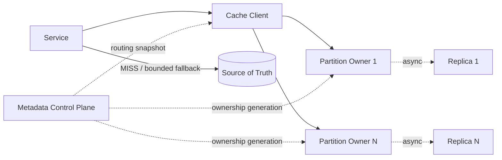

# Design Distributed Cache

This case trains how to start with a loseable memory cache and let capacity, member changes, node failures and Miss amplification gradually introduce shard routing, controlled rebalancing, replica switching and Origin protection, instead of reciting the feature list of Redis or Memcached.

The default learning path only has three documents:

1. This article: Fixed learning contracts, architectural maps, invariants and completion conditions.
2. [Progressive Design Mainline] (01-progressive design mainline.md): Continuous derivation from single node to single Region distributed cache.
3. [Review and Practice] (02-Review and Practice.md): Close-book reconstruction of the design and verification of mastery.

Stop when you have completed the exercise. Caching - source data race conditions and sharding implementation options are placed in [`optional/`](optional/); multi-region, persistent KV, rich Redis capabilities and complete product management are placed in [Parking Lot](PARKING-LOT.md).

## 1. Learning Contract

| Project | Agreement in this case |
|---|---|
| Core scenario | Provide shared memory cache accessed by Key for multiple Services within a Region |
| Core Guarantee | The Cache can be lost as a whole and reconstructed from the Source of Truth; under healthy routing, a Key is processed by a current Owner |
| Scale Assumptions | 1 billion active Entries, average serialization value about 2 KB, peak 5,000,000 GET/s, health status GET P99 less than 2 ms |
| Availability and recovery | Monthly availability target 99.95%; single owner failure to be recovered within 30 seconds; cache write loss for recent asynchronous replication is allowed |
| Origin Constraints | When Cache fails or recovers, Origin's additional security capacity is 100,000 Read/s |
| Consistency Boundary | `HIT` is not guaranteed to be the latest business fact; the caller must declare the maximum acceptable staleness |
| Digging deeper | Sharding and rebalancing; Failover availability boundaries; Cold Start, Stampede and Hot Key |
| Definitely not researching | Authoritative database, Session/lock/counter, complete Redis product, multi-Region strongly consistent cache |

These numbers are only used to introduce the architecture and verification methods, and do not mean that the number of nodes can be determined without the Value distribution and stress testing.

## 2. Scope

Core functions:

- Execute `GET`, `SET + TTL` and `DELETE` by normalized Key.
- Clear distinction between `HIT`, `MISS`, timeout and `ERROR`.
- Execute Expiration, Eviction, and write admissions with limited memory.
- Sharding by Key and publishing versioned routes when members change.
- Use asynchronous replicas to reduce unavailability caused by single node failure and centralize back-to-origin.
- Limit Origin Fallback under Cold Start, Stampede and Hotspot.

Out of scope：

- Treat the Cache as the only store of business facts, inventory, balances, or non-losable events.
- Different data contracts such as session, distributed lock, current limit count and message queue.
- Cross-Key transactions, arbitrary Key Scans and complex queries.
- Write-Behind persistent write buffering, and full Read/Write-Through product.
- Cross-Region consistency, global failure propagation and disaster recovery protocols.
- Complete RBAC, accounting, console, auditing and Managed Cache product platform.

The complete Cache-Aside process on the application side belongs to [cache read link] (../../../05-General Design Pattern/01-Cache Read Link/); in this case, only the boundaries that the caller must understand are retained.

## 3. Minimum external contract

| Operation or result | What the caller can rely on | What not to assume |
|---|---|---|
| `GET → HIT(value)` | The current Owner returns a cached copy that has not expired | Value must be the latest business fact |
| `GET → MISS` | There is currently no returnable Entry | The Key never existed; it may have expired, been eliminated, or lost after switching |
| `GET → ERROR / timeout` | No credible results are obtained | You can treat it as a normal `MISS` and return to the source infinitely |
| `SET(key, value, ttl)` | The current Owner has accepted single Key writing | Entry must be retained until TTL; must exist after Failover |
| `DELETE(key)` | Current Owner has applied single Key invalidation | Source data has been deleted; all replicas and L1 are immediately invisible |

Single Key operations are executed atomically within the current Owner; the core does not provide cross-Key atomicity. TTL limits how long Entry can return from the time of writing, and Eviction is capacity behavior, both of which may produce `MISS`. The TTL itself does not prove the maximum staleness relative to the Source write.

A `SET` or `DELETE` timeout also indicates that the result is unknown and it cannot be assumed that the operation has not taken effect; the caller can only retry limitedly within the business staleness boundary. Cache Client must be authenticated and restricted to the authorized namespace, and the original sensitive Key / Value does not enter the normal log and metric tags.

## 4. Core model

| Concept | Meaning |
|---|---|
| Entry | Rebuildable cached copy of `key + value + expireAt` |
| Logical Partition | A set of Key's stable routing units |
| Routing Snapshot | Immutable version mapping of Partition to Owner |
| Owner | The node that handles a certain Partition under the current Routing Generation |
| Replica | Owner's asynchronous cached copy for failover |
| Origin | Source of Truth external to Cache; not owned by the caching service |

## 5. Target architecture map



This diagram is only a road map, the text must be able to be re-derived along the pressure:

```text
Single node memory cache
→ TTL and Eviction under limited memory
→ Working set/QPS exceeds single node
→ Sharding by Key and versioned routing
→ Member changes create Cold Miss
→ Batch rebalancing and Origin budgeting
→ Node failure
→ Asynchronous replicas and controlled failover
→ Stampede / Cold Start / Hot Key
→ Merge back to source, speed limit, isolation and conditional replication
```

## 6. Core invariants

1. The Source of Truth is always outside the Cache; clearing the Cache will not permanently lose business facts.
2. The semantics of `HIT`, `MISS`, timeout and `ERROR` are separated, and unknown results do not trigger unbounded retry or return to the source.
3. Within a Routing Generation, each Logical Partition has only one valid Owner.
4. Sharding expands the total capacity and throughput of different Keys, and does not automatically expand a single Hot Key.
5. TTL does not guarantee that the Entry will survive until expiration; Eviction, restart, and Failover can all remove it earlier.
6. Asynchronous Replica improves availability, but does not upgrade cached writes to persistent business facts.
7. The speed of rebalance, failover and cold start is bounded by the Origin safety capacity.
8. Any L1, read replication, or staleness degradation must obey the Staleness Window declared by the caller.

## 7. Completion standards

After completing the following tasks without reading the document, this case ends:

- Draw the final architecture from a single node in five minutes and explain what pressures are introduced for each mechanism.
- Explain why the Cache can be lost as a whole, and what `HIT/MISS/ERROR` means.
- Use working set, QPS and Origin Miss QPS to make a magnitude estimate.
- Explain why sharding is based on Key, and why node changes require stable routing and batch switching.
- Explain what asynchronous replication retains and what may be lost or read during a failover.
- Distinguish between TTL and Eviction, Hot Partition, Hot Key and Big Key.
- Explain why Cold Start and Stampede might overwhelm Origin, and how to limit them.
- Analysis of a stale window caused by interleaving a database write with a Cache Fill.
- Give at least three trade-offs and make it clear that multi-region, persistent KV and complete product governance are not within the scope.

## 8. Directory

```text
README.md
01-Progressive design mainline.md
02-Review and practice.md
optional/
Cache and source data boundaries.md
Sharding Migration and Hotspots.md
PARKING-LOT.md
REVIEW.md
```
