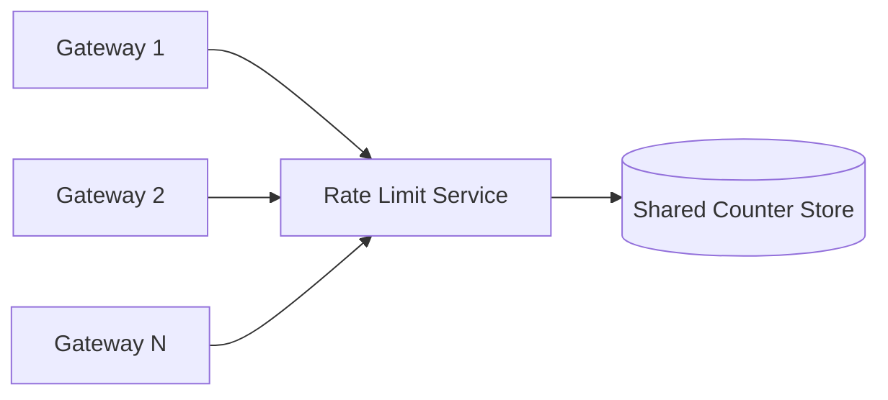
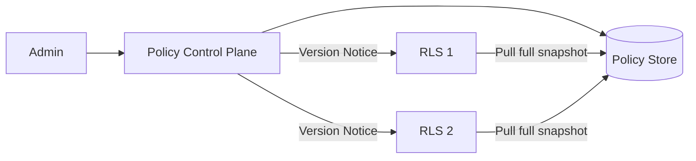
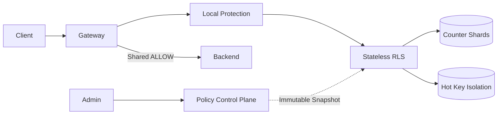

# Rate Limiter: The main line of progressive design

This article is the only thread of knowledge in this case. Each evolution answers:

> Pressure or failure → Why the current solution fails → Minimum new mechanism → Guarantee obtained → Cost and boundary

The core scenario is limited to: within a Region, limit the continuous rate and burst traffic of the online API according to the trusted `tenant + route`. A Decision only updates one shared Counter; cross-Counter transactions, cross-Region strict quotas, and billing ledgers are not on the main line.

## 1. First fix the external semantics

Rate Limiter is located between Gateway and Backend. Its core operations are:

```text
CheckAndConsume(descriptor, cost)
  → ALLOW | DENY | ERROR
```

- `ALLOW`: This Cost has been consumed and Gateway can continue to request.
- `DENY`: The quota is insufficient, no Cost is consumed, and `retryAfter` calculated for the same decision is returned.
- `ERROR`: No credible conclusion can be drawn and Gateway enforces a pre-stated failure strategy; it is not a plain `DENY`.

The descriptor must come from the authentication result and the normalized route, and the Tenant Header self-reported by the client cannot be directly trusted. Rule determines which dimensions are used to form the Counter Key; Key expresses "who shares a bucket", not some Redis string format.

Counter is an expirable flow control state, not an inventory, balance, or billing ledger. Rate Limiter only determines whether you can try to access the Backend, and does not guarantee that the business request will ultimately succeed.

## 2. Single process: Use Token Bucket to express Rate and Burst

### pressure

First there is only one Gateway Process. The goal is to allow the long-term rate $r$ while absorbing normal short-term bursts $B$.

Fixed Window is very simple, but the quota of two windows may be used up near the window boundary; when each window is limited to $L$, nearly $2L$ requests may be passed in a short period of time.

### Minimal mechanism

Save a local Token Bucket for each Counter Key: the capacity is $B$ Tokens, replenished at a rate of $r$ per second; each request consumes `cost` Tokens, and will be rejected if there is no Token.

The bucket does not use a background timer to replenish tokens, but saves the last state $(T_{old},t_{old})$ - $T_{old}$ is the number of **remaining** Tokens after the last judgment, and $t_{old}$ is the time at that moment. When the next request arrives at time $t$, the amount that should have been added during this gap period is calculated (lazy refill), and the current number of Tokens $T_{now}$ is obtained:

$$
T_{now}=\min\left(B,\ T_{old}+r(t-t_{old})\right)
$$

That is, "old balance + $r(t-t_{old})$ that should be replenished during this period", and then truncated by the capacity $B$: the amount accumulated idle for a long time will not accumulate indefinitely into a huge impact.

If $T_{now}\ge cost$, deduct and merge `ALLOW` in the same critical section; otherwise, do not deduct and merge `DENY`. In both cases, the new $(T,t)$ must be saved back.

- $r$ determines the long-term average rate.
- $B$ determines the maximum allowed Burst: the upper bound of the internal throughput for any length of time $\Delta t$ is $r\Delta t+B$, and $B$ is the area that exceeds the average rate.
- `cost` allows different requests to consume different quotas.

### Guarantees, Prices and Boundaries

- Within a single process, the replenishment, check and deduction of the same bucket are executed atomically and will not be negative due to concurrency.
- Local judgment has no network dependencies, but the status only belongs to the current Process; when restarting to a full bucket, an additional Burst will be obtained.
- It protects one instance and does not commit to the combined credit of multiple instances.

Numerical precision, clocking, and TTL are only required if required for implementation. Read [Algorithms and Atomic Implementation](optional/optional-algorithm-and-atomic-implementation.md).

## 3. Multiple Gateways: The local bucket cannot express the Region sharing quota

### pressure

Gateway scales to $N$ instances. If each instance is configured with `100 req/s`, the total upper bound will increase with the number of instances:

$$
R_{total}\le N\times100\ \text{req/s}
$$

Dividing the credit evenly by the number of instances is also unstable: scaling, load tilting, and failover can all cause false rejections or over-issuance. Sticky Routing can only reduce drift, not eliminate these changes.

### Minimal mechanism: Regional Shared Limiter



1. Gateway constructs a Descriptor from the trusted context.
2. Stateless RLS matches Rule and constructs Counter Key.
3. Shared Store saves the authoritative Counter of the Key in this Region.
4. Gateway calls Backend only if the Shared Decision is `ALLOW`.

The original Local Limiter can be retained, but its responsibility becomes instance protection and rapid peak clipping; its `ALLOW` cannot bypass Shared Decision.

### Guarantees, Prices and Boundaries

- Adding a Gateway will no longer increase the Region sharing quota.
- Each time sharing judgment increases network calls in the same Region, RLS and Store enter the critical path of latency and availability.
- Currently only a single Region is guaranteed; when two Regions maintain buckets respectively, the global total may still double.

## 4. Concurrency competition: Check-and-consume must be atomic

### pressure

When there is only one Token left in the bucket, two RLS instances may be executed at the same time:

```text
A reads remaining = 1
B reads remaining = 1
A writes back 0 and ALLOW
B writes back 0 and ALLOW
```

The application layer `GET → Judge → SET` will be over-issued; the RLS process lock cannot coordinate other instances.

### Minimal mechanism: atomic decision-making by Counter Owner

Counter Owner refers to the point where the status of a certain Counter Key is located and the only point that has the right to modify it (such as the Store shard node to which the Key hashed); stateless RLS is only responsible for routing to it, and is not the owner. The judgment must be pushed to the Owner for execution, which uniquely orders concurrent requests.

The authoritative Owner of the same Counter Key is completed in an indivisible state transition:

```text
read status
→ Use Owner time to replenish Token
→ Check remaining >= cost
→ Deduction when ALLOW, no consumption when DENY
→ Save state and return remaining / retryAfter
```

Redis Script, transaction functions or conditional updates can all be implemented; the key semantics is that another operation with the same Key cannot be inserted.

The selection of Store is also determined by this set of semantics, rather than a certain product: single Key atomic state transition, native TTL, low latency on the critical path, and the Counter can be lost (losing it is only a temporary relaxation and does not count as a mistake). Redis + Lua is the most direct implementation; DynamoDB conditional update and self-developed sharded memory service are also established, but the trade-offs are different in terms of latency, persistence and operation and maintenance complexity.

### Guarantees, Prices and Boundaries

- Within a healthy Owner, concurrent Decisions for the same Key have an authoritative order.
- Atomicity only covers one Counter Key and does not automatically cover multiple rules or multiple shards.
- All operations of a single Key pass through the same sequence point, which will form an upper limit for Hot Key.
- When the Store has deducted but the response is lost, retry may conservatively repeat consumption; if the business cannot accept it, introduce [Decision Idempotence](./optional/optional-rules-and-interface-semantics.md) as needed, and do not build a complete deduplication system by default.

## 5. Throughput and Hot Key: Sharding can only expand different Keys

### Pressure 1: The total operation volume exceeds the single Owner

The peak value is $Q$ Decision/s. Each Decision in the core contract updates a Counter, so:

$$
Q_{store}\approx Q
$$

If a future request independently executes $k$ decisions, it will be enlarged to about $kQ$. This estimate is used to determine whether to scale out, not to guess the exact number of nodes.

### Minimal mechanism: sharding by Counter Key

- Stateless RLS scales out.
- Make stable routing for normalized Counter Key and distribute different Keys to different Shards.
- The same Key always goes to an authoritative Owner, preserving single Key atomicity.
- The number of Shards and instances are determined by the actual state size, hotspot distribution and stress testing.

This allows parallel processing by evenly distributed different Counters, but introduces routing, rebalancing, and local failure complexity.

### Pressure 2: A strict Counter becomes a Hot Key

If the Hot Key arrival rate is $\lambda_{hot}$, the single Owner processing capability is $\mu_{owner}$, when:

$$
\lambda_{hot}>\mu_{owner}
$$

Adding normal Shards doesn't help either, since strictly Counter still requires an authoritative order.

The core solution only does three things:

1. Gateway uses loose Local Bucket to first reject obvious overload; Local `ALLOW` still has to go through Shared Limiter.
2. Isolate known Hot Keys/Hot Tenants into independent resource pools to protect common Keys.
3. Set bounded concurrency and queuing for RLS to allow hotspots to fail quickly instead of exhausting global resources.

Isolation reduces the fault domain but does not increase the upper limit of strict hot keys. If the business is willing to use bounded over-issuance in exchange for throughput, then reopen the Token Lease from [Parking Lot](PARKING-LOT.md).

## 6. Shared Limiter glitch: Pre-select downgrade contract

### pressure

When RLS times out, the Store is unavailable, or Shard is failing over, Gateway does not know how many tokens are left in the shared bucket. Waiting or retrying indefinitely will propagate dependency failures to Gateway and Backend.

### Minimal mechanism: Each type of rule declares Failure Mode

| Pattern | Gateway Behavior | What to Keep | What to Give Up |
|---|---|---|---|
| Fail-closed | Fast return dependency is not available, such as `503` | No additional release in unknown state | Business availability |
| Fail-open | Bypass sharing judgment | Business availability | Upper bound of sharing quota during failure |
| Local fallback | Use conservative per-instance Local Bucket | Bounded instance protection | Exact Region total |

The choice depends on the business cost of misplacement and misrejection: expensive or irreversible operations tend to Fail-closed; ordinary API optional Local fallback; Fail-open only when Backend can protect itself.

Call paths should also use short timeouts, limited retries, and bounded concurrency, and differentiate between `DENY`, `ERROR`, and degraded passes. Dependency failures cannot be disguised as user oversubscription.

### Guarantees, Prices and Boundaries

Failure behavior becomes explainable and testable, and full-link resources will not be exhausted due to infinite waiting. However, any availability degradation will give up the precise sharing quota; after recovery, the Local status cannot be disguised as a precise Region Counter.

## 7. Dynamic rules: Control Plane is introduced last

### pressure

Static configuration requires a restart to be modified; field-by-field updates will cause RLS to see mixed versions, and out-of-order propagation may cause old rules to overwrite new ones.

### Minimal mechanism: immutable version snapshot



- Control Plane verifies and persists immutable Rule Snapshot.
- RLS pulls the complete version and atomically replaces the memory pointer after successful verification.
- Only newer versions will be accepted; rollback releases to newer higher versions.
- Control Plane does not enter Decision Path; continues to use Last Known Good in case of failure.
- Policy Version and Counter Epoch are separated, and the quota cannot be reset accidentally when publishing ordinary rules.

### Guarantees, Prices and Boundaries

A single Decision only sees a complete snapshot, old notifications cannot regress the configuration, and short-term control plane failures do not block online traffic. The trade-off is that there is a propagation window between instances; the core only requires a convergence SLO to be declared and does not roll out approvals, canary, RBAC, or audit platforms.

## 8. Closing: Final architecture and invariants



| Component | What pressure is introduced | What is not responsible for |
|---|---|---|
| Local Protection | Instance overload and rapid peak clipping | Region precise quota |
| Stateless RLS | Unified decision-making for multiple gateways | Save authority Counter |
| Counter Shards | Total QPS exceeds single Owner | Global ledger, cross-Key transactions |
| Hot Key Isolation | A single Key slows down other traffic | Let a strict single Key expand infinitely |
| Policy Control Plane | Dynamic Rules and Error Release | Participate in Online Decision |

Six invariants must be maintained:

1. Counter Key comes from trusted, standardized attributes.
2. Local `ALLOW` does not grant final release rights; sharing requests must go through Shared Decision.
3. The replenishment, checking, deduction and saving of the same Counter are completed atomically by the authoritative Owner; `DENY` does not consume the quota.
4. Sharding expands different Keys without changing the serial upper limit of strict Hot Keys.
5. Failure Mode is declared in advance; after downgrading, the commitment to accuracy is synchronously reduced.
6. Rule uses a complete monotonic version snapshot; normal release does not reset the Counter.

## 9. Verify and stop

Minimal validation only covers core promises:

- Stable flow, burst, depletion and replenishment of a single bucket.
- Shared Limit does not increase with the number of instances under multiple Gateways.
- No over-issuance occurs when a large number of concurrent users compete for the last few tokens.
- Sharding and isolation show expected differences between uniform keys and single hot keys.
- User-visible results of three Failure Modes when RLS/Store fails.
- Continue to use the correct version despite bad snapshots, out-of-order versions and control plane failures.

The minimum metrics are Decision's QPS, P99, `ALLOW/DENY/ERROR/DEGRADED`, Store latency and errors, Shard/Hot Key load, and configuration version and age. Raw User ID, IP or API Key are not directly used as high-cardinality metric labels.

After completing [Review and Exercise](02-rate-limiter-review-and-practice.md), you can deduce Shared Counter, Atomic Decision, Sharding/Hot Key, Fault Contract and Rule Snapshot from a single process in closed volume and then stop. Algorithms and interface implementations enter [`optional/`](optional/) on demand; multi-rule transactions, Token Lease, global quotas and complete product governance remain in [Parking Lot](PARKING-LOT.md).
