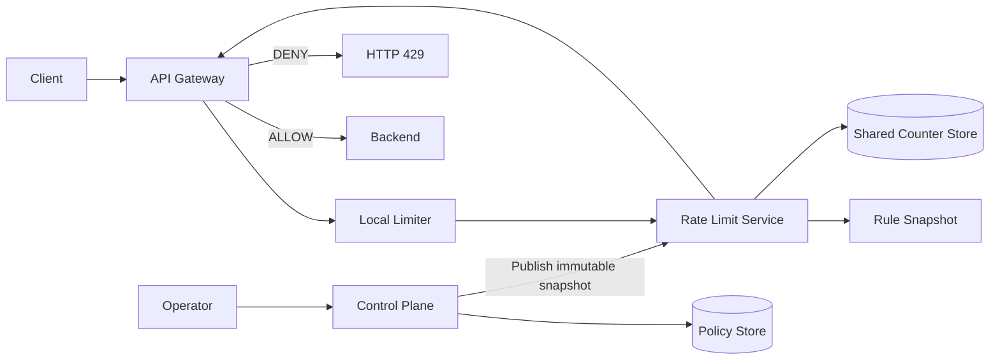

# Design Rate Limiter

This case trains how to start with single-process Rate Limiting, and gradually introduce shared counting, atomic deduction, sharding and downgrading strategies based on multi-instance, concurrency, capacity and failure pressure, instead of replicating a complete Rate Limiting product.

The default learning path only has three documents:

1. This article: fixed scope, core model, architecture map and completion conditions.
2. [Progressive Design Mainline](../01-load-balancer/01-load-balancer-progressive-design-mainline.md): Continuously deduced from single-process Token Bucket to single-Region shared Rate Limiting.
3. [Review and Practice](../01-load-balancer/02-load-balancer-review-and-practice.md): Close-book reconstruction of the design and verification of true mastery.

Stop when you have completed the exercise. Algorithm implementation and rule interface semantics can be read on demand in [`optional/`](optional/); multi-Region, Token Lease and complete product governance stay in [Parking Lot](PARKING-LOT.md).

## 1. Learning Contract

| Project | Agreement in this case |
|---|---|
| Core Scenario | Before the API request enters the Backend, Allow / Deny is judged based on the trusted User, Tenant or Route dimension |
| Core Guarantee | Within a single Region, the inspection and deduction of shared rules are executed atomically on a single Counter Key |
| Scale Assumptions | Single Region peak 2,000,000 Decision/s; shared judgment new P99 latency target less than 5 ms |
| Precision boundary | Shared count within Region; no cross-Region zero over-delivery is promised |
| Digging deeper | Responsibilities of Local and Shared; Atomic sharing counting; Sharding, Hot Key and fault semantics |
| Clearly not researching | WAF, business risk control, financial quotas, complete multi-tenant products, global strict quotas |

Scale numbers are used to drive architectural reasoning and do not represent a product's public SLA, nor do they replace benchmarking.

## 2. Scope

Core functions:

- Construct a rate limiting key based on trusted fields in User, Tenant, API Key, IP or Route.
- Configure long-term Rate and allowed Burst.
- Atomic completion of limit check and consumption: `ALLOW` or `DENY` is returned when the judgment is successful, `ERROR` is returned when the judgment cannot be trusted; `DENY` returns `retryAfter`.
- Supports single instance protection and single Region shared quota.
- Continue to use the last valid configuration when rule update fails.
- Execute the pre-declared Failure Mode when RLS or Shared Counter Store fails.

Out of scope：

- WAF, DDoS cleaning, Bot Detection, identity authentication and business risk control.
- Treat Counter as a billing ledger, inventory or financial limit.
- Strongly consistent quota sharing across Regions.
- Full Policy CRUD, approvals, auditing, RBAC and console.
- Reservation, Outcome Report and Complex Level Quotas.
- Provide cross-Shard All-or-nothing deductions for all rules.

Rate Limiter only determines whether the request can try to enter the Backend, and does not guarantee that the Backend will eventually succeed.

## 3. Core model

| Concept | Meaning |
|---|---|
| Rule | Limit Objects, Algorithms, Rate, Burst and Failure Mode |
| Descriptor | Dimensions that Gateway extracts from authenticated, normalized requests |
| Counter Key | Shared state identity composed of Rule and normalized dimensions |
| Counter | The short-term status of Token Bucket or Window |
| Decision | `ALLOW` / `DENY` / `ERROR`, Remaining, Retry After and whether to downgrade |

A typical Key can express `tenant + route + user`, but the original sensitive value should not directly become the indicator label. The key must come from the authentication result or the registered Route Template, and the client header cannot be blindly trusted.

## 4. Target architecture map



This picture is just a learning map and must be re-derivable along the pressure:

```text
Single process Rate + Burst
→ Multiple Gateways distort the Local quota
→ Share Counter
→ Concurrent competition for the last Token
→ Atomic Check-and-consume
→ Throughput growth and Hot Key
→ Sharding and Isolation
→ Redis / RLS failure
→ Clarify Failure Mode
→ Error rule release
→ Snapshots, versions and rollbacks
```

## 5. The boundary between Local and Shared

| Level | Function | Not guaranteed |
|---|---|---|
| Local Limiter | Protect the current Gateway instance without network calls | The total number of multiple instances does not exceed the business quota |
| Regional Shared Limiter | Multiple Gateways share the same Region's Counter | Cross-Region Zero Oversending |

The combination of the two is not repeated construction: Local protects instances and fault degradation, and Shared executes unified business quotas. When increasing the number of Gateways, the total Local quota may increase with the number of instances, and it cannot be called a Region quota.

## 6. Core invariants

1. Counter Key can only be constructed from trusted, normalized fields.
2. The replenishment, checking, subtraction and saving of the same Counter must be executed atomically.
3. No quota will be consumed when Denying; the retry time is calculated by the same atomic decision.
4. Local Allow does not mean Shared Allow; only after passing both levels can you enter Backend.
5. Expanding the Local Limiter instance cannot be misunderstood as increasing the Region business quota.
6. Ordinary rule version updates should not unintentionally reset existing Counters.
7. Separate the Source of Truth of rule data and short-term Counter.
8. The control plane does not enter the online request path; the data plane retains the last valid snapshot.
9. Failure Mode must be declared in advance and cannot be temporarily guessed when a dependency fails.
10. When using approximate or local budgets, the boundaries of possible overshoots must be clearly defined.

## 7. Completion standards

After completing the following tasks without reading the document, this case ends:

- Deduced Local + Shared architecture from single-process Token Bucket in five minutes.
- Trace the decision-making process of Allow and Deny once.
- Explain why Rate and Burst are expressed separately by Token Bucket.
- Explain why multiple Gateways cannot rely solely on Local Counter.
- Explain why checks and deductions must be atomic.
- Explain what sharding solves and why ordinary sharding cannot solve strict Hot Key.
- Select Failure Mode for normal API and sensitive operations respectively, and explain the cost.
- Explain why rule snapshots, versions and rollbacks should not enter the request path.
- Give at least three trade-offs and make it clear that global quota, financial debit and complete product governance are not within the scope.

## 8. Directory

```text
README.md
01-Progressive design mainline.md
02-Review and practice.md
optional/
Algorithm and atomic implementation.md
Rules and interface semantics.md
PARKING-LOT.md
REVIEW.md
```
