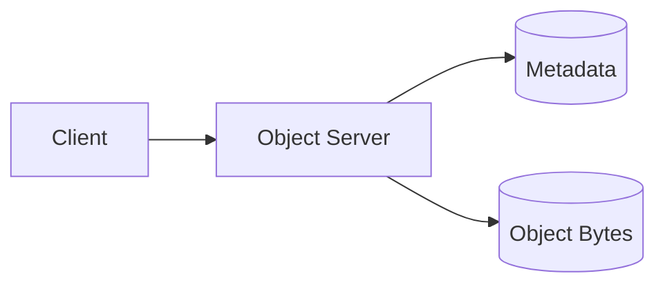
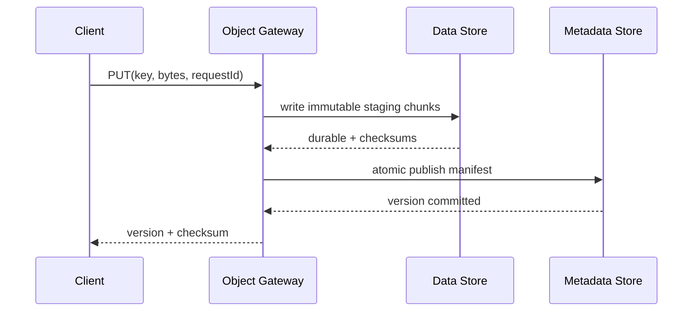
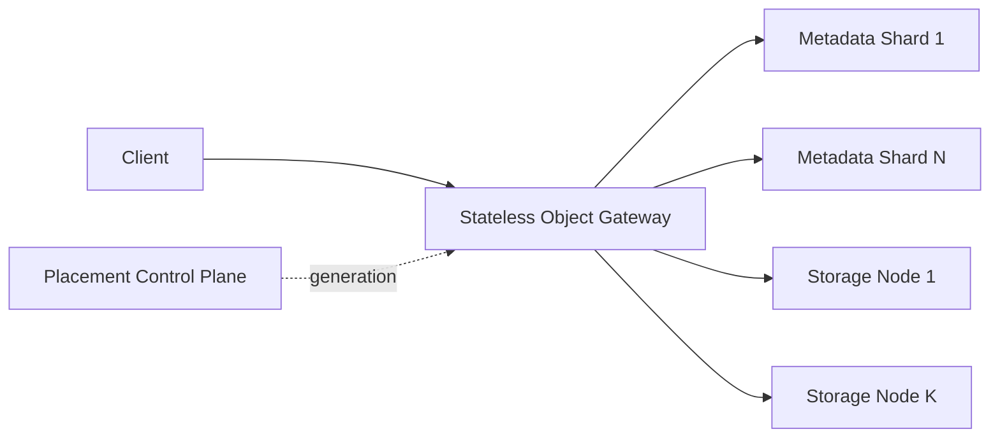
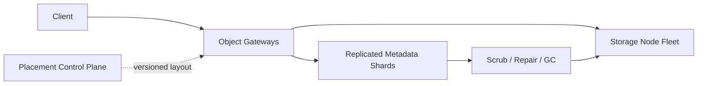

# Object Storage: Progressive design mainline

This article is the only thread of knowledge in this case. Each evolution answers:

> Pressure or failure → Why the current solution fails → Minimum new mechanism → Guarantee obtained → Cost and boundary

The core scenario is limited to a single Region, checked by complete Key, and the object content is immutable after being written. Application business metadata, CDN and cross-region disaster recovery are not included in this main line.

## 1. Fix the contract first: Object is a submitted Version, not a file on a certain disk.

The minimum operation is:

```text
PUT(bucket, key, bytes, requestId, condition?)
GET(bucket, key, range?)
HEAD(bucket, key)
DELETE(bucket, key, condition?)
LIST(bucket, prefix, continuationToken?)
```

- Each PUT creates an immutable Version; overwriting with the same name only changes the Current Version.
- GET reads the Current Version; Version ID is used to identify content and conditional operations. The core does not commit to user-readable retention periods for historical Versions.
- DELETE releases Tombstone so that normal GET no longer returns the old Version.
- PUT Timeout means the result is unknown; retry with the same `requestId` within the deduplication window to converge.
- Conditional write compares Current Version / ETag and rejects on conflict instead of silent Last-write-wins.
- A page of LIST has a clear sequence and continuation token, but cross-page global Snapshot is not provided by default.

The primary invariant is: only the submitted Manifest in the authoritative Metadata defines a visible Object Version; scattered Chunks themselves do not constitute an Object.

## 2. Single node: First open Key → Bytes

### pressure

The caller needs to save bytes by Key much larger than a normal database row and perform a whole object or Range Read.

### Minimal mechanism



The Object Server verifies the Bucket/Key and size limit, writes Bytes to disk in a streaming manner, saves `key → version + location + size + checksum`, GET and press Location to stream back. Business queries, permission owners, and processing status are still in the application database; the object store only owns the Object Namespace and content.

The object content cannot be modified in place. If only the second half is changed, a new Version is also created; this prevents readers from observing mixed bytes in the write and provides stable content identity for validation, replication, and caching.

### Why is the current solution still incorrect?

If you write Metadata first and then Data, the crash will leave visible objects pointing to the half-file; if you write Data first and then Metadata, the crash will leave invisible orphans. Orphans can be cleaned up, but semi-objects cannot be committed to the outside world. Therefore the next step must be to define the Commit Point.

## 3. Writing will crash: Immutable Staging + Atomic Manifest Publish

### pressure

PUT may fail at any point in receiving, pinning, metadata updating, or responding. Network timeouts also prevent the caller from knowing whether the server has submitted.

### Minimal mechanism

A PUT is divided into two stages:

1. Create or restore Upload Attempt based on `requestId`.
2. Write the content into an immutable Staging Chunk, and calculate the end-to-end Checksum during the writing process.
3. Wait for the Chunk to meet the Durable condition required by the current solution.
4. Publish the new Manifest atomically in the Metadata Store and set it as Current Version; this is the Commit Point.
5. Return Version ID, Size, and Checksum.



Crash semantics:

| Crash location | Visible results | Recovery |
|---|---|---|
| Chunk not yet Durable | No new Version | Delete unfinished Staging |
| Chunk Durable, Manifest Unreleased | No new Version | Same as `requestId` Continue to publish or recycle Orphan |
| Manifest published, response lost | New Version visible | Same `requestId` returns the same submission result |

The `requestId` deduplication state must be in the same atomic Metadata update as the Manifest commit, otherwise retries may still result in multiple Current Versions. It must also bind Key, content Checksum / Size and condition parameters; when the same ID carries different request fingerprints, it should be rejected. Deduplication is only retained for a limited time; it cannot be automatically retried unconditionally outside the window. It can only check the Current Version and converge with the help of conditional writing or application-level unique Key.

### GET and integrity

GET first reads the Manifest and then reads the required Chunks from the Data Store. Full GET verifies Fragment, Chunk and final Object Checksum; Range GET only verifies the Fragment/Chunk within the coverage and its identity relationship with the Manifest. Unless the complete object is additionally read, it cannot claim to have verified the entire object Checksum. If it cannot be reconstructed with a good enough Fragment, it must return explicitly corrupted/unavailable and cannot silently return error bytes.

### Guarantees, Prices and Boundaries

- Readers only see the old Version or the complete new Version, not the half-object.
- PUT Timeout keeps the result unknown, but idempotent retries can converge within the window.
- The Metadata Store becomes a critical dependency of Commits and visibility and must be replicated and prevented from accepting writes by the old Owner.
- Staging / Orphan increases temporary capacity and background cleanup.

## 4. The number of objects and byte size exceeds that of a single machine: Metadata / Data independent sharding

### pressure

Assume using this case: $10^9$ Object is added every day, average 1 MB, retained for five years. Rough calculation based on $10^5$ seconds per day:

$$
Q_{put,avg}=\frac{10^9}{10^5}=10{,}000/s
$$

The peak value is about 30,000 PUT/s; if the read-write ratio is 10:1, the peak GET value is about 300,000/s. Five years of logical data:

$$
D_{logical}=10^9\times1\ 	ext{MB}\times365\times5\approx1.825\ 	ext{EB}
$$

If the metadata of each Object Version is about 1 KB, the metadata in five years will be about:

$$
M_{logical}=10^9\times1\ 	ext{KB}\times365\times5\approx1.825\ 	ext{PB}
$$

Metadata is much smaller than object bytes, but it is responsible for PUT Commit, GET check, conditional update and LIST. It cannot use the same sharding and storage layout as EB-level data. The 1 MB average also masks small objects: for the same 1 PB, a 1 KB Object will generate about a trillion pieces of metadata, while a 1 GB Object will only have about a million pieces.

### Minimal mechanism



- Object Identity is mapped to Metadata Logical Shard according to the normalized `tenant + bucket + key` ordered range; hotspots or extremely large Ranges can continue to be split, and the single Key version and Tombstone remain in a consistency domain.
- Chunk IDs in Manifest are independently mapped to Storage Nodes; data sharding focuses on capacity, bandwidth and Failure Domain.
- Gateway caches versioned Routing/Placement Snapshot, and Control Plane does not enter the synchronization path of each Chunk.
- LIST is merged and paged along the ordered Namespace Range; Continuation Token carries at least the last Key and routing/cursor information. Each page adheres to the declared concurrent change semantics, but multiple pages across Shard do not freeze the entire Namespace by default.
- Dynamic Range Split handles ordinary prefix hotspots in isolation from requests; a single Hot Key still has only one Metadata Owner, and the data read traffic of a single Hot Object still requires caching/CDN or controlled replication.

### Network and Dominance Bottlenecks

Average PUT Payload is about:

$$
BW_{put,avg}=10{,}000/s\times1\ 	ext{MB}=10\ 	ext{GB/s}
$$

If the peak GET payload is still 1 MB on average, it is about $300\ ext{GB/s}$. The network must budget for Client Data, internal redundant writes, repair, and migration separately, and cannot only calculate API Request/s.

### Guarantees, Prices and Boundaries

- Namespace QPS / Object Count and Data Capacity / Throughput can be independently scaled horizontally.
- Manifest allows the data location to change while the Object Key remains stable.
- Cross-Metadata Shard transactions with strong Snapshot LIST are not in core contract.
- Routing, Placement, rebalancing and hotspots become new issues; the fixed number of nodes must be determined by bucketed Workload stress testing.

## 5. Storage Node will go bad: replication across fault domains

### pressure

A single disk, a single machine, a rack, or even an AZ can fail. Checksum can only find errors and cannot recover content after the only copy is lost.

### Minimal mechanism

First use the easy-to-reason three-copy baseline:

1. Placement: Select three Storage Nodes with different Failure Domains for each Chunk.
2. This baseline requires that all three target replicas have been persistently written across three Failure Domains and passed Checksum before the Manifest can be released. If lower Quorum or Degraded Write is used, different contracts must be defined and the redundancy reduction window must be quantified.
3. Manifest records Placement Generation and Fragment Checksum.
4. GET reads healthy copies first; when a bad copy is found, good data is returned and queued for Repair.
5. When a failure causes redundancy to fall below the target, the Repair Worker creates and verifies a copy in a new location, and then updates the Manifest atomically.

If three copies fall on the same Failure Domain, they cannot be claimed to be resistant to failures in that domain. Failure domain constraints are part of the persistence contract, not a deployment optimization.

### Separate availability and durability

- When there are enough copies left, GET can continue; when there are not enough copies, it fails explicitly instead of returning unverified content.
- If the new PUT cannot meet the required redundancy for validation, the system can reject the write to preserve the Durability Contract.
- The recovery of the confirmed object depends on whether the remaining good copies and Repair are completed before the next related failure.

### Cost and Boundary

- Three replicas are easy to read, write and repair, but about $3\times$ Raw Capacity with internal write bandwidth is very expensive at exabyte level.
- Synchronous confirmation improves durability but increases PUT Tail Latency; lowering Quorum cannot silently change the contract.
- Metadata itself must also be replicated across fault domains; if the data is intact but the Manifest is permanently lost, the object is also lost.

## 6. EB-level cost: Erasure Coding and versioned layout

### pressure

Five years of logical data is approximately 1.825 EB. The data of the three copies alone is about 5.475 EB, not including Headroom, Staging, Repair and Metadata. The long-term capacity cost of cold/large objects becomes dominant.

### Minimal mechanism

For Chunk Groups that reach a size threshold or move from the hot tier to the capacity tier, use $(k+m)$ Erasure Coding:

$$
A_{EC}=\frac{k+m}{k}
$$

For example, the theoretical Data Amplification of $(8+4)$ is $1.5\times$, and the logical data in this case is approximately 2.738 EB. When 12 fragments are placed in three AZs at a rate of 4 per AZ, losing any AZ will result in the loss of 4 fragments, leaving the 8 required for reconstruction. In reality, Padding, small object packaging, Checksum, Staging, Repair Space and Headroom will be added.

- Under common MDS encoding assumptions, any $k$ intact fragments among $k+m$ fragments can reconstruct the original content; $m$ is the upper limit of the number of tolerable fragment losses, but does not automatically represent a Failure Domain guarantee.
- Manifest record `layoutGeneration + codec + fragment locations + checksums`.
- Degraded Read is executed when reading a missing Fragment; background Repair switches to CAS after the new Generation generates a complete layout and verification.
- During migration, the old and new Layout can coexist, but a reader will only interpret it according to a complete Manifest Generation.

### Guarantees, Prices and Boundaries

- EC significantly reduces long-term capacity amplification.
- Encoding, Degraded Read and Repair consume additional CPU, network and I/O; small Objects may not be suitable for direct EC due to amplification and random I/O.
- Selecting $k,m$, Stripe size and packaging format requires real media and Workload stress testing; the core only knows the formula and failure boundary.
- For details on the layout evolution of three copies to EC, see [Erasure Code and Layout Evolution] (optional/erasure code and layout evolution.md).

## 7. Copies also decay together: Checksum, Scrub and Repair Budget

### pressure

Bit Rot, firmware bugs, software bugs, and faulty replication can lurk for a long time. If only verified on GET, all redundancy of a cold object may not be discovered to be corrupted many years later; the number of replicas alone does not justify a very low probability of loss.

### Minimal mechanism

- Client/Gateway calculates Object Checksum; each Chunk/Fragment has an independent Checksum.
- PUT verifies the transmission, encoding and placement results before submitting; GET verifies the read content before returning.
- Scrubber reads and verifies all Fragments on a provable cycle, instead of just checking Metadata.
- Repair Queue is sorted by remaining redundancy, object value and fault relevance.
- Repair rebuilds the verified good fragment to the new location, CAS switches the manifest after verification, and then delays the recycling of the old layout.
- Audit / Metrics records scan coverage, Corruption, Degraded Object, Repair Age and failures.

Repair must have a capacity budget. If the data to be repaired is $D_{repair}$ and it is hoped to be restored within $T_{target}$, the minimum effective repair throughput is:

$$
BW_{repair,min}\ge\frac{D_{repair}}{T_{target}}
$$

For example, if a Failure Domain loses 10 PB and hopes to make up for it within 7 days, the average reconstruction output alone is about $16.5\ ext{GB/s}$, not counting the remaining fragments, encoding and front-end traffic. The system must retain Repair Headroom during foreground peaks.

### How to talk about "multiple 9s"

Durability goals should be supported by evidence of:

```text
Media and Failure Domain Failure Rate
+ Redundant layout and associated failure assumptions
+ Time to detect latent damage
+ Repair Window and Repair Capacity
+ Metadata resilience
+ Fault injection and recovery drills
→ Annual object loss risk model
```

It's not "there are three copies, so 11 nines." For detailed verification boundaries, see [Verification Repair and Durability Proof] (optional/verification repair and durability proof.md).

## 8. TB-level objects: Multipart, Range and Cleanup

### pressure

When uploading a terabyte-level Object through a single connection, if the network is interrupted, it will be retransmitted from the beginning, and Gateway cannot put all the content into memory. Large object reads often only require a certain Range.

### Minimal mechanism

1. `InitiateMultipart` creates an Upload Session with a deadline.
2. Client uploads Parts independently and in parallel according to Part Number; retries with the same Session + Part Number + Checksum return the same result. If the same Part Number carries different content, it will be rejected to avoid turning retries into silent replacement.
3. Each Part persistently saves Size and Checksum and is not visible to ordinary GET when it is not completed.
4. `CompleteMultipart` verifies the ordered Part List, each Part Checksum, total size and overall Checksum, and atomically publishes a new Manifest.
5. The Complete Timeout result is still unknown; repeated Completes of the same Session and Part List return the same Version or a clear final state, and conflicting Part Lists are rejected.
6. The Staging Part of the expired Session is recycled by the GC after the safety window.
7. Range GET only reads the Chunk covering the range, but still verifies the integrity of the corresponding Fragment / Chunk.

Multipart solves transmission recovery and parallel throughput without changing the atomic visible unit of the Object: ordinary readers cannot see the Part, nor will they see the "half-completed" Object.

## 9. Deletion and GC: Invisible does not mean erased

### pressure

Deleting the Fragment directly may cause a race condition with the Manifest, Repair or old Version being read; and only writing the Tombstone will cause the physical space to grow infinitely.

### Minimal mechanism

- DELETE publishes Tombstone with a single Key conditional update, immediately changing the logical results of ordinary GET / LIST.
- Current / Retained Manifest, Upload Session, Repair, and Reader holding bounded Generation Pin / Read Lease determine when a Fragment is no longer reachable.
- GC only processes fragments that exceed the safe window and have no Manifest/Session/Repair references.
- Reader fixes a manifest generation within a bounded deadline and holds a Pin/Read Lease; layout switching or deletion will not allow it to read two generations of fragments.
- If the physical recovery fails, you can try again, but you cannot reverse the Tombstone to disappear.

Tombstone, recovery window end, all replica wipes, and external Cache / Replica purges are different completion points. The core only designs the first two types of states within a single Region Storage; complete compliance deletion enters the Parking Lot.

## 10. Closure: Final structure and mechanism responsibility



| Mechanism | What pressure is introduced | What is not responsible for |
|---|---|---|
| Immutable Chunk + Manifest | Collapse and Semi-Object | Cross-Object Transactions |
| Request ID + Conditional PUT | Timeout retry and concurrency coverage | Permanent Exactly-once |
| Metadata / Data Sharding | Object Count, EB and Bandwidth | Single Hot Object Delivery |
| Replication | Node/AZ Failure | Automatically Prove Yearly Durability |
| Erasure Coding | Exabytes of Redundancy Cost | Free Degraded Read/Repair |
| Checksum + Scrub + Repair | Silent damage and latent failures | Authoritative error content generated by repairing software bugs |
| Multipart + Atomic Complete | Large object transfer failure | Part-level business visibility |
| Tombstone + Safe GC | Tombstone and physical recycling race | Global cache and compliance erasure |

## 11. Verify and stop

Minimal validation only covers core promises:

- PUT crashes at every non-atomic step, the reader only sees the old Version or the complete new Version; same as `requestId` converges.
- Concurrency condition PUT is not silently overridden; normal GET / LIST after DELETE respects Tombstone.
- During Metadata / Data Shard expansion, Manifest does not point to hybrid Layout Generation.
- Under Node, Disk and single AZ failures, it is confirmed that Version can be recovered by the declared redundancy; if insufficient, it will fail explicitly.
- After injecting Bit Rot, Read / Scrub can discover it, and Repair can generate, verify and safely switch new fragments.
- When the foreground peak and Failure Domain repair coexist, the Repair Backlog does not cross the target Window.
- When Multipart Part is lost, duplicated, out of order, and Complete response is lost, no partially visible Object will be generated.
- When GC is concurrent with long GET, Repair, and Layout Migration, fragments that are still referenced will not be deleted.

Minimum indicators include PUT / GET / HEAD / LIST results and delays, object size distribution, logical / physical bytes, Metadata QPS, Data / Replication / Repair bandwidth, Checksum Failure, Degraded Object, Scrub Coverage Age, Repair Backlog / Age, Staging / Orphan Bytes, each Failure Domain Capacity and hotspot Key.

After completing [Review and Exercise] (02-Review and Exercise.md), you can explain Commit, sharding, redundancy, Repair, Multipart and GC in a closed-book manner. Encoding and durability models go to [`optional/`](optional/); cross-region, full versioning/WORM, Signed URL and product governance stay in [Parking Lot](PARKING-LOT.md).
