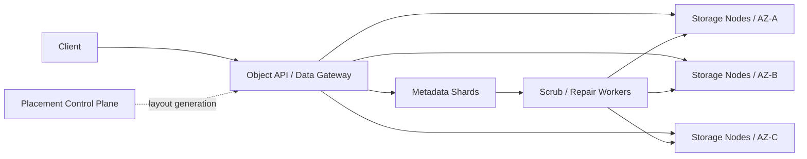

# Design Object Storage

This case trains how to start from a server that saves bytes by key, and gradually introduce immutable chunks, authoritative manifests, sharding, erasure coding, and continuous repair through object submission, capacity, node failure, silent corruption, and large object transfer, rather than replicating the complete function matrix of S3.

The default learning path only has three documents:

1. This article: fixed learning contract, external semantics, core model and completion conditions.
2. [Progressive Design Mainline](01-object-storage-progressive-design-mainline.md): Continuously derived from a single node to a single Region Object Storage.
3. [Review and Practice](02-object-storage-review-and-practice.md): Close-book reconstruction of the design and verification of mastery.

Stop when you have completed the exercise. Erasure coding and layout evolution, verification and repair certificates are placed in [`optional/`](optional/); cross-region, rich S3 product capabilities and complete management are placed in [Parking Lot](PARKING-LOT.md).

## 1. Learning Contract

| Project | Agreement in this case |
|---|---|
| Core scenario | Within a Region, save and read Objects from KB to TB level for multiple Tenants according to `bucket + key` |
| Core Guarantees | A successfully confirmed Object Version whose metadata matches the byte content and can recover within the declared failure domain loss |
| Scale assumptions | 1 billion Objects added every day, average 1 MB, retention for 5 years; peak 30,000 PUT/s, 300,000 GET/s |
| Consistency | After the PUT / DELETE of a single Key is successful, the newly started GET observes the new Version / Tombstone; concurrent conditional writing uses Version / ETag |
| LIST boundary | Each page is ordered by Key, and concurrent change semantics are explained; by default, multiple pages are not promised to form a global Snapshot |
| Availability | GET/PUT monthly availability target 99.99%; control plane or partial Storage Node failure should not enter the single point path for every normal read and write |
| Durability goal | Design goal is to achieve extremely low annual loss probability, but it must be proven with fault domains, Checksum, Scrub, Repair Window and drills, and cannot just write "11 nines" |
| Digging deeper | Object Commit; Metadata/Data separation and sharding; redundancy, verification and Repair; large objects and Multipart |
| Definitely not researching | POSIX file system, cross-Object transactions, arbitrary queries, cross-Region strong consistency, complete S3 products |

The average 1 MB here is only used for the first pass magnitude estimation. The real design must be bucketed by Object Size, because small objects determine Request / Metadata pressure, and large objects determine bandwidth and Repair time.

## 2. Scope

Core functions:

- `PUT`, `GET`, `HEAD`, `DELETE` and paging by Bucket / Prefix `LIST`.
- Each successful PUT generates an immutable Object Version; overwriting with the same name only switches the Current Version atomically.
- Support conditional writing to prevent concurrent clients from silently covering each other.
- Large objects use Multipart Upload; a readable Version will be published only after Complete is successful.
- Metadata and Object Data are independently sharded and can be expanded horizontally with capacity and request rate.
- Place replicas or erasure-coded fragments in multiple Failure Domains.
- Perform validation, background scrubbing, repair and safety GC for end-to-end checksum.
- Expose tenant boundaries for storage, requests, bandwidth, Degraded Object and Repair Backlog.

All entries are first authenticated and checked for Tenant/Bucket permissions; original object content, credentials and sensitive keys do not enter ordinary logs or indicator tags. The complete IAM and encryption platform are not covered in this case.

Out of scope：

- In-place random modification, directory locks, Rename, shared mounts and POSIX semantics.
- Queries by business fields, relational constraints, and transactions across large numbers of Objects.
- Workflow between CDN, media transcoding, business database and object storage.
- Cross-Region synchronous replication, global namespace and disaster recovery.
- Complete Versioning products, Object Lock / WORM, Legal Hold and Lifecycle matrix.
- Complete platform design for Signed URL, IAM/ACL, KMS, billing, auditing and management console.
- Disk firmware, file system, consensus protocol, and all fields of an S3 API.

How the application separates business metadata from large objects, see [Large Object and Object Storage](../../../03-data-and-storage/06-large-object-and-object-storage/); this case study how to honor the object contract within the storage service.

## 3. Minimum external contract

| Operation or result | What the caller can rely on | What not to assume |
|---|---|---|
| `PUT(key, bytes, requestId)` Success | A new immutable Version has been submitted; GET can read the complete content matching the returned Checksum | Temporary Chunk, old Version has been physically deleted |
| `PUT` timeout / `ERROR` | The result is unknown; retrying with the same `requestId` within the deduplication window can converge to the same logical commit | PUT definitely does not take effect |
| Conditional PUT | Submit only when expected Version / ETag is still Current | Unconditional override can detect concurrency conflicts |
| `GET(key)` Success | Returns the complete bytes or legal Range of Current Version, and passes the integrity check | Returns the version referenced by the business database |
| `DELETE(key)` Success | Tombstone has become Current, and newly started ordinary GETs will no longer return the old Version | GETs that have already been started are revoked; all Fragments, historical versions and caches have been physically erased |
| `LIST(prefix, token)` | Returns an ordered page under the current paging contract Key and Continuation Token | There is no addition, overwriting or deletion at all during the cross-page period |

`requestId` binds Key, content Checksum / Size and conditional writing parameters; submission of different content with the same ID in the window must be rejected. It only takes effect within the declared deduplication window; unconditional automatic retry cannot be done after the window is exceeded. The caller needs to check the Current Version and rely on conditional writing or application-level unique Key convergence. It cannot pretend that the infrastructure provides permanent Exactly-once.

This case uses Metadata Record / Manifest as the authoritative state of object existence, Current Version and Chunk layout. The Data Chunk exists but does not have a submitted Manifest, just an invisible Staging / Orphan; the Manifest must not point to a Chunk Set that does not meet the persistence conditions.

## 4. Core model

| Concept | Meaning |
|---|---|
| Object Identity | `tenant + bucket + normalized key` |
| Object Version | An immutable commit with Version ID, Size and Content Checksum |
| Manifest | Authoritative mapping of Version to Chunk/Fragment layout, Checksum and encoding scheme |
| Chunk | Immutable internal data unit; large Object consists of multiple Chunks |
| Fragment | Chunk Replica or Erasure-coded Piece |
| Tombstone | The authoritative version status of the current Key that has been tombstoned |
| Upload Session | Multipart's Staging Part collection, not yet visible Object Version |
| Placement Generation | A layout version and its Failure Domain constraints |

## 5. Target architecture map



This diagram is only a road map, the text must be able to be re-derived along the pressure:

```text
Single node Key → Bytes
→ Write crash exposes half-object
→ Immutable Staging + Atomic Manifest Publish
→ Namespace and byte size exceeds that of a single machine
→ Metadata / Data are separated and independently sharded
→ Storage Node / AZ failure
→ Failure-domain-aware Replication
→ The cost of three copies of EB level is too high
→ Erasure Coding + Versioned Layout
→ Bit Rot and latent faults
→ End-to-end Checksum + Scrub + Repair Budget
→ Terabyte object transfer failures and expensive retries
→ Multipart + Atomic Complete + Range GET
→ Deletion and concurrent Reader/Repair race conditions
→ Tombstone + Safe GC
```

## 6. Core invariants

1. The submitted Manifest will always refer to the complete Chunk Set that meets the persistence conditions of this Version and whose Checksum matches.
2. Chunk/Fragment cannot be modified in place; overwrite to generate a new Version, and then switch Current Pointer atomically.
3. Metadata is the authoritative state of object visibility, version relationships, and layout; scanning Storage Node cannot create visible Objects by itself.
4. The result of PUT timeout is unknown; the same `requestId` shall not produce multiple unexplained logical submissions.
5. Current Version / Tombstone update of single Key is serialized; conditional write failure will not overwrite the updated version.
6. DELETE releases the Tombstone first and then recycles it asynchronously; GC must not delete data that is still referenced by visible Manifest, Reader, Repair or retention policy.
7. Each fragment has content identity and checksum; it must be verified after reading, copying, migrating and repairing.
8. Redundancy must span the declared Failure Domain; multiple copies of the same machine or rack cannot pretend to be AZ failure protection.
9. Repair is completed by creating and verifying new Fragments, CAS switching Manifest/Layout, and delayed recycling of old Fragments. The only good copy cannot be overwritten in place.
10. Separate Durability from Availability: Reject PUT when safe writes cannot be proven, rather than quietly reducing redundant acknowledgment semantics.

## 7. Completion standards

After completing the following tasks without reading the document, this case ends:

- Derive the final architecture from a single node in five minutes and explain what pressures each mechanism is introduced by.
- Track normal PUT/GET, as well as PUT crashes after data is written and before and after Manifest is published.
- Explain why Manifest is Commit Point and why PUT Timeout result is unknown.
- Explain why Metadata / Data are independently fragmented and what capacity axis is driven by each.
- Complete an estimate using number of objects, logical bytes, request rate, bandwidth and redundancy amplification.
- Compare three replicas with $(k+m)$ Erasure Coding, accounting for capacity, read and write and Repair costs.
- Explain how Checksum, Scrub, Repair Window and Repair Budget work together to support durability.
- Explain the different completion points for DELETE, Tombstone, Reader Safety and physical GC.
- Explain why Multipart Complete must be published atomically and can clean up unfinished Uploads.
- Give at least three trade-offs and make it clear that cross-Region, WORM, full S3 and POSIX are not in scope.

## 8. Directory

```text
README.md
01-Progressive design mainline.md
02-Review and practice.md
optional/
Erasure coding and layout evolution.md
Verification Repair and Durability Certificate.md
PARKING-LOT.md
REVIEW.md
```
