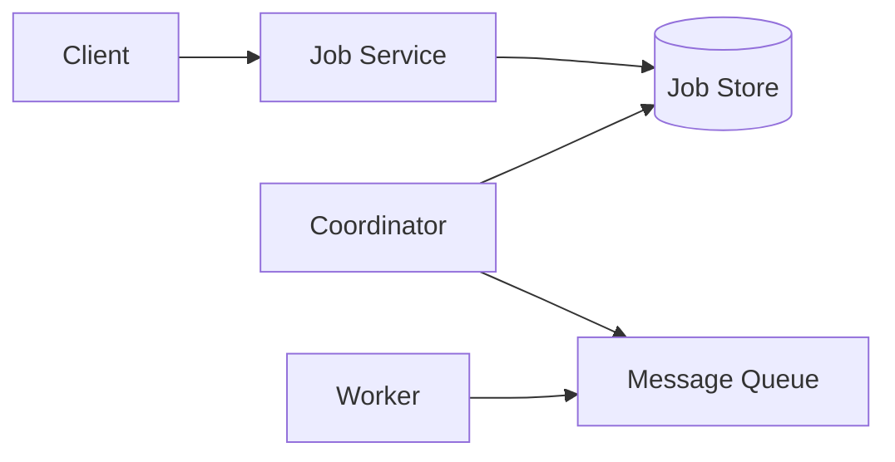
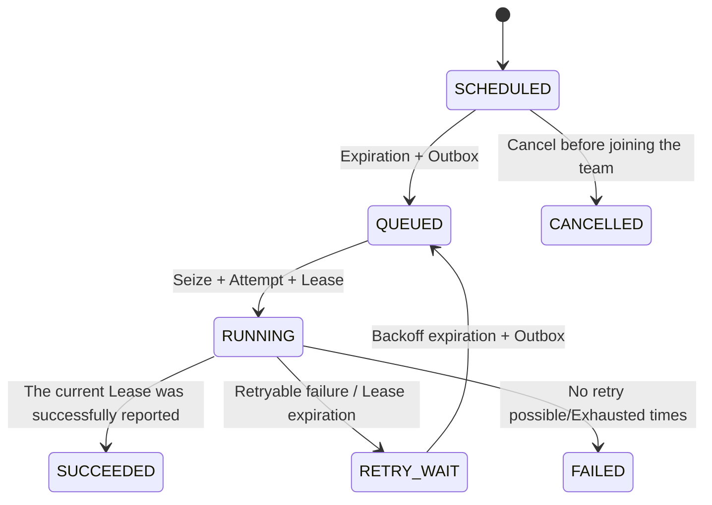

# Job Scheduler: Progressive Design Mainline

This article is the only thread of knowledge. Follow each step:

> Pressure or failure → Why the current solution fails → Minimum new mechanism → Guarantee obtained → Cost and boundary

The core scenario is a one-time job. Cron, complete API/Schema, fixed Shard number and production management do not enter this mainline.

## 1. Minimal system and boundaries

First, we only solve the normal process: the user submits the Job, and the system hands it to the Worker near `runAt`.



- Job Service creates and queries jobs idempotently.
- Job Store saves Job and Execution, which is the authoritative state.
- Coordinator determines when Execution should be triggered.
- MQ buffers expired tasks and decouples scheduling and execution.
- Worker executes user business.

The core entities are Job, Execution and Attempt:

```text
Job 1 ── N Execution
Execution 1 ── N Attempt
```

Job is a scheduling definition; Execution is a logical execution at a certain planned time; Attempt is a physical attempt by the Worker. Retries only increase the Attempt.

### Create response lost

When the job is submitted but the response is lost, the client retries. The creation request carries `(tenantId, idempotencyKey)`, and the unique database constraint causes repeated requests to return the original Job.

- **GUARANTEE**: Client retries will not create two jobs.
- **Cost**: Idempotent records need to cover the maximum request retry window.
- **Boundary**: Creating idempotent does not mean that Worker business side effects are idempotent.

## 2. Discover due tasks

The minimal relational library can be read via time index:

```text
status = SCHEDULED AND scheduledAt <= now
ORDER BY scheduledAt, executionId
```

Stable sorting and cursor paging allow the Coordinator to advance in batches. Scan results can only be called Candidate: between query and write, the task might have been canceled or already handled by another Coordinator. `status = SCHEDULED` must be revalidated when truly modified.

When the Coordinator crashes before committing, the state has not changed and subsequent scans will discover the task again.

- **Guarantee**: Expired tasks in a single database can be found repeatedly and safely.
- **Cost**: Polling incurs query cost and Schedule Delay.
- **New Issue**: Changing status to `QUEUED` and sending MQ are two system writes.

## 3. DB + MQ double write failure: introduce Outbox

Execute directly:

```text
Execution: SCHEDULED → QUEUED
Send executionId to MQ
```

No matter which step you do first, there will be a crash window:

- Write DB first: DB is already `QUEUED`, there is no message from MQ, and the task may be permanently missed.
- Send MQ first: MQ has messages, but the DB is still `SCHEDULED`. The status is inconsistent and will be sent repeatedly.

### Minimum new mechanism: Transactional Outbox

```text
Same database transaction:
  Execution: SCHEDULED → QUEUED
  INSERT ExecutionOutbox(PENDING)

Asynchronous Publisher:
Read PENDING
→ Publish MQ
→ Wait for persistence confirmation
→ Mark SENT
```

If the Publisher crashes when the MQ has been confirmed and the Outbox has not been marked, it will be sent again after recovery.

- **GUARANTEE**: Already submitted send intents will not be silently lost.
- **Cost**: At least one release, duplicate messages may appear in MQ; a persistence link is also added.
- **Boundary**: Outbox is not an Exactly-once distributed transaction for DB and MQ.
- **New Issue**: Multiple Workers may receive the same Execution.

## 4. Duplicate messages: Attempt, atomic preemption and ACK

Receiving an MQ message does not equate to obtaining execution rights. Workers must execute atomically in the authoritative database:

```text
If Execution is still QUEUED:
  Execution → RUNNING
Create Attempt
otherwise:
This is a duplicate or expired message
```

The state transition and Attempt are submitted in the same transaction, and the conditional update can only make one Worker successful. The MQ ACK sequence is:

```text
Pull messages
→ Submit preemption transaction
→ ACK MQ
→ Execute business logic
```

- Database transaction failed: no ACK, waiting for redelivery.
- Conditional update affects zero rows: Security ACK duplicate message.
- Preemption successful: ACK after submission.

The relational database has saved Execution and can grant execution rights atomically. At this time, adding a Redis lock will only produce a second set of consistency states.

- **GUARANTEE**: Duplicate delivery will not generate multiple current Attempts.
- **Price**: Each time you receive it, you need to access the authoritative database.
- **New Issue**: A Worker that gains execution rights may subsequently lose contact permanently.

## 5. Worker lost contact: Lease and limited retry

If the Execution only enters `RUNNING`, the Worker will be permanently stuck after crashing. The preempting transaction thus simultaneously writes:

```text
Execution → RUNNING
Create Attempt
Set currentAttemptId
Set leaseToken + leaseExpiresAt
```

Worker periodically Heartbeat lease renewal. Lease Reaper scans for expired `RUNNING` Executions:

- Can be retried and the number of times has not been exhausted: `RUNNING → RETRY_WAIT`.
- Unable to retry or the number of attempts is exhausted: `RUNNING → FAILED`.
- Backoff expires: `RETRY_WAIT → QUEUED` and creates a new Outbox in the same transaction.

Reaper's scan results are still only Candidate. Recheck status, `currentAttemptId`, `leaseToken`, and observed expiration time on write; zero rows affected indicating that the worker has renewed the lease or another reaper has processed it.

Retries require a maximum number of retries, a capped exponential backoff, and a jitter. Error classification determines whether to retry, and all failures cannot be automatically replayed.

- **Guarantee**: The task will not permanently stop at `RUNNING` after the Worker loses contact.
- **Cost**: Heartbeat increases writes; fault confirmation needs to wait for the Lease to expire; retrying will amplify the load.
- **Boundary**: Lease expiration does not mean that the old Worker's business code has stopped.

## 6. Old Worker is late: Fencing and business idempotence

After Worker A's Lease expires, Worker B may have obtained a new Attempt. A cannot overwrite B's results after recovery.

Heartbeat, success and failure reports all carry `attemptId + leaseToken`. The Job Service only accepts writes that match the currently valid Lease; conditional updates to old Attempts affect zero rows.

This only protects Scheduler's database state, but cannot undo emails that have been sent, charges that have been deducted, or data that has been written to other services. External side effects also require:

- Stable `executionId` as business Idempotency Key; or
- Monotone `attemptNumber` as a Fencing Token, allowing downstream to reject old Attempts.

- **GUARANTEE**: Old Worker cannot corrupt Scheduler authoritative state.
- **Price**: Downstream must participate in an idempotent or fencing contract.
- **Boundary**: Scheduler cannot unilaterally provide end-to-end Exactly-once.

## 7. Unified state machine and invariants



Each transformation has to answer: who executed it, what was revalidated on write, and what side effects must be committed with the transaction.

Core invariants:

1. Accepted tasks will not be silently missed due to ordinary process failures.
2. `SCHEDULED/RETRY_WAIT → QUEUED` and Outbox are submitted in the same transaction.
3. Outbox cannot mark `SENT` before MQ persistence confirmation.
4. `QUEUED → RUNNING` atomic preemption succeeds only once.
5. Preemption is committed with the same transaction as Attempt/Lease.
6. Only the current Lease can renew the lease or submit the result.
7. All scans re-verify status and version on write.
8. Retries are bounded; external side effects rely on business idempotence or fencing.

The goal is not to eliminate all duplication, but rather that no silent leaks occur, duplication is identifiable, and old executors cannot undermine the authoritative state.

## 8. Overview of scale boundaries and expansion

An Execution will generate scheduling, Outbox, preemption, Attempt, Heartbeat and final state writes. Assume that there are a total of $C$ persistent writes in the fixed phase, $H$ Heartbeats during the execution period, and the trigger rate is $R$:

$$
W approx R(C+H)
$$

When $R=100{,}000/s$, and $C+H$ is from single digits to about ten times, it is already on the order of millions of rows written per second. This estimate only proves that a single database is not true and is not used to guess the exact number of nodes.

### 8.1 Sharding by transaction boundaries

A Job's online correctness closures should be co-located as much as possible: Job, Execution, Attempt/Lease, Execution Outbox, and create idempotent records. Each table cannot be hashed independently, otherwise the original local transaction will become a cross-shard transaction.

There is no `jobId` when it is created, so the same `(tenantId, idempotencyKey)` must be stably routed to the same Shard; after creation, `jobId` locates the authoritative Shard. Logical Shard is separated from Physical Database.

- **GUARANTEE**: Core local transactions are retained after sharding.
- **Cost**: Cross-Job queries, online migration and Hot Tenant are more complex.

### 8.2 Expiration discovery after sharding

Each Shard holds its own `scheduledAt` and `nextAttemptAt` time index. $N$ Coordinators divide the work and cover $M$ Shards:

- Every Shard eventually has a Scanner.
- Coordinator takes over for a limited time after failure.
- Allow overlapping scans, condition-dependent writes absorb duplication.
- A busy Shard cannot permanently starve other Shards.

Cursor is a performance status, not a correctness fact; loss will at most cause repeated scanning, but cannot cause permanent skipping. Coordinator Ownership only decides who scans and does not grant execution rights to the Worker.

### 8.3 Extending asynchronous links

Outbox Publisher collects and publishes data in parallel by Shard; MQ partitions by appropriate Key; Worker uses Pull and limited concurrency. No matter how MQ scales, Workers still fall back to Execution's authoritative Shard atomic preemption.

### 8.4 Hotspots and data life cycle

Uniform Hash cannot eliminate hot tenants, hourly triggers, or single high-frequency jobs. Admission/Quota, time jitter or tenant isolation is required instead of just adding normal shards.

Execution, Attempt, and Outbox will continue to grow. Outboxes that have not yet been confirmed, Executions that may still be retried, and data that are still in the idempotent window cannot be cleared in advance; the final state history can be archived to the cold path.

The expanded invariants remain unchanged: state transition and Outbox are still the same transaction; repeated scanning, publishing and consumption are still absorbed by conditional updates and idempotent; capacity optimization cannot turn At-least-once into silent leakage.

## 9. Verification and Stopping

Verify at least:

- Terminate processes before and after DB/MQ boundaries.
- Concurrent Workers preempt the same Execution.
- Heartbeat and Reaper concurrency.
- The old Worker commits the results after the new Attempt starts.
- A large number of tasks are due at the same time, rather than just a uniform load.
- Hot Tenants coexist with regular Tenants.
- Coordinator, Publisher, MQ Partition or database Shard failure.

Minimally observe the Schedule Delay, Outbox Age, MQ Lag, Worker Claim Latency, Expired Lease and Attempt distributions to locate in which segment the backlog is formed.

Stop after you can answer the following questions in closed book:

- Why does Outbox not miss but still duplicate?
- Why can't MQ messages directly grant execution rights?
-Which layer do Attempt, Lease and Business Idempotence protect respectively?
- Why should Shard Key be derived from transaction boundaries?
- How to cover all Shards after data is fragmented and tolerate repeated scanning?
- Why doesn't extending MQ Consumer replace database atomic preemption?

Cron and implementation fragments enter [`optional/`](optional/) on demand; production management, workflow and multi-region stay in [Parking Lot](PARKING-LOT.md).
