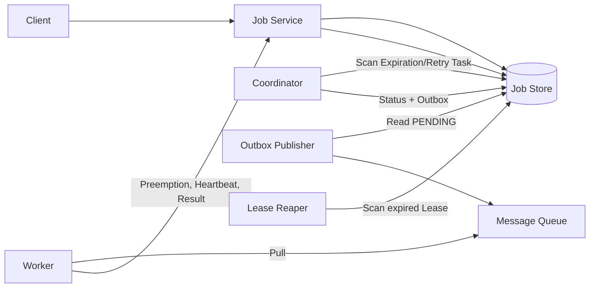

# Design distributed task scheduler

This case trains a transferable ability: starting from the smallest system that "executes tasks on time", let the reliability and scale pressure gradually introduce Outbox, Attempt, Lease, Fencing and sharding, instead of directly reciting a production-level scheduling platform.

The default learning path only has three documents:

1. This article: fixed scope, target architecture and completion conditions.
2. [Progressive Design Main Line] (01-progressive design main line.md): Continuous derivation from the minimum system to the expansion plan.
3. [Review and Practice] (02-Review and Practice.md): Close-book reconstruction of the design and verification of true mastery.

Stop when you have completed the exercise. Cron and implementation fragments are read on demand in [`optional/`](optional/); production management, workflow and multi-region remain in [Parking Lot](PARKING-LOT.md).

## 1. Learning Contract

| Project | Agreement in this case |
|---|---|
| Core Scenario | The user submits a one-time Job, the system hands the Execution to the Worker near the planned time, and saves the result |
| Core Guarantee | Accepted tasks will not be silently missed due to ordinary process failures; the authoritative state is restored according to At-least-once semantics |
| Scale assumptions | 100 million active tasks, peak 100,000 triggers/second; 99% of ordinary tasks are claimed within 5 seconds after the planned time |
| Real-time boundary | Soft real-time, no commitment to millisecond-level precise triggering |
| Digging deep into problems | Reliable execution; horizontal scaling while maintaining correctness |
| Clearly not researching | DAG, resource orchestration, complete multi-tenant governance, global scheduling platform |

Scale numbers are used to drive architectural reasoning and do not represent a claim to meet targets without stress testing.

## 2. Scope

Core functions:

- Create a one-time Job using Idempotency Key and specify `runAt`.
- Query Job and Execution status.
- Give the task to the Worker after it expires.
- Limited retry when Worker fails or loses connection.
- Save success or final failure results.
- Cancel tasks that have not yet been queued.

Out of scope：

- Exactly-once user business side effects.
- Complete semantics for Cron, Misfire and Overlap.
- DAG, Fan-out/Fan-in, Backfill and Compensation.
-CPU, GPU, region and other resource orchestration.
- Complete RBAC, accounting, auditing, console and disaster recovery runbooks.
- Hard real-time scheduling.

Scheduler determines "when to run and which Attempt is currently valid"; Worker executes user business. Scheduler cannot undo external side effects that have already occurred.

## 3. Core model

```text
Job 1 ── N Execution
Execution 1 ── N Attempt
```

| Concept | Meaning |
|---|---|
| Job | User-submitted scheduling definition |
| Execution | A logical execution of Job at a certain planned time |
| Attempt | A physical execution attempt by a Worker |
| Lease | Current Attempt’s limited execution right |
| Outbox | An external send intent submitted with the same transaction as the state transition |

Retry generates a new Attempt and does not generate a new logical Execution. The MQ message only means "you can try to claim", and the real execution right comes from the atomic state transition of the authoritative database.

## 4. Target architecture map



This picture is just a learning map. One must be able to re-derive it along the following pressures:

```text
minimal normal process
→ Expiration discovery
→ DB + MQ double write failed
→ Repeat delivery
→ Worker lost contact
→ Old Worker is late
→Insufficient capacity of single database
```

The corresponding mechanisms are: time index, Transactional Outbox, atomic preemption and Attempt, Lease and limited retry, Fencing, transaction co-location sharding and partition scanning.

## 5. Core invariants

1. Accepted tasks cannot be silently missed due to ordinary process failures.
2. Execution enters `QUEUED` and the corresponding Outbox is submitted with the same transaction.
3. Outbox cannot be marked as `SENT` before MQ persistence confirmation.
4. `QUEUED → RUNNING` atomic preemption can only succeed once.
5. Preemption and creation of Attempt/Lease are the same as transaction submission.
6. Only currently valid `attemptId + leaseToken` can renew the lease or submit the result.
7. The scan result is only Candidate; the status and version are re-verified when writing.
8. Retries are bounded; user business side effects depend on `executionId` idempotent or downstream fencing.
9. After sharding, the state transition and corresponding Outbox are still submitted in an authoritative Shard.

The goal is not to eliminate all duplication, but rather: no silent leaks, duplication identifiable, and old executors unable to undermine the authoritative state.

## 6. Completion criteria

After completing the following tasks without reading the document, this case ends:

- Draw the final architecture from the minimal system in five minutes and explain what stresses are introduced into each component.
- Track the process of Job from creation, expiration, release, preemption to final state.
- Explain why Outbox doesn't leak but still repeats.
- Distinguish between Job, Execution, Attempt and Lease.
- Explain who will handle worker disconnection, old worker lateness, and duplication of business side effects.
- Explain why it is not end-to-end Exactly-once.
- Roughly calculate and write amplification, and explain why a single database cannot directly achieve the goal.
- Explain how to cover all Shards after sharding without writing out a full scan loop.
- Give at least three trade-offs and leave Cron, Workflow and full production governance outside the correct boundaries.

## 7. Table of Contents

```text
README.md
01-Progressive design mainline.md
02-Review and practice.md
optional/
cron semantics.md
Implementation reference.md
PARKING-LOT.md
REVIEW.md
```
