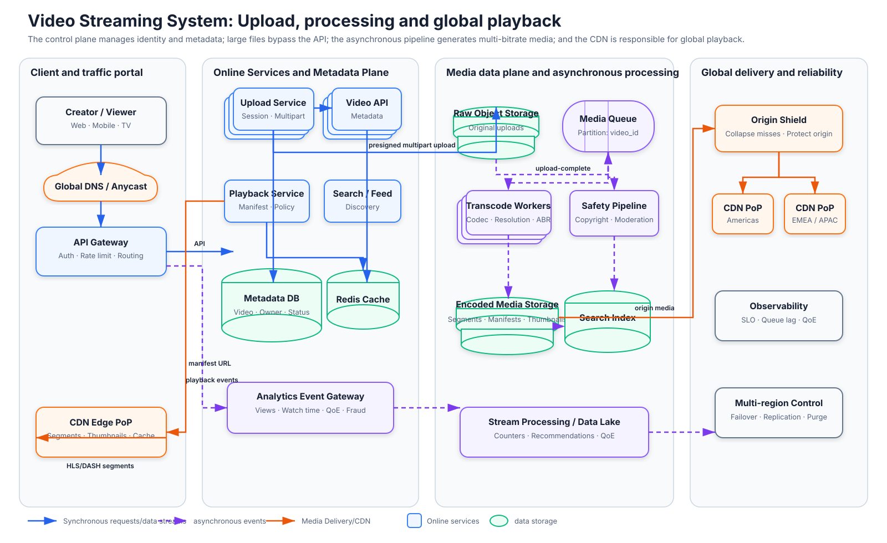

# Design Video Streaming System

## Case portrait

| Dimensions | Focus |
|---|---|
| Primary Archetype | Large-object Media Pipeline |
| Core Invariants | The original video that has been uploaded must be recoverable; access rights and deletion must eventually cover all playback paths |
| Quality attribute priority | Playback Availability → QoE → Cost Efficiency |
| Traffic / Data Shape | Large Object Upload, Asynchronous Computation Pipeline, Global Read and Extremely High Egress |
| Failure strategy | Retry if transcoding fails; bit rate can be downgraded during playback; Control Plane and Media Data Plane are isolated |
| Security Boundaries | Copyright, Content Moderation, Private Video Authorization, Signed URL and Upload Abuse |
| Key Patterns | Direct Upload、Object Storage、Queue、Scheduler、Transcoding DAG、CDN、Adaptive Bitrate |

## Fine architecture diagram

The figure distinguishes the online control plane, media data plane, asynchronous transcoding pipeline, object storage and global CDN playback path.

The [Draw.io source file](assets/video-streaming-architecture.drawio) can be opened and edited using VS Code’s Draw.io Integration.

## Functional boundaries
- The basic version completes video uploading, transcoding, publishing, playback and deletion.
- Search, comments, interaction, recommendations and full copyright identification are included as subsequent extensions, retaining only necessary interface boundaries.

## Acceptable NFR (Design Assumptions)

- Designed with 1,000,000 completed uploads per day and an average original file size of 500 MB (approximately 500 TB/day); the peak playback rate is 5,000,000 concurrent sessions, and the media bytes are mainly borne by the CDN.
- Supports resumable upload of up to 50 GB; the RPO of the original video is close to 0 after the upload is confirmed.
- Popular content playback availability is 99.99%; first frame P95 < 2 seconds, Rebuffer Ratio < 1% under normal network.
- 95% of 10-minute videos produce a playable base bitrate within 15 minutes; failed tasks can be safely retried.
- Private video rights revocation and forced deletion cover API, Origin and CDN within 5 minutes; ordinary deletion can asynchronously recycle objects.

## Core business closed loop

1. Creator creates Video and Upload Session; Control Plane fixes Owner, visibility, file limit and expected Part, and issues Upload URL that limits Object Key, size and validity period.
2. The Client directly writes the Part to Staging Object Storage, using Checksum, Part Number and Session ID to support resuming and idempotent retries. Gateway does not proxy media bytes.
3. Client submits Complete; Upload Service verifies Part Manifest, size and checksum, completes the immutable Raw Object, confirms upload success, and publishes VideoUploaded Event through Outbox.
4. Workflow Orchestrator establishes Probe, Malware/Policy Scan, Transcode, Package, Thumbnail and Publish DAG; Task uses deterministic Output Key so that Retry does not repeatedly generate logical assets.
5. Transcoder generates multi-resolution/encoding Rendition, and Packager splits Segments and generates HLS/DASH Manifest; only when the minimum playback set is met and the policy check is passed, the Playback Version is released atomically.
6. Viewer requests Playback Session; the service checks ACL, region and content status, returns short-term Signed Manifest URL, and Player then pulls Manifest and Segment from CDN/Origin Shield.
7. Player selects the code rate and reports QoE Event based on throughput, Buffer and device capabilities; the popularity signal is used for Cache Warming, but counting and recommendations do not block playback.
8. To revoke or delete, first write Tombstone, reject new Tokens and Purge CDN, and then asynchronously recycle Manifest, Rendition and Raw Object; recycling failure will be discovered by Reconciliation scanning.

## Core topics
- Upload Session, fragmentation, Checksum, Complete Protocol, breakpoint resume and orphan Part recycling.
- Primitive object Durability, Metadata / Object atomic boundaries, Outbox and Replayable upload events.
- Transcode DAG, Task Lease, Deterministic Output, Priority, Retry, DLQ and Poison Media.
- Codec/Resolution Ladder, HLS/DASH, Manifest, Segment, Thumbnail and Release.
- CDN, Origin Shield, Cache Key, Signed URL, Range Request and Adaptive Bitrate.
- Viral Hotspot, Cache Warming, multi-region Origin, Egress, play count and QoE Telemetry.
- Copyright / Policy Scan, Private Video ACL, Takedown, Tombstone, CDN Purge and Proof of Takedown.

## Minimum data list

| Data | Roles | Consistency Focus |
|---|---|---|
| Video Metadata | Owner, visibility, lifecycle and current Playback Version | Strong authorization check; state migration is auditable and cannot point to unfinished versions |
| Upload Session / Part Manifest | The progress of a resumable upload | Part Number idempotent, Checksum, TTL; Complete can only confirm the logical object once |
| Raw Object | Immutable authoritative media input | High durability after upload confirmation; subsequent assets can be regenerated from it |
| Processing DAG / Task | Media processing dependencies and execution status | Lease, Attempt, deterministic Output Key, safe Retry |
| Rendition / Segment / Manifest | Playable Derived Asset | With Codec and version; published as a whole set to prevent Viewer from seeing half-finished products |
| Playback Policy/Session | ACL, region, age restriction and short-term access capability | No new Token will be issued after the authority is revoked; Token has limited resources and expiration time |
| QoE / View Event | Experience, popularity and count input | At-least-once, deduplication; cannot block the core playback path |
| Deletion Tombstone | Authoritative intent for decommissioning and physical cleanup | Covers all forks, CDN and backup lifecycle; retains audit results |

## Key Trade-off

- Direct Upload prevents the application server from becoming a bandwidth bottleneck, but it needs to strictly limit the Signed URL, verify the object when Complete, and recycle the unfinished Session.
- A richer Codec/Bitrate Ladder improves device coverage and QoE, and also linearly amplifies Transcoding Compute, Storage and Cache Fragmentation; it can delay the generation of long-tail formats based on content popularity and device distribution.
- Smaller Segment shortens the first frame and code rate switching time, but increases Request QPS, Manifest size and CDN overhead; larger Segment has higher throughput but slower switching.
- Generating all Renditions first and then publishing them ensures a complete experience, but prolongs Time-to-play; publishing the lowest available set first enables faster playback, and requires Playback Version to prevent mixed assets from being read.
- Long CDN TTL and Signed URL improve Cache Hit Ratio and availability, but extend the revocation window; private or high-risk content requires short Token, versioned Cache Key and active Purge.
- Copying all Raw / Rendition across Regions improves recovery capabilities, but brings huge storage and egress costs; non-rebuildable Raw Objects, rebuildable Renditions, and edge copies placed according to hotness should be distinguished.

## Interview questions

- How to weigh the first frame delay, freezing rate, image quality and cost?
- How to avoid losing the "Complete" video when the Metadata has marked the upload as complete but the last Part of the Raw Object is unreadable?
- How to prevent duplicate or mixed versions of Segments from being published when the same Transcode Task is executed twice?
- When a video suddenly becomes popular and breaks down a single Origin, how do Cache, Origin Shield and throttling work together?
- The Signed URL of the private video has been leaked. How to control the withdrawal window within the target?
- When the transcoding backlog increases tenfold, which tasks take priority, and what degradation status do Viewers and Creators see respectively?

## Subsequent expansion sequence

1. Video Metadata, Upload Session, Direct Upload, Complete Protocol and Raw Durability;
2. Event, Workflow DAG, Transcode Worker, Idempotency and Backpressure;
3. Rendition, Packaging, Manifest, Playback Version and release state machine;
4. Playback Authorization, CDN, Origin Shield, ABR, QoE and Viral Hotspot;
5. Copyright, Moderation, Deletion, Cost, Multi-region and Disaster Recovery.
