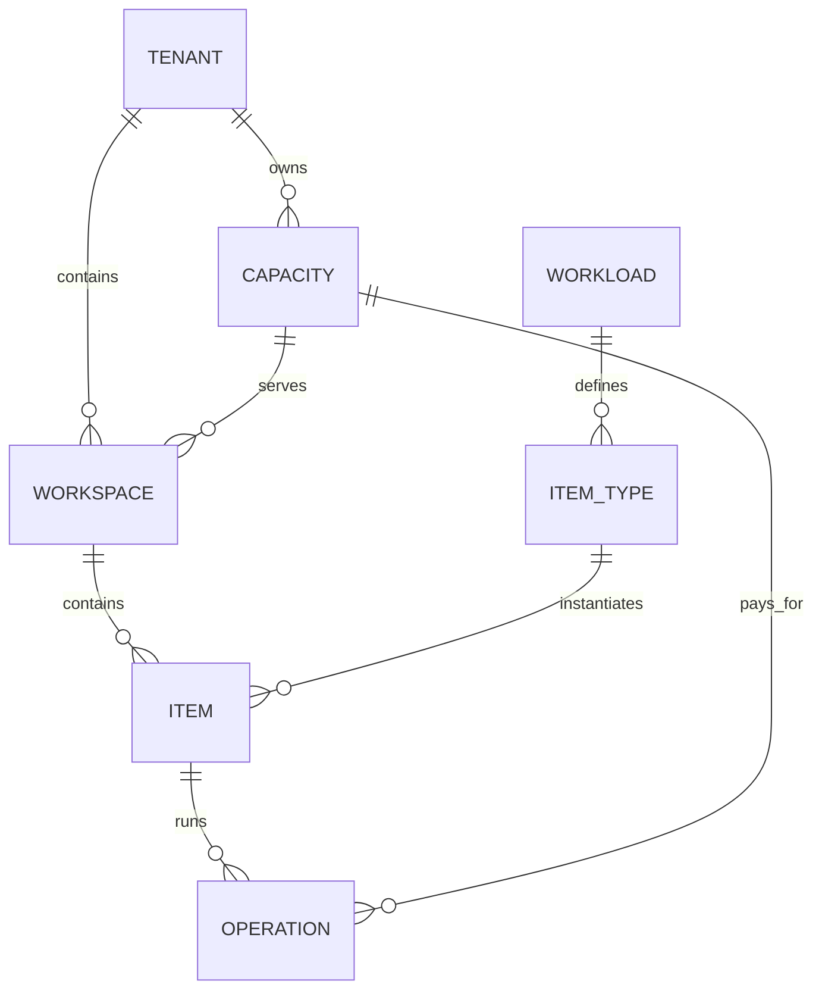

# Core Object Model

## 1. Five objects that must be distinguished

| Object | Meaning of a sentence | Example |
|---|---|---|
| Tenant | A security and governance root for enterprise customers | Contoso Corporation |
| Capacity | Tenant purchased or allocated compute budget | 64 Compute Units |
| Workspace | Collaboration and default permission boundaries for a team | Sales Analytics |
| Item / Artifact | User-saved platform objects | Pipeline, Notebook, Table, Report |
| Workload | The ability to create, edit or run certain types of Items | Data Pipeline, SQL, BI |

There is also a runtime object:

| Object | Meaning |
|---|---|
| Operation / Job | An actual operation of a Workload on an Item will consume Capacity |

## 2. Object relationship



Two points that are easily confused:

- Workspace manages "who works together and which items"; Capacity manages "how many calculations can be used at most for these jobs".
- Workload is the capability or engine; Item is the object saved by the user. For example, BI Workload can create Report Item.

## 3. What belongs to the customer and what belongs to the platform

| Object | Owner | Description |
|---|---|---|
| Tenant, Workspace, Item | Customer Logic Ownership | These resources must be able to be enumerated when migrating or deleting Tenants |
| Capacity | The customer purchases or is assigned, and the platform is responsible for implementing it | It is a logical computing budget and does not necessarily correspond to a dedicated machine |
| Workload | Platform provision or registration | Tenants can enable it but typically do not own the engine code |
| Operation | Generated by customer operation, platform management life cycle | Tenant, Item, Workload and Capacity must be recorded |
| Physical Worker / Cluster | Platform | Can be shared by multiple Capacities or dedicated to large customers |

So Workload is not located in the Workspace directory tree, and Capacity is not the parent node of Item. They all meet Item on Operation.

## 4. Five abstract types of Item

There is no need to memorize dozens of product names, first abstract them into:

| Item type | What is saved | What can be done |
|---|---|---|
| Data Store | Files, tables, and data locations | Read, written, and queried |
| Pipeline | Data sources, steps and dependencies | Ingestion and orchestration |
| Code Job | Notebook, SQL, or script | Transform and analyze data |
| Semantic Model | Tables, relationships, indicators and permissions | Provide unified business semantics |
| Report | Page, chart and model references | Display query results |

## 5. How to disassemble the data of an Item

```text
Item
├── Platform metadata: ID, name, Tenant, Workspace, type, status
├── Definition: Pipeline graph, Notebook content, Report layout
├── Data: files, tables, model data
└── Run records: Job status, logs, errors, resource consumption
```

Can't all be stuffed into one Item table:

| Content | Storage Location | Reason |
|---|---|---|
| Platform Metadata | Metadata Database | Small, requires transactions and indexes |
| Item Definition | Versioned Definition Store | Requires version, rollback, may be larger |
| Files and tables | Shared Data Storage | Huge in size and needs to be expanded independently |
| Job status | Operation Store | High frequency updates, different life cycles |
| Logs and indicators | Telemetry Store | Write more, query by time |

## 6. Minimal data structure

```text
Tenant(tenant_id, name, state)

Capacity(capacity_id, tenant_id, total_units, state)

Workspace(
  tenant_id, workspace_id, capacity_id, name, region, state
)

Item(
  tenant_id, workspace_id, item_id, item_type, workload_id,
  name, state, definition_version, etag
)

Operation(
  tenant_id, capacity_id, workspace_id, item_id, operation_id,
  workload_id, definition_version, class, state, consumed_units
)

Attempt(
  tenant_id, operation_id, attempt_id, worker_id, state,
  lease_until, fencing_token, started_at, ended_at
)

Connection(
  tenant_id, connection_id, source_type, endpoint, secret_reference
)

Principal(principal_id, principal_type)
TenantMembership(tenant_id, principal_id, tenant_role, state)
WorkspaceRole(tenant_id, workspace_id, principal_id, role)
```

Every table and every message comes with `tenant_id`. Items are referenced using immutable IDs, not names that may be renamed.

Identity principals are separated from tenant membership: the same person may be a member of multiple tenants, but each request can only be executed in the context of one explicit tenant.

## 7. Item status

```text
CREATING -> ACTIVE -> DELETING -> SOFT_DELETED -> PURGED
              |
              v
            FAILED
```

Creating an Item may require Workload to allocate resources, so it is not necessarily completed once the database is written. `CREATING` and `FAILED` allow partial failures to be seen, retried, and cleaned up.
