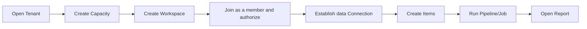

# Platform usage model: who is doing what

Memorizing the object name does not mean understanding the platform. Let’s first look at how a company enters the platform and what different roles do.

## 1. Four types of roles

| Role | Primary Operations | Generally Not Responsible |
|---|---|---|
| Tenant Admin | Create tenants, purchase capacity, manage organization-level policies | Write data processing logic |
| Workspace Admin | Create Workspace, bind Capacity, assign member roles | Manage the entire platform |
| Creator | Create Pipeline, Code Job, Model, Report | Modify tenant-level policies |
| Consumer | Open Report, execute approved query | Modify Item definition |

A person can hold multiple roles at the same time, but delegation is still based on the responsibilities represented by the role.

## 2. From empty tenant to the first report



There are two easily confused chains here:

```text
Resource ownership: Tenant -> Workspace -> Item
Calculate payment: Tenant -> Capacity -> Operation
```

Workspace will be bound to a Capacity, so the Operation generated by the Item will be paid by the Capacity by default. Capacity is not the parent directory of Item, and changing Capacity does not mean relocating Item data.

## 3. Creating and running are not the same thing

When creating a Pipeline, the user saves a definition:

```text
Every day 01:00
Read incremental data from order database
Write to orders_raw table
Start the aggregation job after success
```

At 01:00, the scheduler creates an Operation based on this definition.

```text
Pipeline Item: exists for a long time, can be edited, and can produce multiple versions
Operation: a run of a certain version, with start time, end time and result.
Attempt: An execution attempt when Operation fails to retry.
```

Therefore, one Pipeline Item can correspond to thousands of operations; one operation may have multiple attempts.

## 4. Three areas seen by the user

### Management area

Manage Tenants, Capacity, Workspaces, Members and Policies. The main operation here is control plane metadata.

### Creative area

Edit Pipelines, Notebooks, Semantic Models, and Reports. The platform maintains versioned Item definitions.

### Running area

Start a job, view run history, read data, or open a report. Here the calculation surface will be entered and Capacity will be consumed.

Just because the first two areas can be opened does not mean that the running area is definitely available. For example, when BI Workload fails, users can still list Report Items, but are temporarily unable to execute Report Query.

## 5. Minimal platform API

```http
POST /tenants/{tenantId}/workspaces
POST /workspaces/{workspaceId}/members
POST /workspaces/{workspaceId}/items
PUT  /items/{itemId}/definition
POST /items/{itemId}/operations
GET  /operations/{operationId}
POST /operations/{operationId}:cancel
GET  /capacities/{capacityId}/usage
```

These APIs transfer metadata, definitions, and run commands. Terabytes of data cannot pass through a normal API Gateway and should be read and written directly to the data store by Workers using restricted credentials.

## 6. Two typical operating modes

| Method | Example | Features |
|---|---|---|
| Running in the background | Pipeline, Notebook, Model Refresh | Can be queued, lasting from minutes to hours |
| Run interactively | SQL Query, open Report | User is waiting, low latency and cancellation capabilities are required |

They share the Tenant, Item, Permission, and Capacity models, but do not share a simple FIFO queue.
