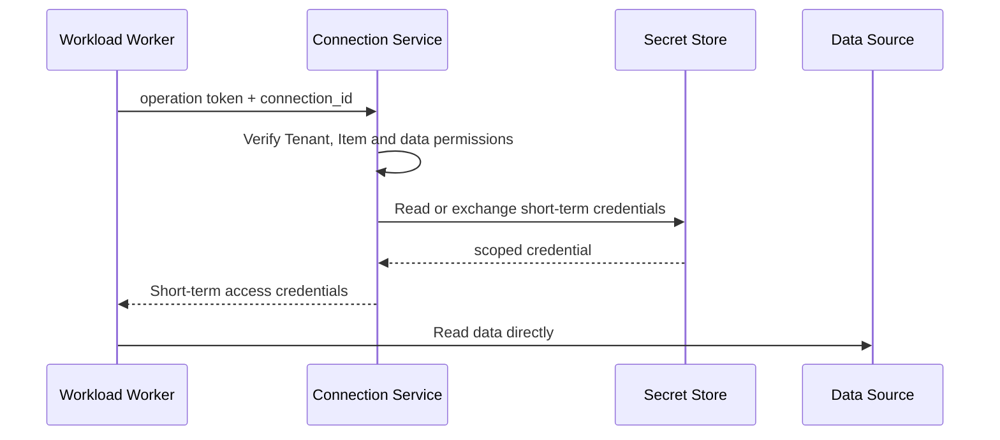

# What exactly is stored in Item?

"Item is a platform object" is still too abstract. This chapter breaks down an Item and answers where the definition, business data, credentials and running records are placed.

## 1. Item is a logical object

Taking `Orders Pipeline` as an example, the user sees an Item on the interface, but the backend actually contains multiple types of information:

```text
Orders Pipeline
├── Identity：item_id、tenant_id、workspace_id、item_type
├── Metadata: Name, Owner, Status, Label, Current Version
├── Definition: step diagram, parameters, dependencies, scheduling configuration
├── References: input table, output table, Connection, downstream job
├── Permissions: Who can read, edit, run and share
└── Operations: Status, errors and resource consumption of each run
```

If it is a Data Store Item, it also has a data namespace; if it is a Report Item, it mainly saves the layout and a reference to the Semantic Model. Different Item types have different contents but share the same shell.

## 2. Definition and data of five types of Items

| Item | Saved Definition | Real Big Data | What happens when you run it |
|---|---|---|---|
| Data Store | Schema, partitions, and data locations | Files, tables, indexes | Read, write, or query data |
| Pipeline | Nodes, dependencies, parameters and triggering rules | Do not save business data directly | Worker executes steps according to the diagram |
| Code Job | Code, dependencies and run configuration | Input and output in Data Store | Start isolated computing tasks |
| Semantic Model | Table relationships, metrics, and data permissions | Optional caching or importing data | Refresh or Query |
| Report | Page, Chart, and Model references | Typically do not save raw data | Generate a set of interactive queries |

Item is not equal to data. Pipeline Item describes "how to move", Data Store Item means "where to put it", and Operation is "really moved this time".

## 3. Where to place Connection and Secret

Data source connection information is an auxiliary resource of the platform:

```text
Connection
├── connection_id
├── tenant_id
├── source_type
├── endpoint
├── auth_method
└── secret_reference
```

Passwords and keys are not written into the Pipeline Definition, nor are they directly stored in the normal Metadata DB. Metadata only saves `secret_reference`, the actual key goes into the Secret Store.

The runtime link is:



Workers are only given short-lived, minimally privileged credentials. Credentials should become invalid after the operation ends or the permission is revoked.

## 4. Why must they be stored separately?

| Content | Recommended Storage | Access Features |
|---|---|---|
| Item identity and metadata | Metadata DB | Small transactions, list by Workspace and query by ID |
| Item definition | Versioned Definition Store | Read and write by version, need to roll back |
| Files and tables | Shared Data Storage | Huge capacity, high throughput read and write |
| Secret | Secret Store | Extremely sensitive, strict audit, short-term authorization |
| Operation status | Operation Store | Status changes frequently, query by time |
| Logs and Metrics | Telemetry Store | Write multi, aggregation by time and tags |
| Usage | Usage Ledger | Traceable for quota and bill reconciliation |

Putting these contents into a `items` table will cause conflicts: metadata requires transactions, big data requires throughput, logs require high-frequency appending, and Secrets require completely different security boundaries.

## 5. Definition uses immutable version

```text
item_id = pipeline-42
current_version = 9

version 8 -> definition blob A
version 9 -> definition blob B
```

Record the `definition_version=9` used when the Operation is created. Even if the user subsequently saves version 10, the running Operation is still executed according to version 9, preventing the rules from changing midway through the task.

## 6. How to reference between Items

References must use stable IDs, not names:

```text
Pipeline --writes--> Raw Orders Table
Notebook --reads--> Raw Orders Table
Notebook --writes--> Daily Sales Table
Semantic Model --reads--> Daily Sales Table
Report --uses--> Semantic Model
```

These edges form Lineage. Before deleting or moving an Item, the platform can alert downstream effects accordingly. But Lineage is usually built asynchronously from events and should not be a single point of synchronization for saving Items.
