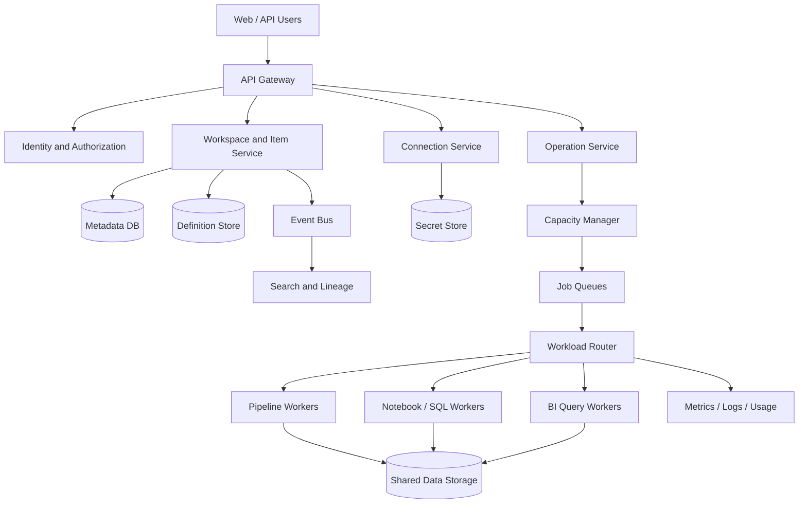

# infrastructure

## 1. High-level architecture



## 2. What are each component responsible for?

| Components | Responsibility | Not Responsible |
|---|---|---|
| API Gateway | Authentication entrance, routing, current limiting | Data processing |
| Workspace and Item Service | Workspace, Item metadata and definition versions | Running long tasks |
| Metadata DB | Tenant, Workspace, Item, ACL | Save large files and tables |
| Definition Store | Save versions of Pipeline, Notebook, and Report | Execute definition |
| Connection Service | Manage data source connections and issue short-term credentials | Write long-term Secrets into Item definitions |
| Secret Store | Save keys and record sensitive access audits | Save common Item metadata |
| Operation Service | Accept Job, remove duplication, record status | Decide on specific Worker implementation |
| Capacity Manager | Check compute budgets, queuing and throttling | Process business data |
| Workload Router | Hand over Operation to the correct engine | Implement all engines uniformly |
| Workload Workers | Run Pipeline, SQL, BI Query | Manage platform permissions |
| Shared Data Storage | Save files and tables | Save all control plane metadata |
| Search and Lineage | Search for Item, display upstream and downstream | As an authoritative database for Item |

## 3. Why split into three parts?

### Control surface

Manage Tenants, Capacity, Workspace, Items, Permissions and Definitions. Keep requests small and emphasize consistency.

### Calculation surface

Run Pipeline, Notebook, SQL and BI Query. Tasks may be long or short, with emphasis on scheduling and isolation.

### Data surface

Save and transfer files and tables. The amount of data is huge and cannot pass through the ordinary API Server.

```text
Control surface: Who does this Item belong to and what is its definition?
Computing: Who will run it and how many resources will it use?
Data plane: Where is the real data it reads and writes?
```

## 4. Why does the data not pass through API Gateway?

Control request goes:

```text
Client -> API Gateway -> Item / Operation Service
```

Big data goes:

```text
Data Source <-> Workload Worker <-> Shared Data Storage
```

The platform first authenticates and then issues short-term, limited-scope credentials to a specific operation. Otherwise, if dozens of GB files are forwarded through the API Server, the control plane bandwidth and number of connections will be overwhelmed by data transmission.

## 5. How to scale on a large scale

### Metadata

Split by the following Key:

```text
hash(tenant_id, workspace_id)
```

Items of the same Workspace should be placed on the same Shard as much as possible to facilitate lists and transactions. Different workspaces of very large tenants can be distributed to multiple shards.

### Operation Queue

Sharded by the following dimensions:

```text
capacity_id + workload_type + priority
```

In this way, a large number of background tasks of a certain Capacity will not block interactive queries of other Capacities.

### data

Shared Data Storage is independently sharded and replicated. The API only returns data locations or short-lived credentials, and workers and query engines access the data layer directly.

## 6. Why Search is not authoritative data

After the Item changes, Search and Lineage are updated asynchronously through Event Bus:

```text
Item saved -> Metadata DB + Outbox -> Event Bus -> Search / Lineage
```

Search can be delayed briefly, but cannot block Item saving. Opening Item by ID always reads the Metadata DB.

## 7. Basic Reliability

- Metadata DB is synchronously replicated across Availability Zones and backed up regularly.
- Item is written and Outbox is committed in the same transaction.
- Job Queue is persistent, and Workers use Lease to receive tasks.
- Tasks can be retried after a Worker crash, but writes must be idempotent.
- Definition uses an immutable version and does not overwrite the old version if it fails to save.
- Search, Lineage and Cache can be reconstructed by events after being lost.
- Each Tenant, Capacity, and Workload has a current limit and a concurrency upper limit.
