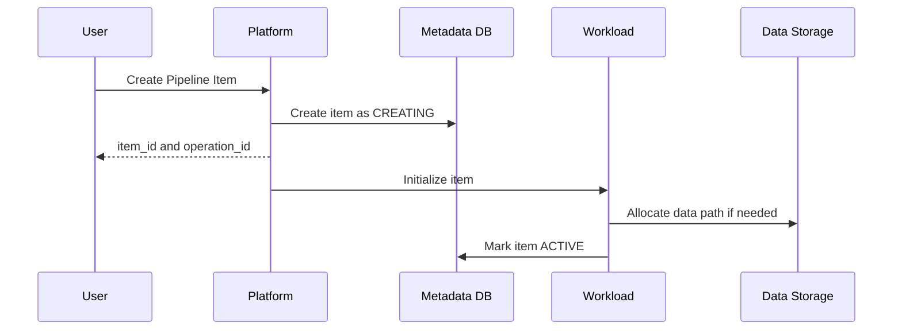

# Workload and Item

## 1. The simplest difference between the two

```text
Workload = Capability / Engine
Item = object saved by the user
```

For example:

| Workload | Item created or used |
|---|---|
| Data Pipeline Workload | Pipeline |
| Data Engineering Workload | Notebook、Code Job、Data Store |
| SQL Workload | SQL Script、Table、Warehouse |
| BI Workload | Semantic Model、Report |

An Item may also be used by multiple Workloads. For example, Data Store is written by Pipeline and read by SQL and BI Workload.

## 2. Why does the platform need to unify the Item model?

Regardless of whether the Item is a Pipeline or a Report, the platform provides:

- Stable ID;
- Tenant and Workspace ownership;
- Name, Owner and status;
- Create, save, share and delete;
- Definition version；
- Search and kinship;
- Permissions and auditing;
- Operation History.

Workload is only responsible for type-specific content. In this way, when adding a new Workload, there is no need to reimplement the entire Workspace, permissions and search.

### Responsibility boundaries for platforms and workloads

| The platform is uniformly responsible | Workload is responsible for itself |
|---|---|
| Tenant, Workspace, Item identity | Type-specific Definition Schema |
| Generic CRUD, version and ETag | Editor or type-specific API |
| Identity, Authorization, and Auditing | Verify that definitions are executable |
| Operation, Queue and Cancellation Contract | Specific Runtime and Worker |
| Capacity admission and metering portal | Reporting resource requirements and actual usage |
| Search, lineage events and lifecycle | Extract type-specific references and lineage |

If BI Workload implements a set of Tenant, permissions, metering and deletion processes on its own, it will not be connected to the unified platform, but will just put another product on the same navigation bar.

## 3. Workload registration contract

```json
{
  "workloadId": "bi",
  "version": "2.0",
  "itemTypes": ["SemanticModel", "Report"],
  "operations": ["Query", "Refresh"],
  "definitionSchemas": ["1.0", "2.0"],
  "requiredPermissions": ["Item.Read", "Data.Read"],
  "runtimeEndpoint": "workload://bi-runtime",
  "meteringSchema": "cu.bi.v1"
}
```

Manifest tells the platform:

- Which Item Types does this Workload support?
- How to verify definitions;
- Which Operations can be run;
- What permissions are required;
- Which Runtime the request should be routed to.
- How to report resource requirements and actual usage.

## 4. How does the platform call Workload?

The platform does not understand Report charts and does not execute SQL. It just passes the standard run envelope:

```json
{
  "operationId": "op-100",
  "tenantId": "contoso",
  "itemId": "report-42",
  "definitionVersion": 9,
  "capacityId": "cap-7",
  "deadline": "2026-08-13T10:00:05Z",
  "executionToken": "short-lived-token"
}
```

The workload returns unified status, error category, and usage, and the output content is still defined by the workload. In this way, the platform can schedule all workloads without knowing the internal algorithm of each engine.

## 5. Create Item



Why not do a big cross-service transaction? Because the Workload or Data Storage might be slow or fail. The platform first saves the Item identity and then initializes it asynchronously; after failure, the Item enters `FAILED` and can be retried or deleted.

## 6. Save Item

The definition takes an immutable version:

```text
Pipeline v8 -> content hash A
Pipeline v9 -> content hash B
item.current_version -> v9
```

The client carries the ETag when saving:

```http
PUT /items/{itemId}/definition
If-Match: "etag-8"
Idempotency-Key: 7f...
```

- Idempotency Key prevents network retries from repeated saves.
- ETag prevents two users from overwriting each other.
- When the new version fails, the old version can still be used.

## 7. Workload fault isolation

When BI Workload fails:

- Report query is not available;
- Workspace and Item lists can still be opened;
- Pipeline and SQL Workload continue to run;
- The platform displays the last known status of the Report;
- Requests will not overwhelm the shared thread pool with infinite retries.

This is to treat Workload as a plug-in and fault domain, rather than writing all logic into a platform service.
