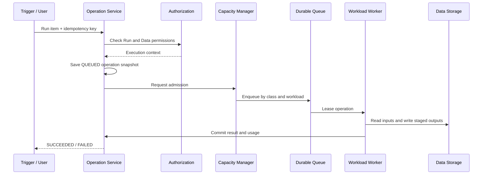

# From Item to Operation: define how to become a run

Item is a static definition, Workload is the execution capability, and Capacity is the computing budget. Operation connects the three.

## 1. Who will create Operation

| Trigger | Example | Source of idempotent keys |
|---|---|---|
| User | Click Run, execute SQL | client request ID |
| Schedule | Run Pipeline every day at 01:00 | item ID + schedule time |
| Upstream events | Refresh model after table update | event ID + target item ID |
| Platform | Recovery, maintenance, or rebuild | maintenance request ID |

No matter what the entrance is, create a unified Operation first, rather than letting the API directly call a Worker.

## 2. Minimal snapshot of Operation

```text
Operation(
  operation_id, tenant_id, workspace_id, item_id,
  definition_version, workload_id, capacity_id,
  initiator, trigger_type, priority, state,
  submitted_at, idempotency_key
)
```

Among them, `tenant_id`, `definition_version`, `capacity_id` and permission context are solidified upon submission. This way after a task is queued for two hours, the platform still knows which version it should execute, who paid for it, and what access is allowed. Sensitive operations need to be rechecked to see if they have been revoked before they are actually run.

## 3. Complete running link



Operation Service manages the status; Capacity Manager manages "whether the resource can be used now"; Workload Worker manages "how to execute it specifically". The three responsibilities cannot be mixed into one service.

## 4. Operation, Attempt and Worker

```text
Operation op-100: a logical operation that the user wants to complete
├── Attempt 1: Worker A crashes
└── Attempt 2: Worker B retries successfully
```

What the user sees is one Operation, while the platform records multiple Attempts internally. Otherwise, retrying will generate multiple unrelated running records, and the time consumption and Compute Units cannot be correctly summarized.

## 5. State machine

```text
SUBMITTED -> QUEUED -> RUNNING -> SUCCEEDED
                |          |
                |          +----> FAILED
                |          +----> CANCELLING -> CANCELLED
                +---------------> EXPIRED
```

- `SUBMITTED`: The request and snapshot have been persisted.
- `QUEUED`: Wait for Capacity and Worker.
- `RUNNING`: An Attempt holds a Lease.
- `SUCCEEDED`: The output has finished committing, not just the code stopped running.
- `FAILED`: The retry policy was exhausted or a non-retryable error was encountered.
- `EXPIRED`: The interactive request has been waiting for too long and there is no value in continuing the execution.

## 6. Output cannot directly cover formal data

The background job may crash halfway through. The safe approach is:

```text
Read old version
-> write to staging/op-100/
-> Verification output
-> Atomic update of current_version pointer
-> Publish TableUpdated event
```

Operation can mark `SUCCEEDED` only if the pointer is submitted successfully. Retry to continue using the same Operation ID as the output namespace, or block old worker submissions with a fencing token.

## 7. What is the difference between interactive Query

Opening a Report also produces an Operation, but it usually:

- higher priority;
- Has a shorter deadline;
- When the client is disconnected, it should be canceled as soon as possible;
- Mainly reads data and does not produce long-term output;
- Allow result caching, but the Cache Key must contain Tenant, permissions and data version.

This explains why backend Pipeline and Report Query share a platform governance model but require different queues and execution strategies.
