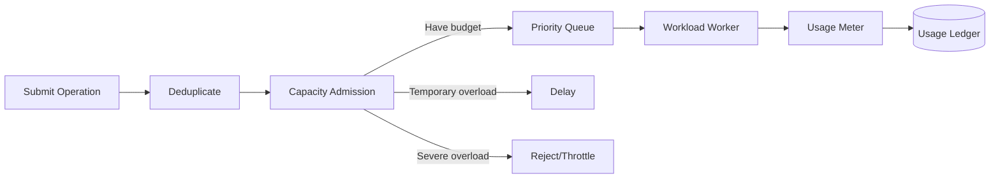

# Capacity and computing units

## 1. What problem does Capacity solve?

Many tenants and workloads share a physical compute cluster. The platform needs to answer:

- How much computing power did this customer purchase?
- Can the current Query or Job be run immediately?
- How do multiple Workspaces share resources fairly?
- Who consumes how many resources?
- Who is delayed and who is rejected when overload occurs?

Capacity is the resource and measurement boundary for these problems.

## 2. What is Compute Unit?

Compute Unit is a unified unit of measurement. Different Workloads can convert their own raw resources to CU:

```text
Pipeline activity -> CPU time + memory + IO -> CU
SQL query         -> CPU + memory + scanned bytes -> CU
Notebook job      -> worker size × running time -> CU
BI query          -> CPU + memory + query time -> CU
```

CU is not a CPU Core, nor is it a machine. It is an abstract unit for unified budgeting and billing usage of the platform.

## 3. Capacity is not a computing cluster

Three layers need to be distinguished:

```text
Capacity: How much computing budget is available to the customer
Admission/Reservation: How much budget is temporarily allowed to be used by a certain operation
Worker Resources: CPU, memory, GPU, IO allocated during actual execution
```

Multiple Capacities can be mapped to the same physical Worker Pool; large customers can also use dedicated Pools. Capacity Manager manages the logical budget, and Workload Scheduler converts Operation into specific Worker resources.

## 4. Capacity and Workspace

```text
Capacity A: 64 CU
├── Sales Workspace
├── Finance Workspace
└── Marketing Workspace
```

Operations in Workspace consume the Capacity to which they are bound by default. Item data still belongs to Workspace/Tenant, not Capacity. Replacing Capacity changes the subsequent calculation budget, not moving all data.

## 5. Operation classification

| Type | Example | User expectations |
|---|---|---|
| Interactive | SQL Query, open Report | Return as soon as possible |
| Background | Pipeline, Notebook, Refresh | Can be queued, but eventually completed |
| System | Task cancellation, recovery, and permission revocation | Resources must be reserved |

They cannot be put into a FIFO queue. When the ten-hour Pipeline is ranked first, users should not be blocked from opening the Report.

## 6. Scheduling process



Capacity Admission check:

- Whether Capacity is enabled;
- Current and recent consumption;
- Interactive / Background budget;
- Workload and Workspace concurrency;
- Resource limit for a single Operation.

Admission uses estimates to prevent obvious overload, and workers report actual usage during operation. The real measurement cannot be tampered with when estimating errors: the platform can reduce subsequent concurrency, form Debt, or terminate operations that exceed the hard upper limit.

## 7. Simplify the budget model

If Capacity provides $C$ CUs, $C$ CU-second can be obtained per second. The budget within time window $T$ is:

$$
Budget = C \times T
$$

For example 64 CU provides in 60 seconds:

$$
64 \times 60 = 3840 \text{ CU-seconds}
$$

The platform can allow a short burst, but excessive consumption forms a debt; when the debt is too high, new operations are delayed or rejected.

## 8. Fairness

It is recommended to use tiered fair queue:

```text
Capacity
  -> Interactive / Background
    -> Workload
      -> Workspace
        -> Operation
```

- Idle resources can be borrowed by other queues.
- When Interactive arrives, Background stops seizing new resources.
- A single Workspace cannot occupy all Workers.
- There are memory and scan limits for a single large Query.
- System cancellation and restore operations reserve a small amount of resources.

## 9. Worker retry

Worker uses Lease to receive Job:

```text
(operation_id, attempt_id, lease_until, fencing_token)
```

After the Worker crashes, the Lease expires and a new Worker creates a new Attempt. Even if the old Worker is restored, it cannot submit results using the old Fencing Token.

Scheduling only guarantees at least one run, so the Workload still needs to be idempotent or use transactional commit when writing data.

## 10. Must-see indicators

- Capacity CU utilization and Debt;
- Interactive/Background consumption;
- Queue length and oldest waiting time;
- admitted, delayed, rejected quantity;
- Top consumers by Tenant, Workspace, Workload;
- Worker retry and lease expiry;
- Query P99 and background job completion delays.
