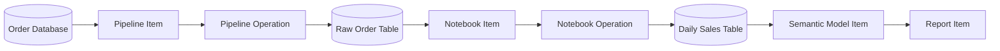
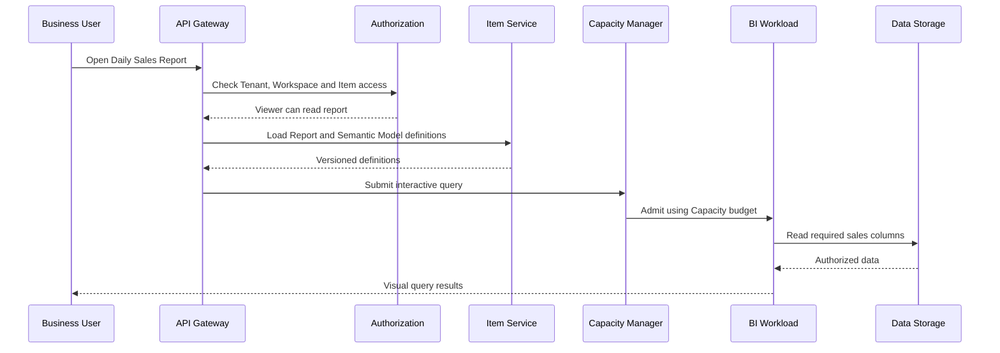

# End-to-end data pipeline

This chapter only takes one link to connect all abstract objects.

## 1. User goals

Contoso's sales team wants to read order data, generate sales summaries, and view reports on a daily basis.

## 2. Create resources

```text
Tenant: Contoso
Capacity: Analytics-Capacity (64 CU)
Workspace: Sales Analytics
Connection: Orders Database Connection

Items:
  Orders Pipeline
  Sales Data Store
  Transform Notebook
  Sales Semantic Model
  Daily Sales Report
```

Workspace binding `Analytics-Capacity`. The user roles are:

- Data Engineer: Contributor, can create and run Pipeline/Notebook.
- Analyst: Contributor, can create Semantic Model/Report.
- Business User: Viewer, can only read Report.

## 3. Background data processing link



### Pipeline

Scheduled trigger submission Pipeline Operation:

1. Operation Service uses the trigger time and Pipeline ID to generate the Idempotency Key.
2. Capacity Manager puts it into the Background Queue.
3. Connection Service verifies Operation permissions and issues short-term credentials for the order database.
4. Pipeline Worker reads the order database directly using short-lived credentials.
5. Write to the Raw Order Table idempotently using the partition date and Operation ID.
6. Usage Meter records CU.

### Notebook

Submit the Notebook Operation after the Pipeline is successful:

1. Notebook Worker reads the Raw Order Table.
2. Aggregate sales by date.
3. Transactionally commit a new version of the Daily Sales Table.
4. Post the `TableUpdated` event.

### Semantic Model

Semantic Model Save:

- table reference;
-Date, Store, Product and other dimensional relationships;
- `Total Sales` and other indicators;
- Data permissions for Business User.

It does not require a copy of the Report layout, nor is it equal to the original table itself.

## 4. The user opens the Report



A page may have multiple charts, so the BI Workload needs to limit the concurrent query of a single page, merge the same query, and pass the cancellation signal to the data layer.

## 5. How to handle failure

| Failure | Processing |
|---|---|
| Pipeline triggers repeatedly | Idempotency Key returns the same Operation |
| Worker crashes midway | New Attempt reruns after Lease expires |
| Raw data repeated writing | Partition + Operation commit marker deduplication |
| Half of the Notebook is generated | The new table version is not submitted, and readers continue to see the old version |
| Capacity overload | Background task queuing; interactive queries have priority but there are limits |
| BI Workload failure | Report query failed, other Workloads continue |
| User has been revoked | Policy version changes, permissions and result cache invalidation |
| Search delay | You can still access by directly pressing the Item ID |

## 6. Where are the data and control information?

| Content | Storage |
|---|---|
| Workspace, Item name and status | Metadata DB |
| Pipeline, Notebook, Model, Report definition | Definition Store |
| Data source Endpoint and Secret reference | Connection Metadata DB |
| Data source password or key | Secret Store |
| Raw Order, Daily Sales table | Shared Data Storage |
| Pipeline/Notebook/Query Status | Operation Store |
| CU consumption | Usage Ledger |
| Item Search and Upstream and Downstream | Search / Lineage Store |
| User Actions | Audit Store |

## 7. Interview summary

You can end with the following sentences:

> This is a large-scale multi-tenant data platform. Tenant provides enterprise isolation, Workspace provides collaboration boundaries, Item is a unified platform object, Workload provides different processing capabilities, Operation is an actual run, and Capacity determines how much computing it can use. The platform stores metadata, definitions, data and running status separately, and uses persistent Queue, Idempotent Write and Lease-based Worker to ensure the reliability of background tasks.
