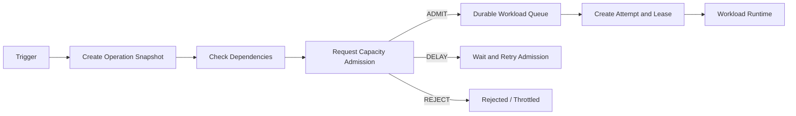

# Operation and Job scheduling domain

This field answers: **What does the user want to run, when should it run, where is it currently running, and whether to retry after failure? **

It manages the logic run life cycle. It asks the Capacity domain for budget availability and hands off the approved operations to the Workload Runtime, but does not execute the Pipeline, SQL, or Report Query itself.

## 1. Business boundaries

Responsible:

- Manual, timed and event triggering;
- Create an Operation snapshot containing the determined Definition Version;
- Idempotent submission, state machine, deadline, cancellation and retry strategies;
- Dependency checking, priority and timing of entering the queue;
- Attempt, Worker Lease, Heartbeat and fencing token;
- Operation history and operation result references.

Not responsible for:

- Determine whether the user has final authority;
- Define Capacity’s total CU amount and fair distribution rules;
- Convert logical jobs to specific CPU, memory or GPU;
- Implement type-specific execution logic;
- Save large-scale data output by Job.

## 2. Authoritative object

```text
Trigger(trigger_id, item_id, type, specification, state)
Operation(operation_id, item_id, definition_version, capacity_id, state)
Dependency(operation_id, predecessor_id, condition)
Attempt(operation_id, attempt_id, worker_id, state, lease_until)
RetryPolicy(operation_type, max_attempts, backoff, retryable_errors)
```

Operation represents a logical intention of the user; Attempt represents an actual attempt by the platform to execute. An Operation can generate multiple Attempts due to Worker crashes.

## 3. Internal capabilities

| Competencies | Answered questions |
|---|---|
| Trigger Service | What event should create an Operation? |
| Operation Service | What is the snapshot and status of this logical operation? |
| Dependency Scheduler | Are the preconditions met and when can the queue be queued? |
| Queue Router | Which Workload, Priority and Cell Queue should be entered? |
| Attempt Manager | Which Worker holds the Lease and is Retry required? |
| Cancellation Controller | How to pass cancellation signal to Runtime and data layer? |

The first version can be merged into `Operation and Scheduler Service`. At high scale, split it up according to write mode and availability goals.

## 4. Scheduling links



Scheduler determines "whether the task is ready"; Capacity Manager determines "whether there is a budget now"; Workload Scheduler or Runtime determines "which machine resources are specifically needed".

## 5. Main interface

```http
POST /items/{itemId}/operations
GET /operations/{operationId}
POST /operations/{operationId}:cancel
POST /operations/{operationId}:retry
POST /items/{itemId}/triggers
POST /attempts/{attemptId}:heartbeat
POST /attempts/{attemptId}:complete
```

Submission requests must include the Idempotency Key. Timing triggers are usually used:

```text
item_id + trigger_id + scheduled_time
```

In this way, two logical operations will not be created when the Scheduler is restarted or the event is re-delivered.

## 6. Published and consumed events

release:

- `OperationSubmitted`、`OperationReady`
- `OperationCancelRequested`
- `AttemptStarted`、`AttemptFinished`
- `OperationSucceeded`、`OperationFailed`

Consumption:

- `ItemDefinitionChanged`、`ItemDeleting`
- `TableUpdated` and other data trigger events;
- `CapacityAdmissionDecided`；
- `WorkloadExecutionReported`。

The final state of the operation must come from the authoritative state machine and cannot be directly overridden simply by "receiving a Worker success message". Completing the request requires verification of the Attempt and fencing token.

## 7. Cooperation with other domains

```text
Access domain: Run is checked when submitting, and sensitive execution is checked again for removal when dequeuing.
Asset domain: solidified Item and Definition Version
Capacity domain: Request Admission, receive ADMIT / DELAY / REJECT
Workload field: execute Attempt, return progress, results and error category
Connection field: Operation Token is used in exchange for short-term credentials
Data plane: Operation can be marked as SUCCEEDED only after the output is submitted successfully.
```

## 8. When will the service be dismantled again?

- When Cron and event triggering are very large, tear out the Trigger Service.
- When the status query QPS is much higher than the scheduled write, remove the Operation Query View.
- When the number of workers is huge and Heartbeat writes are too high, remove the Attempt/Lease Manager.
- When DAG dependencies are complex, remove the Workflow Orchestrator; ordinary single jobs do not need to go through the complex DAG engine.

The core principles of this domain are: Operations are created only once, Attempts can be safely retried, and output can only be submitted by the currently valid Attempt.
