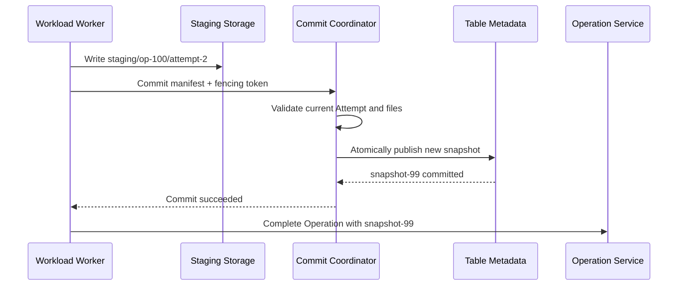

# Data and query plane domain

This field answers: **Where do the customer's files and tables actually exist? How does the computing engine read and write with high throughput? How does it ensure that readers only see the fully submitted version of the data? **

It handles truly large-scale data and should not forward terabytes of data to a normal API Gateway, Item Service, or Operation Service.

## 1. Business boundaries

Responsible:

- Allocate data namespace for Data Store Item;
- Files, tables, partitions, Snapshots and commit versions;
- Staging Write, checksum atomic Commit;
- Implementation of data access Endpoint and short-term Token;
- Data replication, backup, retention and physical cleanup;
- Provides scanning and query interfaces for SQL, BI and other runtimes.

Not responsible for:

- Manage common Item names, Owners and ETags;
- Save Pipeline, Notebook or Report Definition;
- Maintain Workspace Role;
- Determine whether the Operation obtains Capacity Admission;
- Implement the business semantics of all upper-layer Workloads.

## 2. Authoritative object

```text
DataNamespace(tenant_id, item_id, namespace_id, region, state)
Table(table_id, namespace_id, schema_version, current_snapshot_id)
Partition(table_id, partition_key, data_files)
Snapshot(snapshot_id, parent_snapshot_id, manifest_uri, committed_at)
StagingWrite(operation_id, attempt_id, path, fencing_token, state)
RetentionPolicy(resource_id, retention_class, purge_after)
```

The data plane is the authoritative source of committed files, tables, and snapshots. Catalog only saves the association between Data Store Item and `namespace_id`, and does not copy all file lists.

## 3. Internal capabilities

| Ability | Responsibility |
|---|---|
| Namespace Service | Data Store Item to data namespace mapping |
| Table Metadata Service | Schema, Partition, Manifest, and Snapshot |
| Object / File Storage | Save real data blocks |
| Commit Coordinator | Verify fencing token and publish new Snapshot atomically |
| Data Access Gateway | Verifies short-term token and path range, does not proxy big data |
| Query Endpoint | Provides scanning, filtering, and result streaming for interactive queries |
| Replication / Backup | Replication, backup, retention and recovery |

The first version can use mature object storage plus a Table Metadata/Commit Service, without the need to implement the underlying distributed file system by yourself.

## 4. Write and commit



Readers always read `current_snapshot_id`. The Staging data left by the Worker crash is not visible and can be cleaned up by the background based on the Operation status and retention time.

## 5. Reading and querying

There are two main ways to access:

```text
Batch Processing Worker -> Directly read files, tables and Partitions
Interactive Query Runtime -> Read Table Metadata -> Parallel Scan -> Streaming Return Results
```

The key of the result cache contains at least:

```text
tenant_id + query_fingerprint + data_snapshot + permission_version
```

Otherwise, old and unauthorized results may be returned after the data is updated or the user revokes their rights.

## 6. Main interface

```http
POST /data-namespaces
POST /tables/{tableId}/staging-writes
POST /tables/{tableId}/snapshots:commit
GET /tables/{tableId}/snapshots/{snapshotId}
POST /data-access-tokens:issue
POST /queries
DELETE /data-namespaces/{namespaceId}
```

Large file uploads from external clients usually use pre-signed URLs or chunked upload sessions, and the data does not pass through the control plane API instance.

## 7. Published and consumed events

release:

- `DataNamespaceCreated`、`DataNamespacePurged`
- `TableSnapshotCommitted`、`TableSchemaChanged`
- `DataReplicationLagChanged`
- `StagingCleanupFailed`

Consumption:

- `DataStoreItemCreated`、`ItemDeleting`；
- `OperationCancelRequested`；
- `CredentialRevoked`；
- Retention and disaster recovery policy changes.

## 8. Cooperation with other domains

```text
Asset Domain: Owns Data Store Item, references namespace_id
Connection domain: Issuance of data access token with limited scope
Workload domain: Worker and Query Runtime read and write data
Operation field: Provide the current Attempt and fencing token, and receive the submission results
Capacity field: Receive raw usage events such as scan bytes, CPU, IO, etc.
Access domain: Define data permissions for users and operations
```

## 9. When will the service be dismantled again?

- Table Metadata QPS and object read and write throughput are scaled separately when they grow independently.
- When interactive query and background batch processing compete for resources, split the Query Pool and Batch Pool.
- When cross-Region data sovereignty requires different replication strategies, follow the Tenant/Data Classification route.
- When a metadata hotspot occurs in a very large table, fragment the manifest by table or partition.

The key contracts for this domain are: the control plane only manages location and permissions, data flows directly through the high-throughput path, and all visible results must come from submitted Snapshots.
