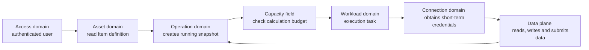

#Multi-tenant data platform

This is a type of system abstracted from products such as Microsoft Fabric and Snowflake. The goal is not to copy a product, but to understand the objects, business boundaries, and operation methods of the multi-tenant data platform.

Documents are organized along two mutually orthogonal dimensions:

```text
01-System design main line: In what order should we understand and design the entire system?
02-Business domain design: By what responsibility boundaries are platform teams and services split?
```

The former is a learning route, and the latter is a business structure, and one-to-one correspondence cannot be forced.

## 1. Core relationship

```mermaid
flowchart TB
T[Tenant Enterprise Customer]
C[Capacity calculation budget]
W[Workspace collaborative space]
I[Item/Artifact Platform Asset]
O[Operation a logical operation]
A[Attempt an execution attempt]
WL [Workload processing capacity]
    D[(Data Plane)]

    T --> C
    T --> W
    W --> I
    I --> O
    C --> O
    O --> A
    WL --> A
    A --> D
```

Three lines converge at Operation:

```text
Asset ownership: Tenant -> Workspace -> Item
Execution process: Item Definition -> Operation -> Attempt -> Workload Runtime
Resource governance: Tenant -> Capacity -> Admission -> Compute Units
```

## 2. Catalog 1: Main line of system design

These 12 articles explain the entire system in order "from problem to evolution":

| Sequence | Documentation | Questions Answered |
|---:|---|---|
| 01 | [Scenarios and Requirements](01-system-design-mainline/01-scenarios-and-requirements.md) | What does the platform provide and what is the ultimate target scale? |
| 02 | [Core Object Model](01-system-design-mainline/02-core-object-model.md) | What is the relationship between Tenant, Workspace, Item, Workload and Capacity? |
| 03 | [Platform Usage Model](01-system-design-mainline/03-platform-usage-model-who-is-doing-what.md) | How do administrators, creators and consumers use the platform? |
| 04 | [What exactly is stored in Item](01-system-design-mainline/04-what-exactly-is-stored-in-item.md) | Where are Metadata, Definition, Data and Secret respectively? |
| 05 | [Infrastructure](01-system-design-mainline/05-infrastructure.md) | How do the control plane, computing plane and data plane cooperate? |
| 06 | [Multi-tenancy and permission isolation](01-system-design-mainline/06-multi-tenancy-and-permission-isolation.md) | How to isolate users, tenants, data and computing? |
| 07 | [Workload and Item](01-system-design-mainline/07-workload-and-item.md) | What are the respective responsibilities of the platform and Workload? |
| 08 | [From Item to Operation](01-system-design-mainline/08-from-item-to-operation-define-how-to-become-a-run.md) | How to turn a static definition into a retryable run? |
| 09 | [Capacity and Computing Unit](01-system-design-mainline/09-capacity-and-computing-units.md) | How to access, schedule, fair allocation and metering calculations? |
| 10 | [End-to-end data pipeline](01-system-design-mainline/10-end-to-end-data-pipeline.md) | How do seven business domains jointly complete a data link? |
| 11 | [Reliability, Deletion and Recovery](01-system-design-mainline/11-reliability-deletion-and-recovery.md) | Which states cannot be lost, and how to recover after failure and deletion? |
| 12 | [Evolution Route and Current Boundary](01-system-design-mainline/12-evolution-route-and-current-boundary.md) | How to evolve from a single cluster to sharding, Cell and cross-Region? |

Shortest main line:

```text
01 Scene -> 02 Object -> 03 Who is using it -> 04 What is stored in Item
-> 08 How to run -> 09 How to calculate -> 10 Complete case
```

## 3. Catalog 2: Seven business domains

These 7 articles split the platform according to "who has authoritative data and what capabilities are provided":

| Business domain | One sentence responsibility | Main authoritative data |
|---|---|---|
| [Tenant and User Access Domain](02-business-domain-design/01-tenant-and-user-access-domain.md) | Who belongs to which customer and what is allowed? | Tenant, Membership, Role, Permission |
| [Workspace and Item Asset Domain](02-business-domain-design/02-workspace-and-item-asset-fields.md) | What customer assets are there in the platform? | Workspace, Item, Definition Version |
| [Connection and Data Access Domain](02-business-domain-design/03-connection-and-data-access-domain.md) | How does Operation securely access data? | Connection, Secret Reference, Credential Grant |
| [Workload platform domain](02-business-domain-design/04-workload-platform-domain.md) | What processing capabilities does the platform support and how to route it? | Workload, Item Type, Runtime Contract |
| [Operation and Job Scheduling Domain](02-business-domain-design/05-operation-and-job-scheduling-domain.md) | What to run, when to run it, and how to retry after failure? | Trigger, Operation, Attempt, Lease |
| [Capacity and Resource Governance Domain](02-business-domain-design/06-capacity-and-resource-governance-domain.md) | How much calculation can be used by who and how much is actually used? | Capacity, Reservation, Usage Ledger |
| [Data and Query Plane Domain](02-business-domain-design/07-data-and-query-plane-domain.md) | How to read, write and reliably submit files and tables with high throughput? | Namespace, Table, Snapshot, Manifest |

Unified answer for each business domain document:

1. What you are responsible for and what you are not responsible for;
2. What authority objects it has;
3. What services can be provided internally;
4. What APIs are provided;
5. Which events are published and consumed;
6. How to cooperate with other business areas;
7. Which abilities can be merged in the first version and when will they be split?

## 4. How do the two directories correspond?

| Business domain | Key chapters in the main line of system design |
|---|---|
| Tenant and User Access | 02, 03, 06, 11 |
| Workspace and Item assets | 02, 03, 04, 05, 07, 11 |
| Connection and Data Access | 04, 05, 10, 11 |
| Workload Platform | 05, 07, 08, 10 |
| Operation and Job Scheduling | 03, 08, 09, 10, 11 |
| Capacity and Resource Governance | 02, 06, 08, 09, 10 |
| Data and Query Plane | 04, 05, 08, 10, 11, 12 |

The end-to-end data-pipeline chapter spans all business domains; the reliability and evolution-roadmap chapters are also cross-domain. Therefore, the 12 learning documents and the 7 business domains do not form a one-to-one relationship.

## 5. How to traverse seven domains in one run



This is also the most important boundary of each domain:

```text
Access domain: who can do it
Asset Domain: What’s in the Platform
Connection Domain: How to Securely Access Data
Workload domain: How to deal with it specifically
Operation domain: when to process and where to run
Capacity field: How many calculations are allowed to be used
Data Plane: Where the data actually lives
```

## 6. Term mapping with Microsoft Fabric

| Abstract concepts | Examples in Microsoft Fabric |
|---|---|
| Tenant | Organization instances aligned with Microsoft Entra Tenant |
| Capacity | Fabric Capacity, measured in Capacity Units |
| Workspace | A space to save and collaborate on Items |
| Item / Artifact | Lakehouse、Notebook、Pipeline、Semantic Model、Report |
| Workload | Data Engineering、Data Factory、Warehouse、Real-Time、Power BI |
| Shared Data Storage | OneLake |

The mapping is only used to help understand the terminology, and there is no need to memorize all Fabric products and Item types.
