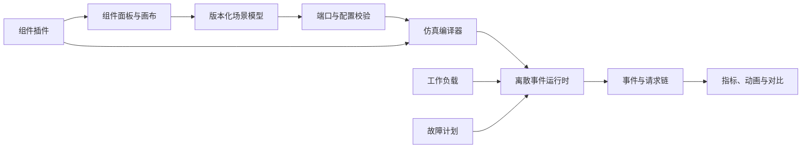

# System Design Simulator

> Build it. Run it. Break it. Measure it.

这是一个面向学习、实验和验证的 **System Design 可视化搭建与仿真平台**。最终产品是网页版：用户从空白画布开始，自由拖入组件、连接数据流、配置容量与行为、施加流量和故障，然后运行可复现的仿真并观察系统如何变化。

> [!IMPORTANT]
> 这个仓库的终极目标不是 Markdown 知识库、文档站、静态架构图工具，也不是把现有文章逐篇翻译成几个固定动画。现有 Markdown 只是参考资料和教学素材；平台本身必须与这些案例解耦，能够搭建并运行仓库里从未写过的新系统。

## 一句话产品定义

一个 **可扩展、可执行、可观测的 System Design Workbench**：像搭积木一样设计系统，像压测实验室一样运行系统，像故障演练平台一样破坏系统，并用指标、事件和请求链路解释结果。

## 用户应该能够做什么

完整体验必须形成下面的闭环，而不是停留在“把图画出来”：

1. **Build**：从空白画布或模板开始，拖入客户端、负载均衡器、服务、缓存、数据库、消息队列、对象存储等组件，并通过有类型的端口连线。
2. **Configure**：设置实例数、并发、容量、服务时间分布、队列策略、超时、重试、缓存、分片、副本、一致性和路由规则。
3. **Generate load**：定义读写比例、到达率、突发流量、数据分布、热点键、请求大小和流量随时间的变化。
4. **Run**：启动、暂停、单步、加速、重置仿真，并用随机种子完整复现一次运行。
5. **Observe**：查看吞吐量、延迟分位数、错误率、队列长度、利用率、命中率、丢弃量、网络流量、成本估算和单请求事件链。
6. **Break**：注入节点宕机、网络延迟、丢包、分区、容量下降、热点、依赖超时和区域故障。
7. **Iterate**：改变拓扑或参数，重新运行，并比较两个设计在同一工作负载下的结果。
8. **Save and share**：撤销/重做、保存版本、导入导出场景，并通过可分享的文件或链接复现实验。
9. **Extend**：通过组件注册表和插件接口加入新的组件行为，无需修改画布、场景格式或仿真调度器。

## “可以设计任何系统”意味着什么

这里的“任何系统”不是声称在浏览器中一比一复制所有生产基础设施，而是保证平台核心 **不绑定具体题目和固定拓扑**：

- 编辑器处理通用的节点、端口、边、分组和区域，而不是 `RateLimiterCanvas`、`NewsFeedCanvas` 之类的案例专用页面。
- 场景是独立、版本化的模型，可以表达拓扑、参数、工作负载、故障计划和运行配置。
- 每个组件都包含可执行行为，而不只是一张图标。改变容量、连接或策略必须能改变仿真结果。
- 内置组件覆盖常见构件；未知系统通过组合这些构件或安装新组件实现。
- 新组件遵守统一运行协议，因此能够自动接入连线校验、仿真时钟、事件流、指标和故障注入。
- 用户可以搭建仓库文档从未出现过的架构；如果只能运行预置案例，就不算完成。

## 产品边界

### 这是

- 通用的节点式 System Design 编辑器。
- 基于离散事件的容量、排队、延迟和故障仿真器。
- 可解释设计取舍的交互式学习实验室。
- 可扩展的组件行为与场景平台。

### 这不是

- Markdown 阅读器或以文档导航为核心的课程网站。
- Draw.io、Excalidraw 或云厂商图标的替代品。
- 只有视觉动画、没有运行语义和指标的架构图。
- 为每篇文章手写一套页面、状态机和结果数据的 Demo 集合。
- 真实生产集群的完整模拟器。默认目标是有明确假设、可复现、足以比较设计取舍的模型；需要真实协议或实现细节时，应通过后续的仿真适配器或真实服务集成扩展。

## 平台如何工作



画布不是运行时，连线也不是装饰。场景模型是唯一事实来源；编译器把通用拓扑转换为可执行的组件进程、资源、缓冲区和事件，运行时推进虚拟时间，观测层只消费运行产生的真实事件和指标。

## 核心模型

### Scenario

每个可保存、可分享、可测试的场景至少包含：

- 版本、ID、名称和随机种子。
- 节点、端口、连接、分组、区域和布局。
- 每个组件的类型与配置。
- 工作负载模型与随时间变化的阶段。
- 故障注入计划。
- 仿真时长、采样和停止条件。

布局信息只影响展示；运行语义不得依赖节点在画布上的像素位置。

### Component

一个组件定义必须提供：

- 稳定的类型标识和版本。
- 可验证的配置 Schema 与编辑表单。
- 输入、输出端口以及连接兼容规则。
- 可执行的请求、存储、排队或路由行为。
- 可以产生的事件、指标和状态。
- 支持的故障类型。
- 可选的图标、说明和教学链接。

编辑器只依赖这份协议。增加新组件时，不应在画布代码中增加案例判断。

### Simulation

第一阶段采用离散事件仿真，重点建模：

- 请求到达与分布。
- 服务时间、并发资源和排队。
- 网络传输、延迟、带宽和丢失。
- 路由、负载均衡、重试、超时和熔断。
- 缓存、存储、复制、分片和一致性策略。
- 异步队列、消费者、背压和批处理。
- 故障发生、传播与恢复。

所有运行使用虚拟时间；相同场景、版本和随机种子必须得到相同结果。实时动画是事件的投影，不能成为仿真逻辑本身。

## 优先复用成熟库

本项目实行 **reuse-first**：通用基础能力优先采用成熟开源库，并通过薄适配层隔离；只实现 System Design 特有的领域模型、组件语义和产品交互。

| 能力 | 首选方案 | 本项目负责的部分 |
|---|---|---|
| Web 应用 | [Next.js](https://nextjs.org/) + [React](https://react.dev/) + TypeScript | 产品页面、编辑器集成和领域交互 |
| 节点画布 | [React Flow / `@xyflow/react`](https://reactflow.dev/) | System Design 节点、端口规则和组件面板 |
| 自动布局 | [ELK.js](https://github.com/kieler/elkjs) | 把场景转换为布局输入，保存用户覆盖结果 |
| 状态管理 | [Zustand](https://zustand.docs.pmnd.rs/) | 场景命令、选择状态、撤销/重做边界 |
| Schema 与校验 | [Zod](https://zod.dev/) | 版本化 Scenario 和 Component 合同 |
| 配置表单 | [React Hook Form](https://react-hook-form.com/) | 从组件 Schema 生成领域配置体验 |
| 离散事件仿真 | [SimScript](https://github.com/Bernardo-Castilho/SimScript) | 把场景编译为 System Design 组件行为 |
| 后台执行 | Web Worker | 隔离仿真计算，不阻塞画布交互 |
| Worker 通信 | 原生 Worker API；接口复杂后引入 [Comlink](https://github.com/GoogleChromeLabs/comlink) | 定义稳定的运行、取消和事件流 API |
| 指标可视化 | [Apache ECharts](https://echarts.apache.org/) | System Design 指标、时间线和运行对比 |
| 本地持久化 | [Dexie](https://dexie.org/) + IndexedDB | 场景、运行记录和迁移策略 |
| 测试 | [Vitest](https://vitest.dev/) + [Playwright](https://playwright.dev/) | 行为模型、确定性、交互和端到端验收 |

首选方案不是不可替换的信仰。合并依赖前必须验证维护状态、许可证、包体、性能和浏览器兼容性；替换应发生在适配层之后，不能退化为重写画布、图布局、图表、持久化或事件调度器。

尤其不要从零实现：缩放和平移、节点拖拽、框选、端口连线、自动布局、图表引擎、表单状态、IndexedDB 封装，以及 SimScript 已经提供的虚拟时钟、事件调度、资源和队列原语。

项目真正需要实现的是：

- 通用 Scenario / Component Schema。
- System Design 组件注册表和插件 SDK。
- 从场景图到 SimScript 模型的编译层。
- 常见基础设施的参数化行为模型。
- 统一的事件、指标、追踪和故障协议。
- 面向学习和设计比较的产品体验。

## 目标架构

目标代码应按职责拆分，而不是按案例拆分：

```text
apps/
  web/                  # 浏览器产品、画布和观测界面
packages/
  model/                # Scenario、Component、事件和指标合同
  component-registry/   # 内置组件定义与插件加载
  simulation-bridge/    # 应用与仿真 Worker 的边界
  ui/                   # 可复用产品 UI
simulation/
  engine/               # SimScript 适配、编译和运行
  components/           # 参数化组件行为
  tests/                # 确定性、排队和故障模型测试
scenarios/              # 可执行示例与回归场景，不包含专用页面
```

同一套模型应支持两种执行方式：

- 默认在浏览器的 Web Worker 中运行 SimScript，保证本地优先、无需登录即可实验。
- 大型批量仿真可以把同一个 Scenario 发送给服务端 Runner；结果协议与浏览器模式保持一致。

## 组件分为两类

组件面板不会把所有架构名词都实现成一套新运行逻辑：

1. **行为组件**拥有独立仿真语义、状态、事件、指标和确定性测试，真正扩展平台能模拟的行为。
2. **角色预设**复用一个已有行为组件，只提供更符合架构角色的名称、图标、说明、合法默认参数和可选的现有策略组合。它不拥有另一套运行时，也不能被算作新的仿真能力。

Phase 1 已实现九个行为类型：Traffic Generator、Network Link、Load Balancer、Service、Queue、Cache、Stream、Object Storage 和 Database。Retry、Timeout、Circuit Breaker、Rate Limit、Backpressure 是策略；Region 和 Availability Zone 是拓扑分组；指标与 Trace 是结果视图，不伪装成组件。

Phase 2 首批角色预设计划为 Client、API Gateway（仅路由边界）、Worker、SQL Store 和 NoSQL Store。它们必须在界面中明确标出底层行为。下一批真正需要新语义的行为组件是 Scheduler、CDN、Search Index、Topic、Realtime Gateway、Workflow 和 Global Router。Function 只有在实现冷启动、缩容到零或计费等语义后才升级为行为组件。

详细覆盖依据：[Component Coverage Audit](docs/component-coverage.md)。

## 开发阶段

### Phase 0：通用可运行纵切

- [x] 建立版本化 Scenario Schema、运行配置与导入导出校验。
- [x] 完成空白画布、组件面板、端口连线和属性编辑。
- [x] 打通 React Flow → Scenario → SimScript → Worker → ECharts 的完整链路。
- [x] 支持 Traffic Generator、Network Link、Service、Queue、Database 五种通用组件。
- [x] 支持吞吐量、延迟、错误率、队列长度和利用率。
- [x] 支持随机种子和确定性重放。
- [x] 完成 ProjectFile v2 与 Scenario v1 确定性迁移，并拆分拓扑和实验配置。
- [x] 补齐撤销/重做、本地项目版本和运行历史。
- [ ] 补齐暂停、单步和加速。

Phase 0 的验收物不是某个 Rate Limiter 页面，而是一个可以从空白画布搭出多种拓扑的通用编辑器。

### Phase 1：系统行为与故障实验

详细执行方案：[Phase 1 Implementation Plan](docs/roadmap/phase-1.md)。

仿真边界与结果解释：[Simulation Model Assumptions](docs/model-assumptions.md)。

当前进度：Phase 1 已完成。P1.0 到 P1.6 已通过属性不变量、100 节点/10 万请求性能预算、键盘路径、模型边界文档和完整 CI 验收。

- 增加负载均衡、缓存、消息流、对象存储、分片与副本。
- 增加超时、重试、熔断、背压和流量控制策略。
- 增加节点故障、链路故障、热点和区域故障。
- 增加请求级追踪、瓶颈解释和两个运行结果的对比。

### Phase 2：开放式平台

详细执行方案：[Phase 2 Implementation Plan](docs/roadmap/phase-2.md)。

当前进度：P2.0 组件覆盖与两类合同规划已完成；下一步是 P2.1 角色预设 Registry。

- 区分具有独立运行语义的行为组件与复用行为的角色预设。
- 用通用行为补齐 Scheduler、CDN、Search、Topic、Realtime、Workflow 和 Global Routing。
- 在真实内置组件验证合同后发布 SDK、版本规则和插件沙箱。
- 支持批量实验、参数扫描、容量边界搜索、分享和可选适配器。

### Phase 3：学习体验

- 把现有知识材料链接为上下文帮助，而不是生成固定画布。
- 提供由同一通用引擎运行的模板、挑战、故障练习和设计评审。
- 用可解释的指标帮助用户理解取舍，不把“标准答案”硬编码进评分。

## 完成标准

只有同时满足以下条件，项目才达到了核心目标：

- 用户可以从空白画布开始，不依赖任何 Markdown 生成拓扑。
- 同一个编辑器能搭建并运行至少三类明显不同的系统。
- 每个可运行组件都有行为模型；纯装饰节点会被明确标记且不参与结果。
- 拓扑或参数变化会通过仿真事件产生合理、可测试的指标变化。
- 相同场景和随机种子能够确定性重放。
- 工作负载、故障和指标与场景分离，可以自由组合。
- 新组件可以通过公开合同加入，不需要修改编辑器核心。
- 场景可以导入导出，并在兼容版本中得到相同的运行语义。
- 核心仿真行为有单元测试，关键用户闭环有浏览器端到端测试。

以下内容不能单独算作进度：新增一张静态图、把一篇文章变成动画、为一个案例写专用页面、展示预先计算好的假指标，或实现成熟库已经解决的通用画布能力。

## 当前状态

Phase 0 的首条通用纵切已经可运行：默认是空白画布，可以自由组合五类可执行组件，也可以加载 Direct Service 和 Async Pipeline 两种不同拓扑；场景经版本化 Schema 校验后，由 Web Worker 中的 SimScript 推进虚拟时间，并产生真实的吞吐量、延迟、错误率、队列和利用率指标。

Phase 1 的 P1.0 已完成：ProjectFile v2 将拓扑和实验分开，旧 Scenario v1 可确定性迁移；组件面板、配置表单和画布节点由 Component Registry manifest 驱动；Policy Registry 合同已建立；仿真已拆为编译、运行、组件行为、故障和遥测边界；每次运行具有 run ID，取消会终止 Worker，旧结果不会覆盖新运行。

Phase 1 的 P1.1 已完成：画布按 manifest 渲染类型化端口，连线支持 weighted one-of、fan-out 与 async publish；ProjectFile v2 由通用 compiler 编译；仿真只以有序 runtime event stream 作为结果真相，summary、节点指标、时间序列、trace 与 span 均由 reducer 重建；Worker 会批量发送进度和事件，固定项目、实验、种子与 run ID 可以确定性重放。

Phase 1 的 P1.2 已完成：Load Balancer 支持 weighted、round-robin 与 health-aware 路由；边可组合超时、确定性退避重试和熔断；节点可使用令牌桶限流；异步链路支持背压和死信；这些策略由 manifest 驱动的通用编辑器配置，并在节点 badge、边标签、runtime events 和 spans 中保持一致。

Phase 1 的 P1.3 已完成：Cache 支持 key 分布、TTL、容量、LRU/FIFO 与 hit/miss 路由，并且只在 miss 下游成功后填充；Stream 支持稳定分区、consumer group、batch、ACK、lag 与背压；Object Storage 按实际对象字节建模读写吞吐；Database v2 支持分片、热点、主从读路由和复制延迟，同时保留 Database v1 的运行语义。所有领域指标均由 runtime events 和 node snapshots 归约得到。

Phase 1 的 P1.4 已完成：可在 `vis-timeline` 故障时间轴中创建、编辑、移动和缩放节点、链路、工作负载与区域故障；重叠故障按确定性规则组合并产生精确激活/恢复事件；画布目标、ECharts 指标窗口和 trace 证据显示同一份运行时故障状态；Zundo 与 Dexie 提供撤销/重做、项目版本、运行历史和刷新恢复，并设置明确保留上限。

Phase 1 的 P1.5 已完成：Trace Explorer 可按结果、延迟、组件与原因筛选请求，以 ECharts 瀑布展示父子依赖、排队、执行、重试、策略和故障标记，并可跳回画布；瓶颈说明只根据事件证据生成并链接到相关 trace；每次运行保存启动瞬间的不可变项目快照；运行对比会锁定 workload、fault、simulation config 与 seed，显示绝对值、差值、百分比及按虚拟时间对齐的曲线，不可比时明确说明原因。

Phase 1 的 P1.6 已完成：项目迁移、序列化、固定种子重放、计数、队列、重试和 hop-limit 具有属性不变量；100 节点项目中的 10 万请求运行受 `<5s` CI 性能门禁约束；裁剪 request trace 不会改变 summary、节点指标或时间序列；Results 与 Fault Timeline 有原生键盘路径；模型假设和不支持语义已文档化，CI 统一运行完整 `pnpm check`。

当前仍是早期平台。下一步是规划 Phase 2 的开放式组件 SDK、插件隔离与批量实验；不能退回文档站或案例专用 Demo。

本地运行：

```bash
pnpm install
pnpm dev
```

打开 `http://localhost:3000`。执行全部静态检查、单元测试、生产构建和端到端测试：

```bash
pnpm check
```

## 现有 Markdown 的定位

现有内容保留为 **参考语料和测试素材**：

- 提取组件参数、故障模式、指标和设计取舍。
- 编写可执行的示例 Scenario 与回归测试。
- 在用户选中组件或查看结果时提供可选解释。
- 构建学习挑战和评审问题。

它们不应成为页面结构、组件类型或仿真引擎的耦合依赖。任何文章都可以被删除或替换，而不影响用户从空白画布搭建系统。

资料目录：

1. [Interview Method](00-interview-method/)
2. [Back-of-the-Envelope](01-Back-of-the-Envelope/)
3. [Core Concepts](02-core-concepts/)
4. [Data and Storage](03-data-and-storage/)
5. [Infrastructure Components](04-Infrastructure-Components/)
6. [General Design Patterns](05-general-design-patterns/)
7. [Case Design](06-case-design/)
8. [Security and Observability](07-security-and-observability/)
9. [Templates and Review](08-templates-and-review/)

## 工程原则

1. **Executable over decorative**：先证明模型能运行，再美化动画。
2. **Composition over hard-coding**：通过积木组合系统，不写案例分支。
3. **Model over pixels**：场景模型是事实来源，画布只是编辑视图。
4. **Determinism over spectacle**：结果可重放、可测试，动画不驱动逻辑。
5. **Assumptions are explicit**：所有延迟、容量和故障假设都能查看和修改。
6. **Reuse over reinvention**：成熟库可以满足的能力不自行重写。
7. **Extensibility is core**：组件扩展不是后期补丁，而是第一版的数据模型约束。
8. **Docs are optional context**：学习材料增强理解，但不决定平台能设计什么。

## Terminology convention

- 行业中通常直接使用的英文术语保留英文，例如 `Fan-out`、`Backpressure`、`Watermark`、`Backfill`、`Traffic Cutover`、`Read Replica` 和 `Circuit Breaker`。
- 首次出现时可以写成“英文术语（自然中文解释）”，之后保持一致。
- 不创造含义模糊的缩写或黑话。
- 术语必须带上对象和边界：明确是哪个组件、哪类流量、哪个版本，以及执行的是 `Rollback` 还是 `Failback`。

## License

项目许可证尚未确定。引入依赖、复制示例或发布组件包之前，必须检查并记录对应许可证。
