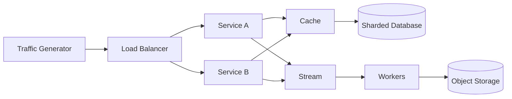
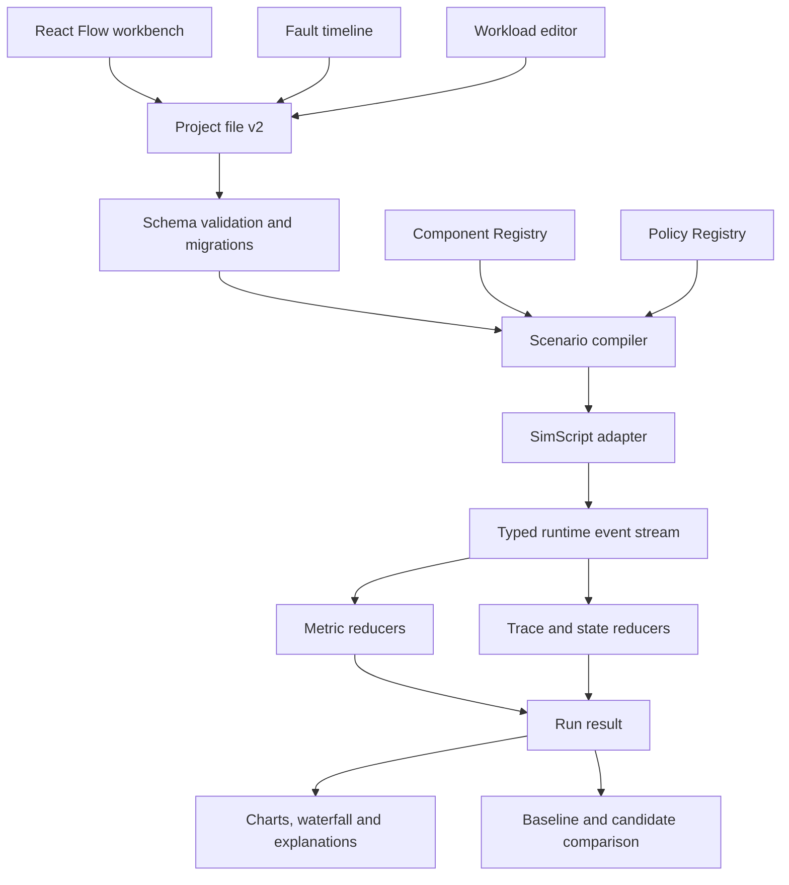

# Phase 1 Implementation Plan

> Status: in progress — P1.0 through P1.5 complete
>
> Objective: evolve the Phase 0 workbench from “a topology can run” into a reusable system-behavior and failure laboratory.

## 1. Outcome

At the end of Phase 1, a user must be able to build a system from a blank canvas, attach reliability policies, define workload and scheduled failures, run a deterministic simulation, inspect request traces and state transitions, and compare two designs under the same experiment.

Phase 1 is not a collection of case-specific pages. Every deliverable must extend the shared Scenario model, Component Registry, simulation runtime, or generic workbench.

The reference acceptance experiment is deliberately composed from generic building blocks:



During the run, one service instance fails, a cache hotspot develops, and a network link degrades. The simulator must derive the resulting rerouting, queue growth, retry amplification, latency change, failures, cache behavior and consumer lag from the model. None of those values may be precomputed for this topology.

## 2. Starting point

Phase 0 currently provides:

- a blank React Flow canvas with five executable component types;
- a versioned Scenario schema;
- SimScript execution inside a Web Worker;
- deterministic seeded runs;
- throughput, latency, error, queue and utilization output;
- JSON import and export;
- Direct Service and Async Pipeline examples using the same generic engine;
- unit, build and browser end-to-end verification through `pnpm check`.

Before extending it, Phase 1 must address these constraints in the current implementation:

- component schemas, defaults, editor fields and runtime behavior are selected through separate `switch` statements;
- the simulation engine combines compilation, routing, component behavior, faults, tracing and metrics in one file;
- every node currently selects only one outgoing edge, which cannot correctly express load balancing, fan-out or asynchronous publication;
- traces do not yet contain spans, parent relationships, attempts or failure reasons;
- Worker execution is run-to-completion and does not yet provide robust cancel, pause, step or progress messages;
- `capacity-drop` admission must be corrected so normal runs use full capacity and SimScript resource capacity follows an active fault;
- Scenario v1 mixes topology and experiment configuration, which makes fair design comparison unnecessarily difficult.

## 3. Design rules

Every Phase 1 change follows these rules:

1. A component is registered once; canvas metadata, config validation and runtime behavior use the same stable type and version.
2. Topology, workload, faults and run configuration are separate models that can be recombined.
3. SimScript owns virtual time, event scheduling and resource queues.
4. Metrics are reduced from runtime events. UI code never fabricates or predicts results.
5. Reliability features use virtual time and seeded randomness only; wall-clock time must not alter a result.
6. A new component or policy cannot require a case-specific canvas or result page.
7. Mature libraries provide generic UI, persistence, validation and visualization capabilities. Custom code implements System Design semantics and adapters.
8. Each milestone must leave `main` runnable and must pass `pnpm check`.

## 4. Target architecture



Target code boundaries:

```text
packages/
  model/
    project/             # ProjectFile v2, topology and experiment contracts
    events/              # Runtime event, span, status and reason contracts
    migrations/          # v1 -> v2 and later migrations
  components/
    manifests/           # Config schemas, defaults, ports and capabilities
    policies/            # Policy schemas and applicability rules
  simulation/
    compiler/             # Validated project + experiment -> executable model
    runtime/              # SimScript adapter and Worker session control
    components/           # One behavior module per component type
    policies/             # Retry, timeout, circuit breaker and admission behavior
    faults/               # Deterministic fault resolution
    telemetry/            # Event sink, trace builder and metric reducers
apps/web/src/
  features/canvas/
  features/components/
  features/workloads/
  features/faults/
  features/runs/
  features/traces/
  features/compare/
```

`packages/model` remains free of React and SimScript. Component manifests are serializable metadata plus Zod validation. Runtime functions stay in `packages/simulation` and are joined to manifests by stable `{ type, version }` keys.

## 5. Project file v2

Phase 1 introduces a project format that separates a design from the experiment applied to it:

```text
ProjectFileV2
  schemaVersion
  id, name
  topology
    nodes
    edges
    groups / regions
  experiments[]
    workloads[]
    faults[]
    simulationConfig
    seed
  activeExperimentId
```

Required behavior:

- import of a valid Scenario v1 automatically produces ProjectFile v2;
- migration is pure, deterministic and covered by snapshot tests;
- unknown schema versions fail with an actionable message and never partially load;
- saved run results are not embedded in the portable project file; they are stored separately and reference the project and experiment revision;
- node and policy types include their own version so behavior changes can be migrated explicitly.

## 6. Component and policy model

### 6.1 Component Registry

Each component manifest defines:

- stable type and version;
- name, category, icon token and description;
- config Zod schema and default config;
- typed input and output ports;
- connection compatibility;
- emitted metrics and supported faults;
- capability flags such as routing, storage, caching or asynchronous delivery.

Each simulation behavior defines:

- compile-time validation;
- runtime resource creation;
- request handling and output emission;
- state and metric events;
- response to supported faults.

The palette and properties panel are generated from manifests. They must not gain a new type-specific branch each time a component is added. Custom field widgets are allowed for genuinely domain-specific values, but they register against a schema field type rather than a case name.

### 6.2 Typed ports and routing

Phase 1 replaces the current “choose one outgoing edge” rule with explicit port semantics:

- `request` / `response` for synchronous calls;
- `publish` / `consume` for asynchronous delivery;
- `hit` / `miss` for cache routing;
- `success` / `failure` for conditional paths;
- weighted one-of routing for a Load Balancer;
- broadcast or fan-out only when a component behavior explicitly requests it.

Cycles remain legal, but the runtime enforces hop and retry budgets and reports the exact termination reason.

### 6.3 Policies

Policies attach where their behavior belongs instead of becoming decorative nodes:

- outbound edge policies: timeout, retry and circuit breaker;
- node admission policies: rate limiting and concurrency limits;
- asynchronous producer or consumer policies: backpressure, batching and dead-letter routing;
- routing policies: round-robin, weighted, least-active and health-aware selection.

A standalone Rate Limiter component may be provided because its architectural placement is meaningful, but it must use the same rate-limit policy implementation as node admission.

Policy order is explicit and validated. A retry attempt creates a child span and re-enters timeout and circuit-breaker evaluation; it does not recursively wrap itself.

## 7. Runtime event contract

The runtime emits a canonical event stream. Metrics, traces, animations and explanations consume this stream rather than maintaining separate truth.

Minimum event fields:

- run ID, virtual timestamp and deterministic sequence number;
- request ID, trace ID, span ID and optional parent span ID;
- node ID, optional edge ID and attempt number;
- event type and status;
- duration, queue duration and transferred bytes when applicable;
- stable reason code such as `timeout`, `queue_full`, `node_down`, `rate_limited`, `circuit_open` or `packet_loss`;
- small typed attributes for component-specific evidence.

Minimum event families:

- request generated, arrived, queued, started, completed and failed;
- dependency call started and returned;
- retry scheduled and attempt started;
- timeout fired;
- circuit opened, entered half-open and closed;
- rate-limit accepted or rejected;
- cache hit, miss, eviction and expiry;
- message published, consumed, acknowledged and dead-lettered;
- fault activated and recovered.

Events are batched across the Worker boundary to avoid one `postMessage` per event. The UI receives progress snapshots during a long run and a final immutable `RunResult`.

## 8. New component behavior

Phase 1 adds these reusable models. Each starts with a deliberately bounded behavior contract.

| Component | Required behavior | Required metrics |
|---|---|---|
| Load Balancer | weighted and round-robin selection, active capacity, health-aware exclusion | requests per target, imbalance, rejected requests |
| Cache | key-aware hit/miss, bounded capacity, TTL, eviction policy, fallback port | hit rate, miss rate, evictions, occupancy |
| Stream | partitions, producer capacity, consumer groups, batch size, acknowledgement | publish rate, consumer rate, lag, partition imbalance |
| Object Storage | request concurrency, object size, read/write throughput and failure rate | operations, bytes, latency, utilization |
| Database v2 | shard routing, primary and replica roles, read preference, replication delay | per-shard utilization, hot-shard ratio, replica lag |
| Region / Zone | logical grouping and inherited failure target | member health and cross-region traffic |

The first implementation models behavior needed for design comparison. It does not emulate vendor protocols or consensus algorithms.

## 9. Fault model

Faults are scheduled experiment inputs, not arbitrary UI flags. Every fault has an ID, typed target, start, duration and validated parameters.

Required faults:

- node down;
- node capacity reduction;
- link latency increase;
- link bandwidth reduction;
- link packet loss;
- hot-key or skewed-key workload;
- zone or region outage.

Overlapping fault semantics must be deterministic:

- node down dominates node capacity and latency modifiers;
- capacity multipliers compose multiplicatively and are clamped to a valid range;
- latency modifiers compose in a documented order;
- independent loss probabilities compose rather than overwrite one another;
- a region fault expands to its member nodes and links at compile time;
- recovery occurs at an exact virtual timestamp and emits a recovery event.

The workbench exposes a fault timeline with create, edit, move, resize, enable and delete operations. Selecting a fault highlights its affected topology. Selecting a metric time range highlights active faults during that interval.

## 10. Observability and comparison

### 10.1 Trace explorer

The trace explorer provides:

- filtering by status, latency, component and reason code;
- a waterfall view with parent-child dependency spans;
- retry attempts and timeout boundaries;
- queue wait versus service time;
- fault and policy state markers on the same virtual-time axis;
- “show on canvas” navigation for the selected span.

### 10.2 Bottleneck explanation

Bottleneck explanations are evidence-based rules over measured events, not an AI-generated score. Examples include:

- utilization remains high while queue length grows;
- retries increase upstream traffic after downstream timeouts;
- one shard receives a disproportionate key distribution;
- cache misses correlate with database load;
- a circuit breaker reduces failures but rejects traffic while open.

Every explanation includes the component, virtual-time interval, metric evidence and relevant trace links.

### 10.3 Baseline versus candidate

Comparison runs share the same experiment revision and seed while using two topology revisions. The UI presents:

- throughput, P50, P95, P99 and error deltas;
- queue, utilization, cache and lag deltas;
- aligned time-series charts;
- fault-window overlays;
- trace examples for materially different outcomes;
- explicit warnings when the experiments are not comparable.

The comparison layer never declares a universal winner. It reports measured differences and the assumptions that produced them.

## 11. Reuse-first dependency plan

Keep the existing libraries:

- React Flow for canvas interaction and topology selection;
- SimScript for virtual time, scheduled events and capacity-constrained resources;
- Zod for project, component, policy and event validation;
- Zustand for active editor state;
- ECharts for metrics, comparison charts and trace waterfall rendering;
- Playwright and Vitest for browser and model verification.

Add only where the capability is actually needed:

- React Hook Form plus its Zod resolver for manifest-driven configuration forms;
- `zundo` for undo and redo over Zustand scenario commands;
- Dexie for local project revisions and run history in IndexedDB;
- `vis-timeline` for editable fault intervals after a small integration and accessibility spike;
- `fast-check` for topology, migration and deterministic-runtime invariant tests.

Do not introduce a second graph editor, chart library, state store or simulation scheduler. Do not use a cache package that reads real wall-clock time unless it supports an injected virtual clock; simulated TTL must remain deterministic.

Every added dependency must pass maintenance, license, browser bundle and Worker compatibility review before merge.

## 12. Milestones

### P1.0 — Foundation hardening

Deliverables:

- [x] fix normal and faulted capacity admission, including SimScript resource capacity;
- [x] split model, compiler, runtime, telemetry and UI responsibilities;
- [x] introduce Component Registry and Policy Registry contracts;
- [x] introduce ProjectFile v2 and tested Scenario v1 migration;
- [x] add run IDs and robust Worker error and cancel behavior;
- [x] preserve all Phase 0 behavior and examples.

Status: complete. Verified by model and registry contract tests, simulation capacity/recovery tests, Worker lifecycle tests, production build, and browser acceptance tests for both Phase 0 examples and v1-to-v2 import/export.

Exit criteria:

- normal capacity and scheduled capacity reduction have separate regression tests;
- a cancelled large run releases its Worker and cannot publish a stale result;
- existing v1 exports load as v2 without semantic loss;
- adding a test component requires registry entries, not edits to canvas or engine dispatch code.

### P1.1 — Typed execution and telemetry

Deliverables:

- [x] typed ports and explicit routing modes;
- [x] generic compiler from topology and experiment to runtime objects;
- [x] canonical runtime event stream;
- [x] span-based trace model and metric reducers;
- [x] batched progress and event messages from the Worker.

Status: complete. Verified by typed-port and compiler rejection tests, deterministic ProjectFile v2 replay, weighted one-of/fan-out/asynchronous routing experiments, event-to-result reducer equality, Worker progress ordering, production build, and browser end-to-end acceptance.

Exit criteria:

- weighted one-of, fan-out and asynchronous publish have distinct tests;
- metrics reconstructed from the event log equal the final summary;
- same project revision, experiment and seed produce identical events excluding wall-clock duration.

### P1.2 — Reliability policies and Load Balancer

Deliverables:

- [x] Load Balancer with weighted, round-robin and health-aware routing;
- [x] timeout and bounded retry with deterministic backoff and optional jitter;
- [x] circuit breaker with closed, open and half-open transitions;
- [x] token-bucket rate limiting;
- [x] backpressure and dead-letter behavior;
- [x] policy badges and manifest-driven editors.

Status: complete. Verified by deterministic routing and health-state tests, timeout/retry/circuit transition tests, rate-limit and asynchronous delivery tests, canonical event and span assertions, production build, and browser end-to-end policy editing and export.

Exit criteria:

- a timeout produces a failed attempt span and a bounded retry span;
- retry amplification is visible in upstream and downstream request counts;
- a circuit opens at the configured threshold and later probes half-open;
- Load Balancer target failure reroutes traffic according to health state;
- rate-limit accounting is deterministic for a fixed seed.

### P1.3 — Data and asynchronous components

Deliverables:

- [x] Cache with key distribution, TTL, capacity and eviction behavior;
- [x] Stream partitions, consumer groups and lag;
- [x] Object Storage reads and writes with byte throughput;
- [x] database shards, replicas, read routing and replication delay;
- [x] generic configuration and result views for the new components.

Status: complete. Verified by virtual-time state tests, deterministic executable component scenarios, cache fallback and failed-fill tests, stream lag and backpressure tests, object byte-event assertions, database hot-shard and replica-freshness assertions, production build, and browser end-to-end configuration, export and simulation tests.

Exit criteria:

- increasing cache hit rate measurably reduces database requests;
- a slow consumer grows lag and backpressure changes producer outcomes;
- a hot key creates observable shard imbalance;
- replica reads trade freshness for read capacity under an explicit model.

### P1.4 — Fault laboratory

Deliverables:

- [x] editable fault timeline;
- [x] node, link, workload and region fault targets;
- [x] deterministic overlap and recovery rules;
- [x] fault state on nodes, edges, charts and traces;
- [x] undo, redo, local project revisions and run history.

Status: complete. Verified by target-validation and region-expansion tests, exact virtual-time activation/recovery assertions, overlapping-capacity and independent-loss composition tests, editable timeline projections, topology highlighting, ECharts fault-window overlays, event-backed trace evidence, validated undo/redo snapshots, IndexedDB revision/run retention tests, refresh restore, production build, and browser end-to-end acceptance.

Exit criteria:

- moving a fault interval changes only the corresponding virtual-time window;
- node-down, packet-loss, latency and region failures produce distinct reason codes;
- undo and redo restore the exact validated project revision;
- refreshing the page restores local projects but never silently overwrites an imported file.

### P1.5 — Trace, explanation and comparison

Deliverables:

- [x] request and dependency waterfall;
- [x] trace-to-canvas navigation;
- [x] evidence-based bottleneck rules;
- [x] immutable run snapshots;
- [x] baseline and candidate comparison using one experiment.

Status: complete. Verified by trace filtering and waterfall projection tests, ECharts queue/service/retry/fault rendering, deterministic evidence-rule tests, trace-to-canvas browser navigation, immutable run snapshot and revision guards, and browser acceptance for comparable topology revisions plus rejected seed changes.

Exit criteria:

- a user can explain a failed request from source to terminal reason;
- bottleneck claims link to measured utilization, queue or traffic evidence;
- two topology revisions run against identical workload, faults and seed;
- aligned comparison charts show both absolute values and deltas.

### P1.6 — Release hardening

Deliverables:

- [x] property-based invariants for migrations and runtime determinism;
- [x] performance budgets for large graphs and runs;
- [x] keyboard and screen-reader paths for editors and timelines;
- [x] documentation for model assumptions and unsupported semantics;
- [x] CI coverage for all Phase 1 acceptance experiments.

Status: complete. Verified by migration/serialization and runtime property tests, a combined 100-node/100,000-request `<5s` gate, lossless aggregate telemetry under trace sampling, keyboard browser acceptance, documented model boundaries, and the complete `pnpm check` CI gate.

Exit criteria:

- 100 nodes and 100,000 requests complete within the agreed browser budget without blocking canvas interaction;
- corrupted or unsupported project files fail safely;
- no Worker leak remains after run, cancel, rerun or navigation;
- every built-in component and policy has deterministic unit tests;
- the complete reference acceptance experiment passes in Playwright.

## 13. Test strategy

### Unit tests

- Zod schemas, registries and connection compatibility;
- v1 to v2 migration and future-version rejection;
- every component and policy behavior in virtual time;
- overlapping fault resolution;
- metric and trace reducers;
- bottleneck evidence rules.

### Property-based tests

- the same seed produces the same ordered runtime events;
- counters are non-negative and completed plus terminal failures never exceed generated requests;
- queue occupancy never exceeds configured bounds without an explicit overflow event;
- retry and hop budgets always terminate cyclic graphs;
- migration followed by serialization remains valid.

### Integration tests

- compiler plus SimScript runtime plus event reducers;
- Worker run, progress, pause, cancel and stale-result protection;
- project persistence and migration;
- baseline and candidate experiment locking.

### Browser tests

- build a topology from blank canvas and configure it through generated forms;
- attach policies and verify trace attempts;
- schedule and move a fault, then observe its metric window;
- inspect a failed trace and navigate to its component;
- compare two designs under the same experiment;
- export, refresh, import and rerun deterministically.

## 14. Performance budgets

Initial budgets, measured on a supported desktop browser:

- opening a 100-node project must keep the canvas interactive;
- a 100,000-request deterministic run should finish within 5 seconds on the CI reference runner;
- Worker event batches should update the UI no more frequently than necessary for readable progress;
- retained trace details are capped independently from aggregate metrics;
- cancellation should restore an idle UI within 500 milliseconds;
- run history uses explicit retention limits and never grows IndexedDB without bound.

Budgets may be revised with benchmark evidence, but regressions cannot be hidden by lowering test coverage or returning sampled fake results.

## 15. Risks and mitigations

| Risk | Mitigation |
|---|---|
| Component growth recreates hard-coded branches | Complete registries and generated forms before adding the new catalog |
| Retry, timeout and circuit semantics become ambiguous | Specify policy order and stable reason codes before UI work |
| SimScript cannot pause cleanly inside a Worker | Add a Worker scheduling adapter and prove pause/cancel in P1.0 before relying on it |
| Event volume overwhelms the UI | Batch events, cap detailed traces and reduce metrics inside the Worker |
| Fault combinations produce order-dependent results | Define composition rules and test overlapping schedules |
| Cache TTL accidentally uses real time | Require virtual-clock injection behind the cache policy interface |
| Design comparison is unfair | Lock experiment revision and seed, and show incompatibility warnings |
| “Bottleneck score” becomes unexplainable | Emit only evidence-backed findings with metric and trace references |
| Phase 1 expands indefinitely | Enforce the bounded component behaviors and explicit non-goals below |

## 16. Non-goals

Phase 1 does not include:

- cloud-vendor API compatibility;
- packet-level network emulation;
- full database query planning or storage-engine simulation;
- consensus protocols such as Raft or Paxos;
- production traffic replay;
- accounts, multiplayer editing or hosted collaboration;
- public third-party plugin execution;
- AI-generated grading or architecture decisions;
- a custom graph editor, chart engine, persistence database or simulation scheduler.

Those capabilities require separate decisions after the generic Phase 1 contracts are stable.

## 17. Definition of done

Phase 1 is complete only when all of the following are true:

- [x] all P1.0 through P1.6 exit criteria pass in CI;
- [x] the reference experiment can be built from a blank canvas;
- [x] faults and policies change actual runtime events and derived metrics;
- [x] a failed request can be explained through spans and stable reason codes;
- [x] two designs can be compared under the exact same experiment and seed;
- [x] new components use shared registries and do not add case-specific pages;
- [x] project v1 files migrate, project v2 files round-trip, and unsupported versions fail safely;
- [x] all metrics shown by the UI originate from runtime events and online event aggregates;
- [x] `pnpm check` passes, including production browser tests;
- [x] the README Phase 1 checklist is updated to reflect the shipped state.

## 18. Execution order

Implementation starts with P1.0. No new component work begins until the capacity regression, Component Registry, project migration and Worker lifecycle tests pass. After P1.1 establishes typed execution and telemetry, P1.2 and P1.3 may proceed in parallel. P1.4 builds on the event and fault contracts; P1.5 builds on stable run results; P1.6 closes the phase.
